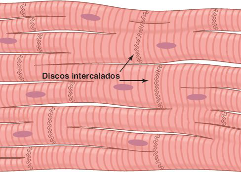
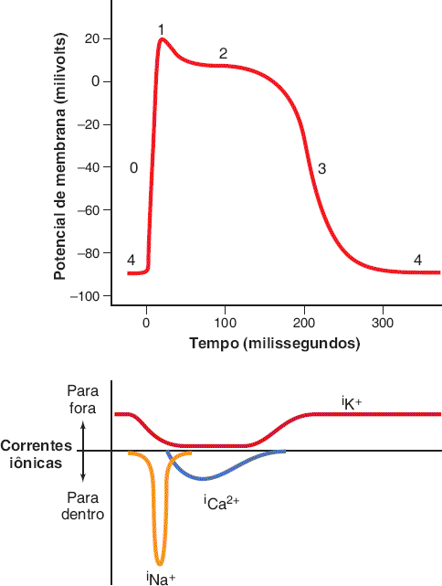
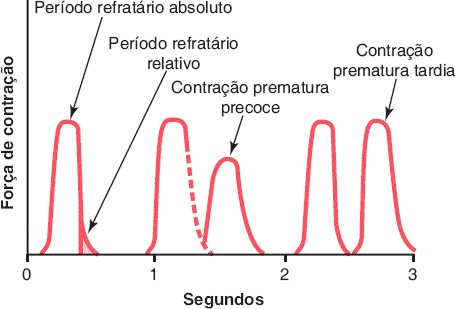
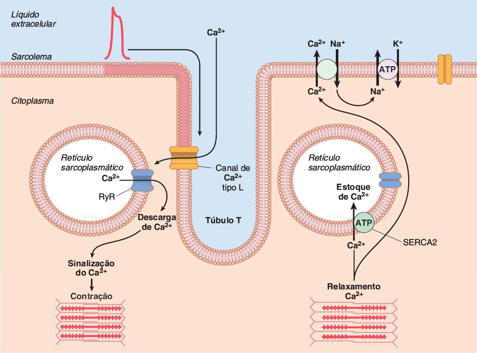
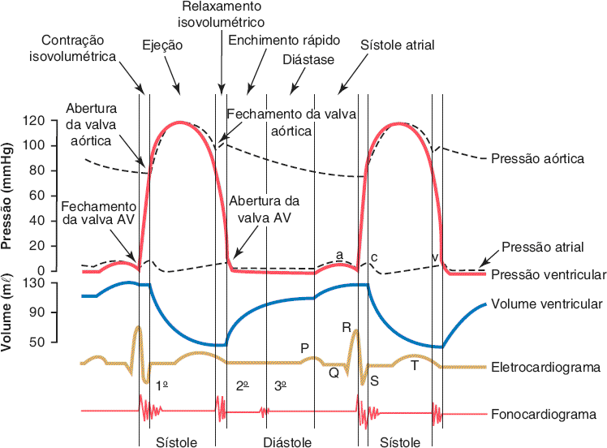
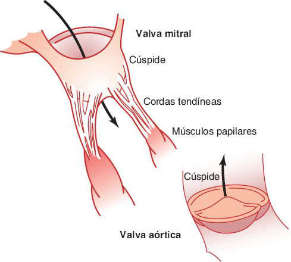
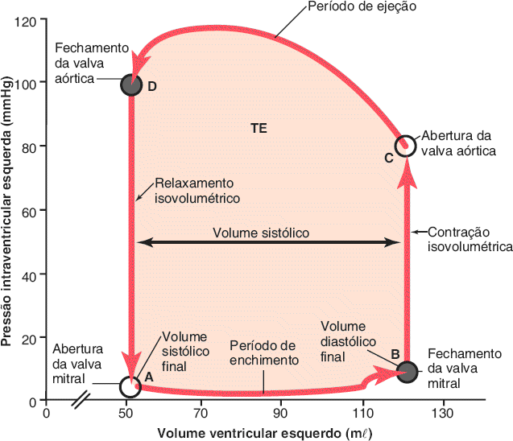
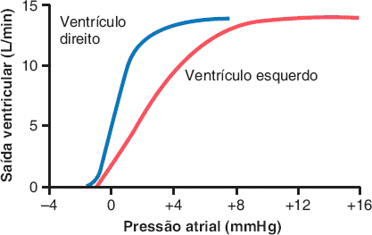

# Tema A · O músculo cardíaco e as valvas cardíacas

**Área:** Fisiologia · **Resumão:** [resumao.pdf](resumao.pdf) (9 páginas) · **Anki:** [flashcards.apkg](flashcards.apkg) (53 cartões)

**Fontes:** Guyton & Hall, 14ª ed., cap. 9 (PDF p. 363–405) · Porto, Semiologia Médica, 8ª ed., cap. 46 (ciclo cardíaco e bulhas)

[Índice](../../README.md) · [Tema B →](../b-excitacao-ritmica/README.md)

## O essencial

- O miocárdio é um **sincício funcional**: os discos intercalados têm junções comunicantes, e o estímulo passa de célula a célula. Átrios e ventrículos são dois sincícios separados pelo esqueleto fibroso; só o **feixe AV** os conecta.
- O potencial de ação ventricular tem **platô** (≈0,2–0,3 s) graças aos **canais lentos de Ca²⁺ (tipo L)** e à queda da permeabilidade ao K⁺. O platô gera um **período refratário longo**, que impede o tétano.
- **Acoplamento excitação-contração:** o Ca²⁺ que entra pelos túbulos T dispara a liberação de mais Ca²⁺ do retículo sarcoplasmático (receptor de rianodina). O Ca²⁺ extracelular é indispensável à força.
- Ciclo cardíaco: **contração isovolumétrica → ejeção → relaxamento isovolumétrico → enchimento** (rápido, lento, sístole atrial = 20%). Nas fases isovolumétricas, **todas as valvas estão fechadas**.
- Volumes do VE: **VDF 110–120 mL, VS ≈70 mL, VSF 40–50 mL, FE ≈60%**.
- **Frank-Starling:** quanto mais o ventrículo se enche (pré-carga), mais forte se contrai e mais sangue ejeta. O simpático aumenta FC e força; o vago reduz sobretudo a FC.

## Valores para decorar

| Parâmetro | Valor | Observação |
|---|---|---|
| Potencial de repouso ventricular | −85 a −90 mV | Pico do PA ≈ +20 mV |
| Duração do potencial de ação | 0,2 s (átrio) · 0,3 s (ventrículo) | Platô pelos canais lentos de Ca²⁺ |
| Período refratário absoluto | 0,25–0,30 s (ventrículo) | Relativo: +0,05 s · átrio: 0,15 s |
| Velocidade de condução | 0,3–0,5 m/s (músculo) · 4 m/s (Purkinje) |  |
| Duração do ciclo a 72 bpm | 0,833 s | Sístole ≈ 0,4 do ciclo |
| Contração isovolumétrica | 0,02–0,03 s | Valvas todas fechadas |
| Relaxamento isovolumétrico | 0,03–0,06 s | Valvas todas fechadas |
| Pressão para abrir a aórtica | ≈ 80 mmHg (VE) · ≈ 8 mmHg (VD) |  |
| Contribuição da sístole atrial | ≈ 20% do enchimento | 80% entra antes da contração atrial |
| VDF · VS · VSF | 110–120 · 70 · 40–50 mL | FE ≈ 60% |
| Pressão aórtica | 120/80 mmHg | Pulmonar ≈ 1/6 da aórtica |
| Onda a atrial | AD 4–6 · AE 7–8 mmHg |  |
| Débito cardíaco em repouso | 4–6 L/min | Exercício: 4–7 vezes mais |
| FC máxima por simpático | 180–200 bpm | Escape vagal: 20–40 bpm |
| K⁺ que pode matar | 8–12 mEq/L | 2–3 vezes o normal |

## Figuras-chave

**Guyton & Hall, Fig. 9.2** — Natureza de interconexão sincicial das fibras musculares cardíacas.

**Guyton & Hall, Fig. 9.5** — Fases do potencial de ação da célula do músculo ventricular cardíaco e correntes iônicas associadas para sódio (iNa+), cálcio (iCa2+) e potássio (iK+).

**Guyton & Hall, Fig. 9.6** — Força de contração do músculo cardíaco ventricular, mostrando também a duração do período refratário absoluto e o período refratário relativo, além do efeito da contração prematura. Observe que as contrações prematuras não causam a soma das ondas, como ocorre no músculo esquelético.

**Guyton & Hall, Fig. 9.7** — Mecanismos de acoplamento excitação-contração e relaxamento no músculo cardíaco. ATP, trifosfato de adenosina. RyR, canal receptor de rianodina liberador de Ca2+; SERCA2, bomba de Ca2+-ATPase.

**Guyton & Hall, Fig. 9.8** — Eventos do ciclo cardíaco para a função ventricular esquerda, mostrando alterações na pressão atrial esquerda, pressão ventricular esquerda, pressão aórtica, volume ventricular, eletrocardiograma e fonocardiograma. AV, atrioventricular.

**Guyton & Hall, Fig. 9.9** — Valvas mitral e aórtica (valvas ventriculares esquerdas).

**Guyton & Hall, Fig. 9.11** — Diagrama de volume-pressão demonstrando mudanças no volume e na pressão intraventricular durante um único ciclo cardíaco (setas vermelhas). A área sombreada representa a saída do trabalho externo líquido (TE) pelo ventrículo esquerdo durante o ciclo cardíaco.

**Guyton & Hall, Fig. 9.13** — Curvas aproximadas do volume ventricular direito e esquerdo normais para o coração humano em repouso, extrapoladas a partir de dados obtidos em cães e dados de pacientes humanos.

## Glossário

| Termo | Significado |
|---|---|
| **Sincício funcional** | Conjunto de células que se comportam como uma só, porque o estímulo passa livre entre elas pelas junções comunicantes. |
| **Disco intercalado** | Membrana entre duas células miocárdicas, com junções comunicantes e desmossomos. |
| **Platô** | Fase 2 do potencial de ação: membrana despolarizada por 0,2–0,3 s. |
| **Período refratário** | Intervalo em que a célula não responde a novo estímulo (absoluto) ou só a estímulo forte (relativo). |
| **Túbulos T** | Invaginações do sarcolema que levam o potencial de ação para dentro da célula. |
| **Receptor de rianodina (RyR)** | Canal do retículo sarcoplasmático que libera Ca²⁺ quando estimulado pelo Ca²⁺ que entra. |
| **SERCA2** | Bomba de Ca²⁺ do retículo sarcoplasmático; recapta Ca²⁺ e permite o relaxamento. |
| **Pré-carga** | Grau de estiramento do músculo no fim da diástole (VDF, pressão diastólica final). |
| **Pós-carga** | Pressão contra a qual o ventrículo ejeta (pressão na aorta). |
| **Fração de ejeção** | Fração do VDF ejetada a cada sístole (VS/VDF), normal ≈ 60%. |
| **Diástase** | Fase de enchimento lento, no terço médio da diástole. |
| **Incisura** | Pequeno entalhe na curva de pressão aórtica no fechamento da valva aórtica. |
| **Frank-Starling** | Lei intrínseca: mais enchimento → mais força → mais volume ejetado. |

## Correlações clínicas

- **Insuficiência cardíaca e fração de ejeção.** A **FE** do ecocardiograma separa a insuficiência cardíaca com FE reduzida (contração fraca, VSF alto) da com FE preservada (ventrículo rígido, enche mal). A queda da FE é um dos marcadores de pior prognóstico.
- **Ruptura de músculo papilar.** No infarto da parede inferior ou posterior, a necrose do músculo papilar faz a cúspide mitral abaular para o átrio na sístole: **insuficiência mitral aguda**, edema agudo de pulmão e sopro holossistólico novo.
- **Hiperpotassemia.** Na insuficiência renal o K⁺ sobe e o coração fica flácido, com bradicardia e bloqueios. No ECG: **onda T apiculada**, depois QRS alargado. É emergência.
- **Taquicardia e enchimento.** Como a diástole encurta mais que a sístole, FC muito alta reduz o enchimento e o débito. Isso explica sintomas de baixo débito nas taquiarritmias (Porto, Fig. 47.6).

## Pegadinhas de prova

- Músculos papilares **não fecham** a valva AV: eles impedem o abaulamento excessivo das cúspides.
- Nas fases **isovolumétricas** todas as quatro valvas estão fechadas.
- A contração atrial contribui só com **≈20%** do enchimento; o grosso entra na fase de enchimento rápido.
- A taquicardia encurta **mais a diástole** que a sístole.
- O vago age sobretudo nos **átrios** (FC); o simpático, em átrios e ventrículos (FC e força).
- A onda **c** atrial é o abaulamento das valvas AV; a **v**, o enchimento atrial com as AV fechadas.
- Hiperpotassemia: coração **flácido**. Hipercalcemia: contração **espástica**.

## Onde ler nas fontes

| Livro | Onde | O que ler |
|---|---|---|
| Guyton & Hall | Cap. 9 · PDF p. 365–377 | Fisiologia do músculo cardíaco: sincício, potencial de ação, acoplamento |
| Guyton & Hall | Cap. 9 · PDF p. 377–395 | Ciclo cardíaco (Fig. 9.8), valvas (Fig. 9.9), alça pressão-volume (Fig. 9.11) |
| Guyton & Hall | Cap. 9 · PDF p. 395–405 | Regulação: Frank-Starling, autonômico, íons, temperatura |
| Porto | Cap. 46 · PDF p. 520–536 | Revisão clínica do ciclo e correlação com bulhas (Fig. 46.6 e 46.7) |

---

[Índice](../../README.md) · [Tema B →](../b-excitacao-ritmica/README.md)

*Figuras reproduzidas dos livros-texto para uso pessoal de estudo; o número de cada figura no livro está indicado na legenda.*
