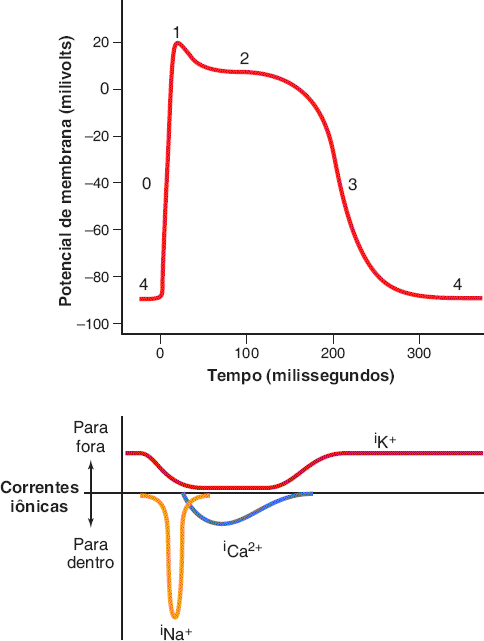
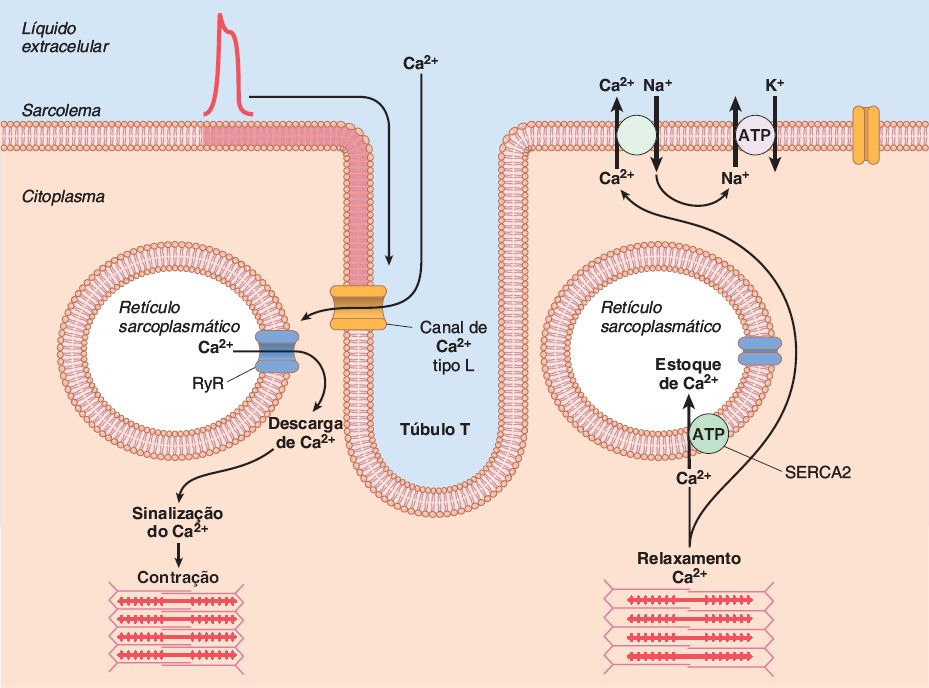
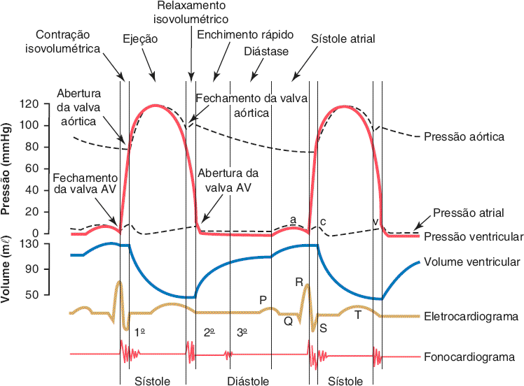
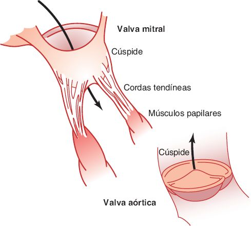
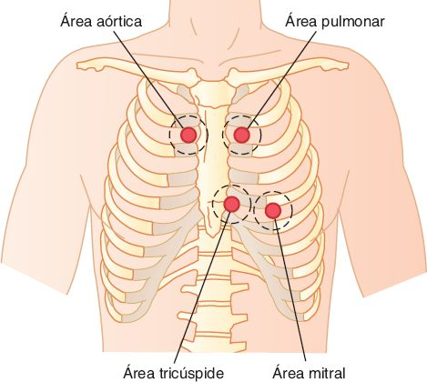
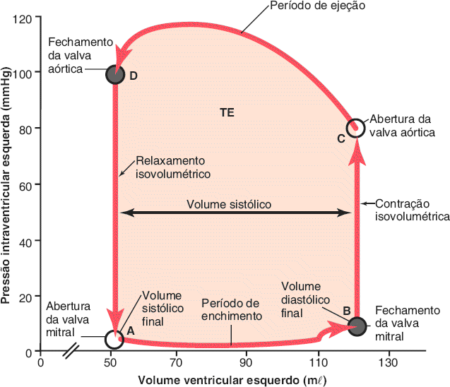

# A · Músculo cardíaco e valvas cardíacas

Fonte: Guyton & Hall, Tratado de Fisiologia Médica, cap. 9 (bulhas: cap. 23; focos: Porto).  
📄 [Resumão em PDF](resumao.pdf) · 🗂️ [Baralho do Anki](flashcards.apkg) (76 cartões, 18 de oclusão de imagem) · ⬅️ [Todos os temas](../../README.md)

## O essencial

1. O coração são duas bombas em série; o miocárdio é um sincício funcional graças aos discos intercalares (junções comunicantes).
2. O platô do potencial de ação ventricular vem da entrada lenta de Ca²⁺ (canais tipo L) e da menor saída de K⁺; por isso o miocárdio não tetaniza.
3. Liberação de Ca²⁺ induzida por Ca²⁺: o Ca²⁺ que entra pelo túbulo T abre os receptores de rianodina do retículo.
4. Ciclo cardíaco: contração isovolumétrica → ejeção → relaxamento isovolumétrico → enchimento (rápido, diástase, sístole atrial).
5. Frank-Starling: quanto mais o ventrículo enche, mais forte contrai; o coração bombeia o que recebe.

## Sumário

- [1. O miocárdio em 5 linhas](#1-o-miocárdio-em-5-linhas)
- [2. Potencial de ação ventricular](#2-potencial-de-ação-ventricular)
- [3. Acoplamento excitação-contração](#3-acoplamento-excitação-contração)
- [4. Ciclo cardíaco](#4-ciclo-cardíaco)
- [5. Valvas e bulhas](#5-valvas-e-bulhas)
- [6. Alça pressão-volume, pré e pós-carga](#6-alça-pressão-volume-pré-e-pós-carga)
- [7. Regulação do bombeamento](#7-regulação-do-bombeamento)
- [Valores para decorar](#valores-para-decorar)
- [Glossário](#glossário)
- [Correlações clínicas](#correlações-clínicas)
- [Onde ler na fonte](#onde-ler-na-fonte)

## 1. O miocárdio em 5 linhas

- Coração = <b>duas bombas em série</b> (direita → pulmão; esquerda → corpo). Átrio é bomba fraca de escorva; ventrículo é a força principal.
- Três tipos de músculo: <b>atrial</b>, <b>ventricular</b> (contraem como o esquelético, porém por mais tempo) e <b>fibras condutoras especializadas</b> (quase não contraem; geram e conduzem o impulso, tema b).
- <b>Discos intercalares</b> com <b>junções comunicantes (gap junctions)</b>: o potencial passa de célula a célula, então o miocárdio é um <b>sincício funcional</b>.
- São <b>dois sincícios</b> (atrial e ventricular) separados pelo <b>esqueleto fibroso</b>. A única ponte elétrica é o <b>feixe AV</b>, o que permite ao átrio contrair antes.
- <b>Torção do VE</b>: na sístole o ápice gira no sentido horário e a base no anti-horário; na diástole a "destorção" ajuda a sugar sangue.

 Discos intercalares e o sincício do músculo cardíaco. <i>(Guyton & Hall, Fig. 9.2)</i>

## 2. Potencial de ação ventricular

| Fase | O que acontece |
|---|---|
| 0 | Abrem os <b>canais rápidos de Na⁺</b>: de −85 a ≈ +20 mV |
| 1 | Canais de Na⁺ fecham; saída transitória de K⁺ |
| 2 · platô | <b>Entra Ca²⁺ (canais tipo L, lentos)</b> e a <b>permeabilidade ao K⁺ cai ~5×</b>. Dura ≈ 0,2 s |
| 3 | Canais de Ca²⁺ fecham; K⁺ sai rápido e a fibra repolariza |
| 4 | Repouso ≈ −85 mV (−80 a −90) |

 Fases do potencial de ação da fibra ventricular e correntes iônicas. <i>(Guyton & Hall, Fig. 9.5)</i>

> 📌 **O que a prova cobra**
>
> - Platô = <b>Ca²⁺ entrando + K⁺ "preso"</b>. Por causa dele a contração dura até 15× a do músculo esquelético.
> - <b>Período refratário absoluto do ventrículo: 0,25 a 0,30 s</b> (quase toda a contração) + relativo de 0,05 s. Resultado: <b>o coração não tetaniza</b> e as extrassístoles não somam força.
> - Átrio tem refratário mais curto (≈ 0,15 s), por isso aguenta frequências muito altas (flutter, fibrilação).
> - Condução: músculo <b>0,3 a 0,5 m/s</b>; Purkinje <b>até 4 m/s</b>.

## 3. Acoplamento excitação-contração

 Entrada de Ca²⁺ pelo túbulo T, liberação pelo RyR e recaptação pela SERCA2. <i>(Guyton & Hall, Fig. 9.7)</i>

- Potencial desce pelos <b>túbulos T</b> → abre <b>canais de Ca²⁺ tipo L</b> → o Ca²⁺ extracelular ativa os <b>receptores de rianodina (RyR2)</b> do retículo sarcoplasmático → liberação de muito mais Ca²⁺ (<b>liberação de Ca²⁺ induzida por Ca²⁺</b>).
- Ca²⁺ + <b>troponina C</b> → pontes cruzadas actina-miosina → contração.
- Relaxamento: <b>SERCA2</b> devolve Ca²⁺ ao retículo; o <b>trocador Na⁺/Ca²⁺</b> expulsa Ca²⁺ da célula; a <b>Na⁺/K⁺-ATPase</b> tira o Na⁺.

> 📌 **Diferenças em relação ao músculo esquelético**
>
> O retículo sarcoplasmático cardíaco é <b>pouco desenvolvido</b>; os túbulos T são <b>5× mais largos (25× o volume)</b> e guardam Ca²⁺ em mucopolissacarídeos. Por isso a <b>força depende do Ca²⁺ extracelular</b>: sem Ca²⁺ no meio, o coração para.

## 4. Ciclo cardíaco

 Eventos do ciclo cardíaco do lado esquerdo (diagrama de Wiggers). <i>(Guyton & Hall, Fig. 9.8)</i>

O ciclo começa no <b>nó sinusal</b>. Há um <b>atraso &gt; 0,1 s</b> no nó AV, então o átrio contrai antes do ventrículo. Duração = 1/FC (72 bpm → 0,83 s). Quando a FC sobe, <b>a diástole encurta mais que a sístole</b> (sístole ≈ 40% do ciclo a 72 bpm e ≈ 65% com FC 3×), e o enchimento pode ficar incompleto.

| Fase | Valvas | Detalhe que cai |
|---|---|---|
| Enchimento rápido | AV abertas | 1º terço da diástole; o sangue acumulado no átrio entra de uma vez |
| Diástase | AV abertas | Terço médio; pouco fluxo |
| Sístole atrial | AV abertas | Último terço; <b>≈ 20% do enchimento</b> (80% é passivo) |
| Contração isovolumétrica | <b>todas fechadas</b> | 0,02 a 0,03 s; termina quando PVE &gt; ≈ 80 mmHg (PVD &gt; ≈ 8) |
| Ejeção | semilunares abertas | ≈ 70% do volume sai no 1º terço (ejeção rápida) |
| Relaxamento isovolumétrico | <b>todas fechadas</b> | 0,03 a 0,06 s; termina quando as AV abrem |

| Onda atrial | Causa |
|---|---|
| <b>a</b> | Contração atrial (AD +4 a 6 mmHg; AE +7 a 8 mmHg) |
| <b>c</b> | Início da sístole ventricular: <b>abaulamento das valvas AV</b> para o átrio |
| <b>v</b> | Fim da sístole: átrio enchendo pelas veias com as AV fechadas |

> 📌 **Volumes normais (decorar)**
>
> <b>VDF 110 a 120 mℓ</b> · <b>VS ≈ 70 mℓ</b> · <b>VSF 40 a 50 mℓ</b> · <b>FE = VS/VDF ≈ 60%</b>. ECG: P precede a contração atrial; QRS começa pouco antes da sístole; T ocorre pouco antes do fim da contração.

## 5. Valvas e bulhas

 Valvas mitral e aórtica: cúspides, cordas tendíneas e músculos papilares. <i>(Guyton & Hall, Fig. 9.9)</i>

|  | AV (mitral, tricúspide) | Semilunares (aórtica, pulmonar) |
|---|---|---|
| Estrutura | Finas, com <b>cordas tendíneas e papilares</b> | Fibrosas e resistentes, <b>sem cordas</b> |
| Fechamento | Suave | <b>Abrupto</b> (alta pressão arterial) |
| Fluxo e desgaste | Orifício grande, fluxo lento | Orifício menor: <b>fluxo rápido e mais abrasão</b> |
| Som | <b>B1</b>: grave e mais longo | <b>B2</b>: agudo e curto |

> 📌 **Pegadinha clássica: músculos papilares**
>
> As valvas abrem e fecham <b>passivamente</b> pelo gradiente de pressão. Os papilares <b>não fecham a valva</b>: puxam as cúspides para o ventrículo e <b>impedem o prolapso</b> para o átrio. Isquemia do papilar ou ruptura de corda no infarto → <b>insuficiência mitral aguda</b>.

 Focos de ausculta. Pelo Porto: aórtico 2º EIC D; pulmonar 2º EIC E; aórtico acessório 3º-4º EIC E; tricúspide na base do apêndice xifoide; mitral no 5º EIC E na linha hemiclavicular (ictus). <i>(Guyton & Hall, Fig. 23.2)</i>

- <b>Curva aórtica</b>: sobe a ≈ 120 mmHg; a <b>incisura</b> marca o fechamento da aórtica (breve refluxo); cai lentamente até ≈ 80 mmHg. Pressões do lado direito ≈ 1/6 das esquerdas.
- <b>B3</b>: início do terço médio da diástole (enchimento rápido). Normal em crianças e jovens; em idosos sugere <b>IC sistólica</b>.
- <b>B4</b>: sístole atrial contra <b>ventrículo rígido</b> (HVE do idoso, hipertensão). <b>Some na fibrilação atrial</b>.
- Abertura das valvas normalmente não faz som.

## 6. Alça pressão-volume, pré e pós-carga

 Alça pressão-volume do VE. A área é o trabalho externo (TE). <i>(Guyton & Hall, Fig. 9.11)</i>

- <b>I</b> enchimento (50 → 120 mℓ) · <b>II</b> contração isovolumétrica (até ≈ 80 mmHg) · <b>III</b> ejeção (sai ≈ 70 mℓ) · <b>IV</b> relaxamento isovolumétrico.
- <b>Pré-carga</b> = <b>pressão diastólica final</b>. <b>Pós-carga</b> = <b>pressão na aorta</b> (artéria de saída).
- Trabalho: quase todo é pressão-volume; energia cinética é ≈ 1%, mas passa de <b>50% na estenose aórtica</b>.
- Energia: <b>70 a 90% de ácidos graxos</b>; eficiência de <b>20 a 25%</b> (na IC, até 5%).
- <b>Laplace: T = P × r</b>. Pressão alta crônica → <b>hipertrofia concêntrica</b> (reduz o raio e a tensão). Ventrículo dilatado gasta mais O₂ para a mesma pressão.

## 7. Regulação do bombeamento

> 📌 **Frank-Starling**
>
> Quanto mais o músculo é distendido no enchimento, maior a força: <b>o coração bombeia todo o sangue que volta a ele</b>. Motivo: sobreposição actina-miosina mais próxima do ideal. O débito é determinado pelo <b>retorno venoso</b>.

- Estiramento do AD: FC ↑ 10 a 20% (direto no nó sinusal) + <b>reflexo de Bainbridge</b> (via vagal) FC ↑ 40 a 60%.
- <b>Simpático</b>: FC até 180 a 200 bpm, força até <b>dobra</b>, débito 2 a 3×. O tônus basal mantém o bombeamento 30% acima.
- <b>Vago</b>: age sobretudo nos <b>átrios</b> → reduz muito a FC (pode parar e depois "escapar" a 20 a 40 bpm) e pouco a força (20 a 30%).
- Débito de repouso 4 a 6 ℓ/min; no exercício, 4 a 7×. A pós-carga só reduz o débito com pressão média &gt; ≈ <b>160 mmHg</b>.

| Situação | Efeito no coração |
|---|---|
| <b>K⁺ alto</b> | Coração <b>dilatado e flácido</b>, FC ↓, <b>bloqueio AV</b>; 8 a 12 mEq/ℓ pode matar (despolariza o repouso → potencial menor) |
| <b>Ca²⁺ alto / baixo</b> | Alto: contração <b>espástica</b>. Baixo: fraqueza |
| <b>Febre / hipotermia</b> | Febre ↑ FC (até o dobro). Hipotermia ↓ muito a FC |

## Valores para decorar

| Item | Valor |
|---|---|
| Potencial de repouso ventricular | −85 a −90 mV |
| Duração do potencial de ação ventricular | ≈ 0,2 a 0,3 s |
| Período refratário absoluto · relativo (ventrículo) | 0,25 a 0,30 s · + 0,05 s |
| Velocidade de condução: músculo · Purkinje | 0,3 a 0,5 m/s · até 4 m/s |
| Duração do ciclo a 72 bpm | 0,833 s (sístole ≈ 40%) |
| Volume diastólico final · sistólico final | 110 a 120 mℓ · 40 a 50 mℓ |
| Volume sistólico · fração de ejeção | ≈ 70 mℓ · ≈ 60% |
| Pressão no VE: sistólica · diastólica | ≈ 120 mmHg · 0 a 5 mmHg |
| Abertura da valva aórtica | PVE > 80 mmHg |
| Contribuição da sístole atrial ao enchimento | ≈ 20% |
| Débito cardíaco de repouso · exercício | 4 a 6 ℓ/min · 4 a 7× maior |
| Eficiência máxima do coração | 20 a 25% |

## Glossário

- **Sincício funcional**: Conjunto de células que se comporta como uma só, porque o potencial passa livremente pelas junções comunicantes.
- **Discos intercalares**: Membranas que separam as células do miocárdio; contêm as junções comunicantes (gap junctions).
- **Platô**: Fase 2 do potencial de ação ventricular, sustentada pela entrada de Ca²⁺.
- **SERCA2**: Bomba de Ca²⁺ do retículo sarcoplasmático; recapta o Ca²⁺ no relaxamento.
- **Pré-carga**: Grau de estiramento do músculo antes de contrair; na prática, a pressão diastólica final.
- **Pós-carga**: Carga contra a qual o músculo contrai; na prática, a pressão na aorta.
- **Incisura**: Pequena queda na curva da pressão aórtica quando a valva aórtica fecha.
- **Trabalho sistólico externo**: Área da alça pressão-volume; energia que o ventrículo transfere ao sangue.
- **Diástase**: Fase média da diástole, de enchimento lento.

## Correlações clínicas

- **Hiperpotassemia**: K⁺ alto despolariza o repouso, deixa o coração dilatado e flácido e pode causar bloqueio AV e parada (8 a 12 mEq/ℓ).
- **Hipercalcemia e hipocalcemia**: Ca²⁺ alto leva à contração espástica; Ca²⁺ baixo, a fraqueza do miocárdio.
- **Febre**: Aumenta a frequência cardíaca (pode dobrar); a hipotermia a reduz muito.
- **Ruptura de músculo papilar**: No infarto, o papilar lesado deixa a cúspide abaular para o átrio: insuficiência mitral aguda.
- **Hipertensão e hipertrofia concêntrica**: Pela lei de Laplace, a pressão alta crônica engrossa a parede e reduz o raio para normalizar a tensão.

## Onde ler na fonte

| Fonte | O que ler |
|---|---|
| Guyton cap. 9 | Fisiologia do músculo cardíaco, ciclo cardíaco (Fig. 9.8), alça pressão-volume (Figs. 9.10 e 9.11), Frank-Starling. |
| Guyton cap. 23 | Valvas e bulhas cardíacas; áreas de ausculta (Fig. 23.2). |
| Porto, Semiologia Médica | Exame do coração: focos de ausculta e bulhas. |

---
Figuras reproduzidas das fontes indicadas, para estudo pessoal. Repositório privado.
