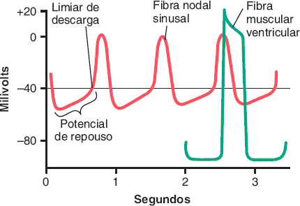
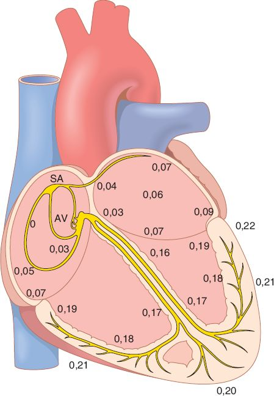
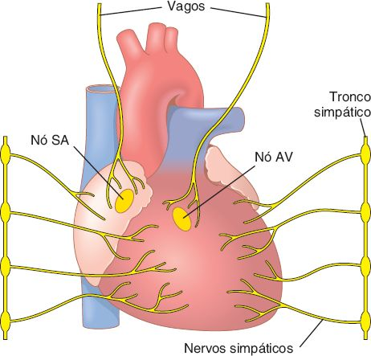

# B · Excitação rítmica do coração

Fonte: Guyton & Hall, Tratado de Fisiologia Médica, cap. 10.  
📄 [Resumão em PDF](resumao.pdf) · 🗂️ [Baralho do Anki](flashcards.apkg) (48 cartões, 10 de oclusão de imagem) · ⬅️ [Todos os temas](../../README.md)

## O essencial

1. O nó sinusal é o marca-passo porque tem a maior frequência intrínseca (70 a 80/min), graças ao vazamento de Na⁺ pela corrente funny.
2. O nó AV atrasa o impulso (≈ 0,13 s no total) para os átrios esvaziarem antes de os ventrículos contraírem.
3. As fibras de Purkinje conduzem muito rápido (1,5 a 4 m/s), fazendo os ventrículos contraírem quase ao mesmo tempo.
4. Vago: acetilcolina abre canais de K⁺, hiperpolariza e reduz a frequência; simpático: noradrenalina (β1) aumenta Na⁺ e Ca²⁺ e acelera.

## Sumário

- [1. O sistema excitocondutor](#1-o-sistema-excitocondutor)
- [2. Por que o nó sinusal dispara sozinho](#2-por-que-o-nó-sinusal-dispara-sozinho)
- [3. Condução: onde atrasa e onde acelera](#3-condução-onde-atrasa-e-onde-acelera)
- [4. Hierarquia dos marca-passos](#4-hierarquia-dos-marca-passos)
- [5. Controle autonômico do ritmo e da condução](#5-controle-autonômico-do-ritmo-e-da-condução)
- [Valores para decorar](#valores-para-decorar)
- [Glossário](#glossário)
- [Correlações clínicas](#correlações-clínicas)
- [Onde ler na fonte](#onde-ler-na-fonte)

## 1. O sistema excitocondutor

 Nó sinusal, vias internodais, nó AV, feixe AV e ramos (sistema de Purkinje). <i>(Guyton & Hall, Fig. 10.1)</i>

Duas funções: <b>gerar</b> o impulso rítmico e <b>conduzi-lo</b> rápido. Resultado: os átrios contraem ≈ 1/6 s antes dos ventrículos, e todas as partes dos ventrículos contraem <b>quase ao mesmo tempo</b>. É um sistema sensível à isquemia.

| Estrutura | Onde / como | Detalhe que cai |
|---|---|---|
| <b>Nó sinusal (SA)</b> | Parede posterolateral superior do AD, logo abaixo e lateral à veia cava superior | 3 × 15 × 1 mm; fibras de 3 a 5 µm, quase sem miofibrilas; ligadas direto ao músculo atrial |
| <b>Vias internodais</b> | Anterior, média e posterior; <b>feixe de Bachmann</b> (interatrial anterior) leva ao AE | ≈ 1 m/s (músculo atrial comum ≈ 0,3 m/s) |
| <b>Nó AV</b> | Parede posterior do AD, atrás da valva tricúspide | <b>Retarda</b> o impulso |
| <b>Feixe AV (His)</b> | Atravessa o esqueleto fibroso; desce 5 a 15 mm no septo | <b>Condução unidirecional</b> (átrio → ventrículo) |
| <b>Ramos e Purkinje</b> | Ramos direito e esquerdo subendocárdicos → ápice → voltam à base; penetram 1/3 da parede | Fibras grandes, <b>1,5 a 4 m/s</b> |

## 2. Por que o nó sinusal dispara sozinho

 Potencial do nó sinusal comparado com o da fibra ventricular. <i>(Guyton & Hall, Fig. 10.2)</i>

- "Repouso" de <b>−55 a −60 mV</b> (ventrículo: −85 a −90), porque a membrana é naturalmente permeável a <b>Na⁺ e Ca²⁺</b>.
- A −55 mV os <b>canais rápidos de Na⁺ estão inativados</b>: quem faz o potencial são os <b>canais de Ca²⁺ tipo L (lentos)</b>. Por isso a subida e a repolarização são lentas.
- Entre os batimentos, o Na⁺ entra pela <b>corrente funny</b> e o potencial sobe devagar até o <b>limiar ≈ −40 mV</b>: abrem os canais tipo L e dispara.
- Fim: os canais de Ca²⁺ <b>inativam em 100 a 150 ms</b> e <b>abrem canais de K⁺</b> → repolariza e <b>hiperpolariza</b>. Os canais de K⁺ vão fechando, o vazamento de Na⁺/Ca²⁺ vence de novo e o ciclo recomeça.

> 📌 **Resumo em uma linha**
>
> <b>Vazamento de Na⁺ (funny) → limiar −40 mV → Ca²⁺ tipo L dispara → K⁺ repolariza/hiperpolariza → recomeça.</b>

## 3. Condução: onde atrasa e onde acelera

 Tempo (em segundos) de chegada do impulso a cada região do coração. <i>(Guyton & Hall, Fig. 10.4)</i>

| Trecho | Tempo acumulado | Por quê |
|---|---|---|
| Nó sinusal → nó AV | 0,03 s | Vias internodais |
| Dentro do nó AV | +0,09 s (→ 0,12 s) | Atraso nodal |
| Feixe AV penetrante | +0,04 s (→ 0,16 s) | Atravessa o tecido fibroso |
| Ramos → fim do Purkinje | +0,03 s (→ ≈ 0,19 s) | Purkinje 1,5 a 4 m/s |
| Endocárdio → epicárdio | +0,03 s (→ ≈ 0,22 s) | Músculo 0,3 a 0,5 m/s, em espiral |

> 📌 **O que a prova cobra**
>
> - <b>Atraso AV total = 0,13 s</b> no nó + feixe; somando as vias internodais, <b>0,16 s</b> até o ventrículo. Serve para o átrio esvaziar antes da sístole.
> - Causa do atraso: <b>poucas junções comunicantes</b> entre as células do nó (alta resistência).
> - Causa da rapidez do Purkinje: fibras <b>grossas</b> e <b>junções comunicantes muito permeáveis</b>. Velocidade ≈ 6× o músculo e ≈ 150× algumas fibras do nó AV.
> - Dos ramos até a última fibra ventricular: <b>≈ 0,06 s</b>. Contração <b>síncrona</b>; condução lenta nos ventrículos reduz o bombeamento em 20 a 30%.
> - A <b>barreira fibrosa</b> isola átrio de ventrículo. Uma <b>via acessória</b> que a atravesse permite <b>reentrada</b> e arritmias graves.

## 4. Hierarquia dos marca-passos

- Nó sinusal <b>70 a 80</b>/min · nó AV <b>40 a 60</b>/min · Purkinje <b>15 a 40</b>/min.
- O nó sinusal comanda porque é o <b>mais rápido</b>: descarrega o nó AV e o Purkinje antes que eles atinjam o próprio limiar.
- <b>Marca-passo ectópico</b>: outro local passa a disparar mais rápido que o sinusal (ou o impulso sinusal é bloqueado). Contração em sequência anormal.
- <b>Bloqueio AV total</b>: átrios seguem o sinusal; ventrículos passam a um ritmo do Purkinje de <b>15 a 40 bpm</b>.

> 📌 **Síndrome de Stokes-Adams**
>
> No bloqueio AV súbito, o Purkinje estava <b>suprimido</b> pelo ritmo sinusal rápido (supressão por sobrecarga) e só assume após <b>5 a 20 s</b>. Sem bombeamento, a pessoa <b>desmaia após 4 a 5 s</b>. Se a pausa for longa, pode morrer.

## 5. Controle autonômico do ritmo e da condução

 Inervação autonômica do coração: vagos sobre os nós SA e AV; simpáticos em todo o coração. <i>(Guyton & Hall, Fig. 9.14)</i>

|  | Parassimpático (vago) | Simpático |
|---|---|---|
| Distribuição | <b>Nós SA e AV</b>; pouco músculo atrial; quase nada no ventrículo | Todo o coração, forte no <b>ventrículo</b> |
| Mediador | <b>Acetilcolina</b> | <b>Noradrenalina</b> → receptores <b>β1</b> |
| Mecanismo | ↑ permeabilidade ao <b>K⁺</b> → <b>hiperpolariza</b> (SA vai a −65 a −75 mV) → demora a chegar ao limiar | ↑ permeabilidade a <b>Na⁺ e Ca²⁺</b> → rampa diastólica mais íngreme |
| Nó sinusal | FC ↓ (vago moderado: até metade); forte: para | FC ↑ (máximo: quase <b>triplica</b>) |
| Nó AV | ↓ excitabilidade da junção AV → atrasa; forte: <b>bloqueia</b> | Condução AV mais rápida |
| Força | Pouco efeito | Até <b>2×</b> (mais Ca²⁺) |

> 📌 **Escape ventricular**
>
> Com estímulo vagal muito forte o ventrículo pode parar por 5 a 20 s. Depois, um ponto do Purkinje (geralmente na porção septal do feixe AV) assume a <b>15 a 40 bpm</b>: é o <b>escape ventricular</b>.

## Valores para decorar

| Item | Valor |
|---|---|
| Repouso do nó sinusal | −55 a −60 mV |
| Limiar de descarga do nó sinusal | ≈ −40 mV |
| Frequência intrínseca: nó SA · nó AV · Purkinje | 70 a 80 · 40 a 60 · 15 a 40 /min |
| Chegada ao nó AV | 0,03 s |
| Atraso total no nó AV + feixe penetrante | ≈ 0,13 s (chega ao ventrículo em 0,16 s) |
| Velocidade nas vias internodais | ≈ 1 m/s |
| Velocidade no Purkinje | 1,5 a 4 m/s |
| Tempo do feixe até a última fibra ventricular | ≈ 0,06 s |
| Escape ventricular após parada sinusal (Stokes-Adams) | 5 a 20 s de pausa; depois 15 a 40 bpm |

## Glossário

- **Corrente funny (If)**: Entrada de Na⁺ por canais ativados na hiperpolarização; gera a despolarização lenta do nó sinusal.
- **Marca-passo ectópico**: Outro local que passa a disparar mais rápido que o nó sinusal.
- **Feixe AV (His)**: Única via elétrica normal entre átrios e ventrículos, através do esqueleto fibroso.
- **Síndrome de Stokes-Adams**: Desmaio por pausa ventricular no início de um bloqueio AV total, até o Purkinje assumir.
- **Supressão por sobrecarga**: O Purkinje estimulado rápido pelo sinusal fica suprimido e demora a assumir o ritmo.
- **Vias internodais**: Feixes anterior, médio e posterior que levam o impulso do nó sinusal ao nó AV.

## Correlações clínicas

- **Bloqueio AV total**: Átrios seguem o sinusal e ventrículos o Purkinje (15 a 40 bpm): bradicardia grave, pode exigir marca-passo.
- **Reentrada e via acessória**: Uma via fora do feixe AV pode reconduzir o impulso e causar taquiarritmias (ex.: pré-excitação).
- **Estímulo vagal forte**: Massagem do seio carotídeo ou reflexo vagal intenso pode parar o sinusal por alguns segundos até o escape.

## Onde ler na fonte

| Fonte | O que ler |
|---|---|
| Guyton cap. 10 | Sistema excitocondutor (Fig. 10.1), potencial do nó sinusal (Fig. 10.2), nó AV (Fig. 10.3), tempos de condução (Fig. 10.4). |
| Guyton cap. 9 | Inervação autonômica do coração (Fig. 9.14). |

---
Figuras reproduzidas das fontes indicadas, para estudo pessoal. Repositório privado.
