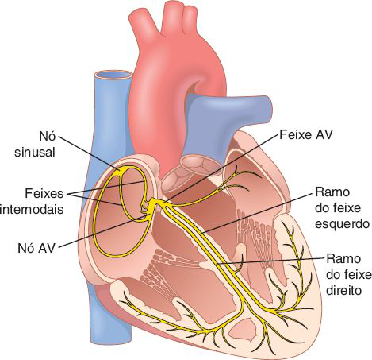
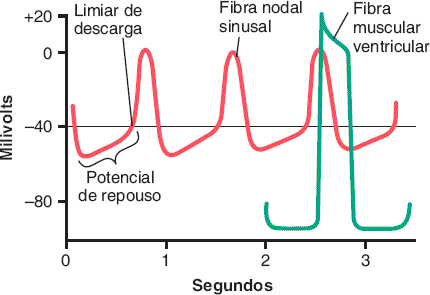
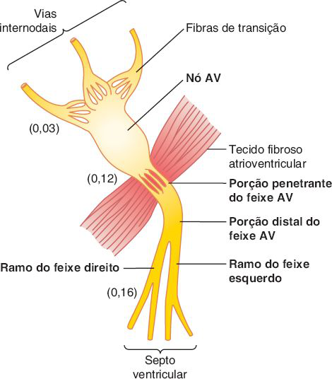

# Tema B · Excitação rítmica do coração

**Área:** Fisiologia · **Resumão:** [resumao.pdf](resumao.pdf) (7 páginas) · **Anki:** [flashcards.apkg](flashcards.apkg) (43 cartões)

**Fontes:** Guyton & Hall, 14ª ed., cap. 10 (PDF p. 406–426) · Porto, Semiologia Médica, 8ª ed., cap. 46 (sistema excitocondutor, Fig. 46.5)

[← voltar ao índice](../../README.md)

## O essencial

- Caminho do impulso: **nó sinusal → vias internodais → nó AV → feixe AV (His) → ramos direito e esquerdo → fibras de Purkinje → miocárdio**.
- O **nó sinusal** é o marca-passo porque dispara mais rápido (**70–80/min**) que o nó AV (**40–60/min**) e as fibras de Purkinje (**15–40/min**).
- Automatismo: o repouso do nó sinusal é **−55 a −60 mV**, os canais rápidos de Na⁺ ficam inativados, e a entrada lenta de Na⁺ (**corrente funny**) leva a membrana ao limiar de **−40 mV**, quando abrem os **canais de Ca²⁺ tipo L**.
- O **nó AV retarda** o impulso (≈0,13 s no nó e no feixe; **0,16 s** desde o nó sinusal) para os átrios se esvaziarem antes da sístole ventricular. Causa: poucas junções comunicantes.
- **Purkinje** conduz a **1,5–4 m/s** e despolariza todo o ventrículo em ≈0,06 s: contração síncrona.
- **Vago (ACh):** abre canais de K⁺, hiperpolariza e reduz FC e condução AV. **Simpático (noradrenalina, β1):** aumenta a permeabilidade a Na⁺/Ca²⁺, acelera FC e condução e aumenta a força.

## Valores para decorar

| Parâmetro | Valor | Observação |
|---|---|---|
| Nó sinusal: dimensões | ≈ 3 × 15 × 1 mm | Átrio direito, junto à veia cava superior |
| Repouso do nó sinusal | −55 a −60 mV | Ventrículo: −85 a −90 mV |
| Limiar do nó sinusal | ≈ −40 mV | Abrem os canais de Ca²⁺ tipo L |
| Repouso do nó sinusal com vago | −65 a −75 mV | Hiperpolarização por K⁺ |
| Frequência intrínseca | SA 70–80 · AV 40–60 · Purkinje 15–40/min |  |
| Condução no músculo atrial | 0,3 m/s | Vias internodais ≈ 1 m/s |
| Condução no Purkinje | 1,5–4,0 m/s | ≈ 6 vezes o músculo ventricular |
| Condução no músculo ventricular | 0,3–0,5 m/s |  |
| Nó sinusal → nó AV | 0,03 s |  |
| Atraso no nó AV + feixe penetrante | 0,09 + 0,04 = 0,13 s |  |
| Nó sinusal → ventrículo | 0,16 s | ≈ intervalo PR |
| Ramos → última fibra ventricular | ≈ 0,06 s | Contração síncrona |
| Supressão do Purkinje no bloqueio | 5–20 s | Desmaio após 4–5 s (Stokes-Adams) |

## Figuras-chave

**Guyton & Hall, Fig. 10.1** — O nó sinusal e o sistema de Purkinje do coração, mostrando também o nó atrioventricular (AV), as vias (feixes) internodais atriais e os ramos do feixe ventricular.

**Guyton & Hall, Fig. 10.2** — Descarga rítmica de uma fibra nodal sinusal. Além disso, o potencial de ação nodal sinusal é comparado com o de uma fibra muscular ventricular.

**Guyton & Hall, Fig. 10.3** — Organização do nó atrioventricular (AV). Os números representam o intervalo de tempo desde a origem do impulso no nó sinusal. Os valores foram extrapolados para humanos.

**Guyton & Hall, Fig. 10.4** — Transmissão do impulso cardíaco através do coração, mostrando o tempo de surgimento (em frações de segundo após o aparecimento inicial no nó sinoatrial) em diferentes partes do coração. AV, atrioventricular; SA, sinoatrial.

**Guyton & Hall, Fig. 9.14** — Nervos cardíacos simpáticos e parassimpáticos. (Os nervos vagos para o coração são nervos parassimpáticos.) AV, atrioventricular; SA, sinoatrial.

## Glossário

| Termo | Significado |
|---|---|
| **Automatismo** | Capacidade de uma célula gerar potenciais de ação sozinha, sem estímulo externo. |
| **Corrente funny (I-f)** | Entrada lenta de Na⁺ por canais HCN que despolariza a célula marca-passo na fase 4. |
| **Limiar** | Potencial em que se abrem os canais que geram o potencial de ação (≈ −40 mV no nó sinusal). |
| **Hiperpolarização** | Potencial mais negativo que o repouso, por saída de K⁺. |
| **Vias internodais** | Feixes atriais de condução rápida entre o nó sinusal e o nó AV (anterior, média, posterior). |
| **Feixe de Bachmann** | Feixe interatrial anterior; leva o impulso ao átrio esquerdo. |
| **Feixe AV (de His)** | Única conexão elétrica normal entre átrios e ventrículos. |
| **Marca-passo ectópico** | Marca-passo localizado fora do nó sinusal. |
| **Escape ventricular** | Ritmo de 15–40 bpm gerado pelo Purkinje quando o impulso sinusal não chega. |
| **Stokes-Adams** | Síncope por pausa ventricular no início de um bloqueio AV total. |

## Correlações clínicas

- **Síndrome de Stokes-Adams.** No bloqueio AV total súbito, o Purkinje demora 5–20 s para assumir. O paciente perde a consciência e pode convulsionar. No Brasil a **doença de Chagas** é causa frequente de bloqueio AV e de Stokes-Adams (Porto).
- **Via acessória (Wolff-Parkinson-White).** Uma ponte muscular atravessa a barreira fibrosa fora do feixe AV. O impulso pula o retardo do nó AV (PR curto) e pode reentrar, causando taquicardias.
- **Marca-passo artificial e ressincronização.** O marca-passo trata bradicardias e bloqueios. O ressincronizador (biventricular) devolve a contração síncrona em corações dilatados.
- **Fármacos.** **Atropina** bloqueia o vago e acelera a FC. **Betabloqueadores** bloqueiam β1 e reduzem FC e condução AV. A **ivabradina** bloqueia a corrente funny e reduz a FC sem mexer na força.

## Pegadinhas de prova

- No nó sinusal o potencial de ação depende de **Ca²⁺** (tipo L), não do canal rápido de Na⁺, que está inativado a −55 mV.
- O nó sinusal é o marca-passo por ser o **mais rápido**, não por ser o único com automatismo.
- O **maior atraso** está no nó AV (0,09 s), não no feixe de His.
- O vago age por **hiperpolarização** (↑ K⁺), e não por bloquear canais de Na⁺.
- O feixe AV conduz em **um só sentido** (átrio → ventrículo).
- Purkinje é a fibra **mais rápida**; nó AV, a **mais lenta**.

## Onde ler nas fontes

| Livro | Onde | O que ler |
|---|---|---|
| Guyton & Hall | Cap. 10 · PDF p. 407–418 | Nó sinusal e automatismo (Fig. 10.2), nó AV (Fig. 10.3), Purkinje (Fig. 10.4) |
| Guyton & Hall | Cap. 10 · PDF p. 418–425 | Marca-passos ectópicos, Stokes-Adams, controle autonômico |
| Porto | Cap. 46 · PDF p. 525–527 | Sistema excitocondutor e inervação (Fig. 46.5) |
| Porto | Cap. 47 · PDF p. 557–560 | Repercussões clínicas das bradi e taquiarritmias (Fig. 47.6 e 47.7) |

---

*Figuras reproduzidas dos livros-texto para uso pessoal de estudo; o número de cada figura no livro está indicado na legenda.*
