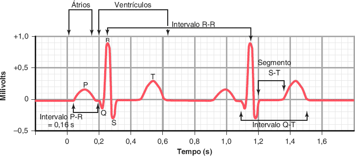
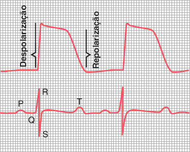
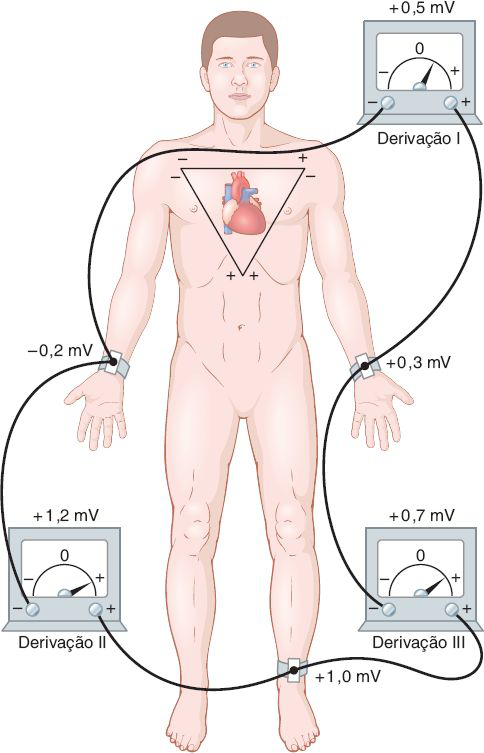
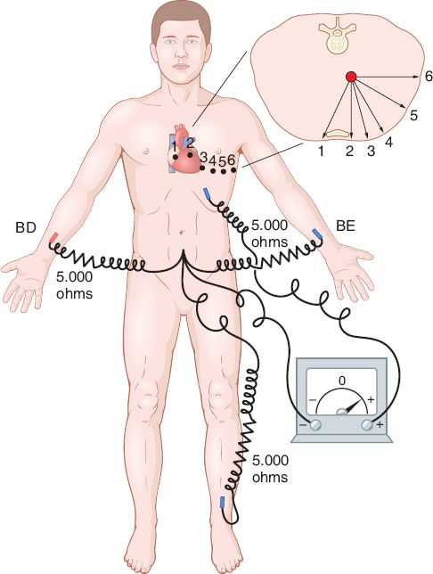
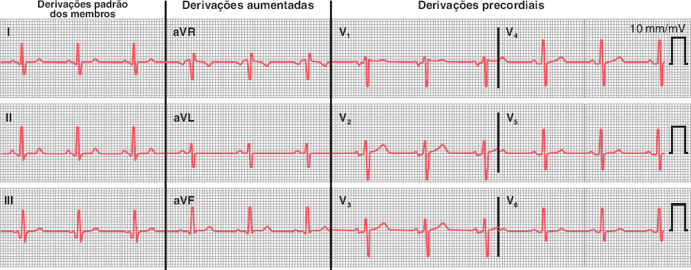
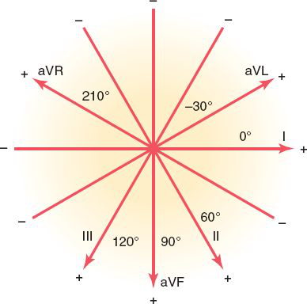

# Tema C · Eletrocardiograma normal

**Área:** Fisiologia · **Resumão:** [resumao.pdf](resumao.pdf) (6 páginas) · **Anki:** [flashcards.apkg](flashcards.apkg) (49 cartões)

**Fontes:** Guyton & Hall, 14ª ed., cap. 11 (PDF p. 427–450) · Guyton & Hall, 14ª ed., cap. 12 (eixos e eixo elétrico médio, PDF p. 451–470)

[← voltar ao índice](../../README.md)

## O essencial

- **Onda P** é a despolarização dos átrios. O **QRS** é a despolarização dos ventrículos. A **onda T** é a repolarização dos ventrículos. A repolarização atrial fica escondida no QRS.
- O ECG só registra algo quando o músculo está **parcialmente** despolarizado ou repolarizado. Músculo todo em repouso ou todo despolarizado dá linha reta.
- **Papel:** 25 mm/s, então um quadradinho (1 mm) vale **0,04 s** e um quadrado grande (5 mm) vale **0,20 s**. Na vertical, 10 mm valem **1 mV**.
- **Valores de Guyton:** PR **0,16 s**, QRS **0,06–0,08 s**, QT **0,35 s**, RR **0,83 s** (72 bpm).
- **Derivações:** D1, D2 e D3 (bipolares), aVR, aVL e aVF (aumentadas) e V1 a V6 (precordiais). **Lei de Einthoven: D1 + D3 = D2.**
- **Eixo elétrico médio** do QRS: ≈ **+59°** (normal de ≈ 20° a 100°). A onda T é positiva porque o epicárdio do ápice se repolariza **primeiro**.

## Valores para decorar

| Parâmetro | Valor | Observação |
|---|---|---|
| Velocidade do papel | 25 mm/s | 1 mm = 0,04 s · 5 mm = 0,20 s |
| Calibração vertical | 10 mm = 1 mV |  |
| Intervalo P-R | ≈ 0,16 s | Encurta com FC alta |
| Duração do QRS | 0,06–0,08 s | Longo se > 0,09 s; bloqueio se > 0,12 s |
| Intervalo Q-T | ≈ 0,35 s | ≈ duração da contração ventricular |
| Intervalo R-R | ≈ 0,83 s | = 72 bpm |
| Voltagem do QRS (membros) | 1,0–1,5 mV | Eletrodo sobre o coração: 3–4 mV |
| Voltagem da P | 0,1–0,3 mV |  |
| Voltagem da T | 0,2–0,3 mV |  |
| Potencial de ação ventricular | ≈ 110 mV · 0,25–0,35 s |  |
| Repolarização atrial | 0,15–0,20 s após a P | Escondida no QRS |
| Eixos: D1, D2, D3 | 0°, +60°, +120° |  |
| Eixos: aVL, aVF, aVR | −30°, +90°, +210° |  |
| Eixo médio do QRS | ≈ +59° | Normal ≈ 20° a 100° |
| Frequência cardíaca no papel | 1.500 ÷ mm · 300 ÷ quadrados | Entre dois R |

## Figuras-chave

**Guyton & Hall, Fig. 11.1** — Eletrocardiograma normal.

**Guyton & Hall, Fig. 11.3** — Parte superior, potencial de uma fibra muscular ventricular durante a função cardíaca normal, mostrando a rápida despolarização e, em seguida, a repolarização ocorrendo lentamente durante o estágio de platô, mas rapidamente em direção ao final. Parte inferior, eletrocardiograma registrado simultaneamente.

**Guyton & Hall, Fig. 11.6** — Arranjo convencional de eletrodos para registrar as derivações eletrocardiográficas padrão. O triângulo de Einthoven é sobreposto no peito.

**Guyton & Hall, Fig. 11.8** — Conexões do corpo com o eletrocardiógrafo para registro das derivações torácicas. BE, braço esquerdo; BD, braço direito.

**Guyton & Hall, Fig. 11.11** — Eletrocardiograma normal de 12 derivações.

**Guyton & Hall, Fig. 12.3** — Eixos de três derivações bipolares e três unipolares.

## Glossário

| Termo | Significado |
|---|---|
| **Derivação** | Par de eletrodos (ou eletrodo + referência) e o circuito até o eletrocardiógrafo. |
| **Derivação bipolar** | Registra a diferença entre dois membros (D1, D2, D3). |
| **Derivação aumentada** | Um membro no polo positivo e os outros dois unidos no negativo (aVR, aVL, aVF). |
| **Terminal central de Wilson** | Os três membros unidos por resistências iguais, usado como polo negativo das precordiais. |
| **Triângulo de Einthoven** | Triângulo formado pelos dois braços e a perna esquerda em torno do coração. |
| **Eixo da derivação** | Direção do polo negativo para o positivo da derivação. |
| **Eixo elétrico médio** | Direção média do vetor de despolarização ventricular (≈ +59°). |
| **Segmento** | Trecho entre ondas, sem incluir ondas (ex.: S-T). |
| **Intervalo** | Trecho que inclui ondas (ex.: P-R, Q-T). |
| **Isoelétrico** | Na linha de base: sem diferença de potencial. |
| **Holter** | Registro contínuo do ECG por 24–48 h durante a vida diária. |

## Correlações clínicas

- **Bloqueios e PR.** PR longo sugere **atraso no nó AV** (vago aumentado, fármacos, doença do sistema de condução). PR curto sugere **via acessória** (pré-excitação).
- **QRS largo.** QRS > 0,09 s é anormal; **> 0,12 s** indica bloqueio de condução no sistema de Purkinje, como o **bloqueio de ramo**. Hipertrofia ou dilatação alargam o QRS para 0,09–0,12 s.
- **Desvio do eixo.** Desvio para a esquerda na **hipertensão** (hipertrofia do VE) e no bloqueio de ramo esquerdo. Desvio para a direita na hipertrofia do VD e no bloqueio de ramo direito.
- **Holter e monitores.** Para sintomas transitórios (síncope, palpitações, tontura) usa-se o **Holter** (24–48 h), registradores intermitentes (semanas) ou o monitor de eventos implantável (até 2–3 anos).

## Pegadinhas de prova

- Onda T é **repolarização ventricular**, não atrial. A repolarização atrial some dentro do QRS.
- Durante o **segmento S-T** os ventrículos estão **todos despolarizados**: não há diferença de potencial, então o traçado é isoelétrico.
- A onda T normal é **positiva** porque a repolarização começa no **epicárdio do ápice**, ao contrário da despolarização.
- **aVR** é normalmente **negativa**.
- Lei de Einthoven: **D1 + D3 = D2** (não D1 + D2 = D3).
- Em V1 o QRS é predominantemente **negativo**; em V6, **positivo**.
- Um quadradinho vale **0,04 s**, não 0,4 s; o quadrado grande vale **0,20 s**.

## Onde ler nas fontes

| Livro | Onde | O que ler |
|---|---|---|
| Guyton & Hall | Cap. 11 · PDF p. 427–435 | Ondas, relação com o potencial de ação, calibração e valores normais (Fig. 11.1 a 11.3) |
| Guyton & Hall | Cap. 11 · PDF p. 435–449 | Corrente no tórax e as 12 derivações (Fig. 11.5 a 11.11) |
| Guyton & Hall | Cap. 12 · PDF p. 453–455 | Eixos das derivações, sistema hexagonal (Fig. 12.3) |
| Guyton & Hall | Cap. 12 · PDF p. 459–470 | Vetores do QRS e da T, eixo médio e desvios |

---

*Figuras reproduzidas dos livros-texto para uso pessoal de estudo; o número de cada figura no livro está indicado na legenda.*
