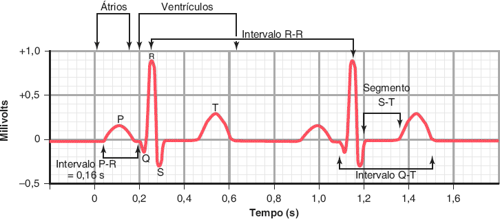
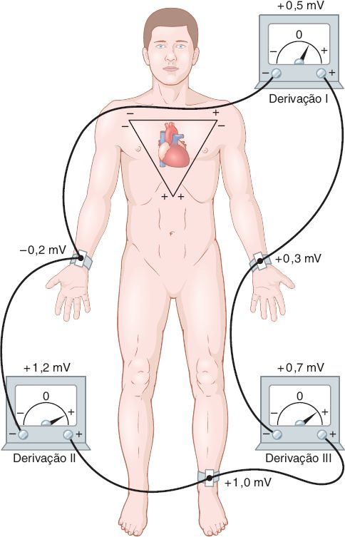
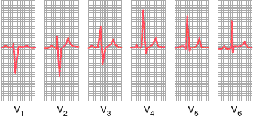
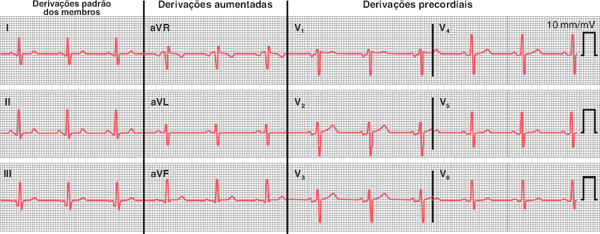
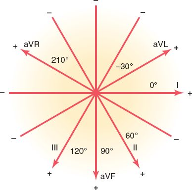
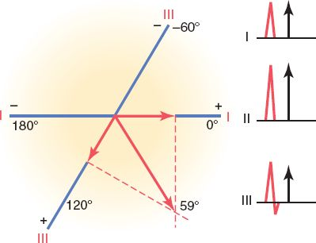

# C · O eletrocardiograma normal

Fonte: Guyton & Hall, Tratado de Fisiologia Médica, caps. 11 e 12.  
📄 [Resumão em PDF](resumao.pdf) · 🗂️ [Baralho do Anki](flashcards.apkg) (48 cartões, 5 de oclusão de imagem) · ⬅️ [Todos os temas](../../README.md)

## O essencial

1. P = despolarização atrial; QRS = despolarização ventricular; T = repolarização ventricular.
2. Papel padrão: 25 mm/s e 10 mm/mV; quadradinho = 0,04 s e 0,1 mV; quadrado grande = 0,20 s.
3. Lei de Einthoven: a qualquer instante, I + III = II.
4. Eixo médio normal do QRS ≈ +59° (Guyton); I e aVF positivos indicam eixo normal na prática.

## Sumário

- [1. O que cada onda representa](#1-o-que-cada-onda-representa)
- [2. Papel, calibração e intervalos](#2-papel-calibração-e-intervalos)
- [3. As 12 derivações](#3-as-12-derivações)
- [4. Vetores e eixo elétrico](#4-vetores-e-eixo-elétrico)
- [5. Roteiro de leitura e monitorização](#5-roteiro-de-leitura-e-monitorização)
- [Valores para decorar](#valores-para-decorar)
- [Glossário](#glossário)
- [Correlações clínicas](#correlações-clínicas)
- [Onde ler na fonte](#onde-ler-na-fonte)

## 1. O que cada onda representa

 ECG normal: ondas, intervalos e segmento ST. <i>(Guyton & Hall, Fig. 11.1)</i>

| Onda | Evento elétrico | Detalhe que cai |
|---|---|---|
| <b>P</b> | Despolarização <b>atrial</b> | 0,1 a 0,3 mV; começa ≈ 0,16 s antes do QRS |
| <b>QRS</b> | Despolarização <b>ventricular</b> | Q, R e S; 1,0 a 1,5 mV nos membros (até 3 a 4 mV no precórdio) |
| <b>T</b> | Repolarização <b>ventricular</b> | 0,2 a 0,3 mV; ocorre 0,25 a 0,35 s após a despolarização |
| T atrial | Repolarização atrial | 0,15 a 0,20 s após a P: fica <b>escondida no QRS</b> |

- P e QRS são <b>ondas de despolarização</b>; T é <b>onda de repolarização</b>.
- <b>Sem corrente, sem onda</b>: com o músculo todo polarizado (repouso) ou todo despolarizado (segmento ST), o ECG fica na linha de base.
- O potencial de ação monofásico tem ≈ 110 mV; o ECG na pele registra só ≈ 1 mV, porque o sinal é captado à distância.
- O ECG é gerado pela <b>diferença de potencial entre partes despolarizadas e partes polarizadas</b> do coração.

## 2. Papel, calibração e intervalos

| Medida | Valor | Como lembrar |
|---|---|---|
| 1 quadradinho (1 mm) | 0,04 s · 0,1 mV | 5 quadradinhos = 1 quadrado grande |
| 1 quadrado grande (5 mm) | 0,20 s · 0,5 mV | 5 quadrados grandes = 1 s |
| Calibração | 10 mm = 1 mV | Pulso retangular de 2 quadrados grandes |
| <b>Intervalo PR (PQ)</b> | ≈ <b>0,16 s</b> | Início da P ao início do QRS; ↓ simpático, ↑ vago |
| <b>QRS</b> | ≈ 0,06 a 0,08 s | &gt; 0,09 s é prolongado; &gt; 0,12 s quase sempre bloqueio |
| <b>Intervalo QT</b> | ≈ <b>0,35 s</b> | Início do QRS ao fim da T: dura a contração ventricular |
| <b>RR</b> | 0,83 s → 72 bpm | FC = 60 / RR (em segundos) |

> 📌 **Frequência cardíaca em 5 segundos (complemento clínico)**
>
> - <b>FC = 60 / RR</b> (Guyton). Na prática: <b>1500 / nº de quadradinhos</b> entre dois R, ou <b>300 / nº de quadrados grandes</b>.
> - Sequência dos quadrados grandes: 1 = 300 · 2 = 150 · 3 = 100 · 4 = 75 · 5 = 60 · 6 = 50 bpm.
> - Ritmo irregular: conte os QRS em 6 s (30 quadrados grandes) e multiplique por 10.

## 3. As 12 derivações

 Derivações bipolares dos membros e triângulo de Einthoven. Note: I + III = II. <i>(Guyton & Hall, Fig. 11.6)</i>

| Derivação | Polo negativo | Polo positivo | Eixo |
|---|---|---|---|
| <b>I</b> | Braço direito | Braço esquerdo | 0° |
| <b>II</b> | Braço direito | Perna esquerda | +60° |
| <b>III</b> | Braço esquerdo | Perna esquerda | +120° |
| <b>aVR</b> | (central dos outros dois) | Braço direito | −150° (210°) |
| <b>aVL</b> | (central dos outros dois) | Braço esquerdo | −30° |
| <b>aVF</b> | (central dos outros dois) | Perna esquerda | +90° |

- <b>Triângulo de Einthoven</b>: braços e perna esquerda são os vértices em volta do coração. A perna direita é só o terra.
- <b>Lei de Einthoven</b>: em qualquer instante, <b>I + III = II</b>. Ex.: I = +0,5 e III = +0,7 → II = +1,2 mV. Conhecendo duas, calcula-se a terceira.
- Como os eixos de I, II e III apontam para o lado positivo do vetor normal, o QRS é <b>positivo nas três</b>, maior em <b>II</b>.
- <b>Aumentadas (aV)</b>: um membro contra os outros dois unidos. <b>aVR sai invertida</b> (QRS negativo); aVL e aVF parecem com as bipolares.

 Derivações precordiais: eletrodo explorador no tórax contra o terminal central (Wilson), 5.000 Ω em cada membro. <i>(Guyton & Hall, Fig. 11.8)</i>

 Precordiais normais: V1 e V2 negativas, V4 a V6 positivas. <i>(Guyton & Hall, Fig. 11.9)</i>

- Eletrodo no tórax (+) contra o <b>terminal central de Wilson</b> (−: braços e perna esquerda ligados por resistências).
- <b>V1 e V2</b>: QRS <b>predominantemente negativo</b> (eletrodo mais perto da <b>base</b>, que fica negativa durante quase toda a despolarização).
- <b>V4 a V6</b>: QRS <b>predominantemente positivo</b> (perto do <b>ápice</b>). A transição fica em V3 ou V4.
- Posições (complemento clínico): V1 4º EIC direito e V2 4º EIC esquerdo, na borda esternal; V4 5º EIC na linha hemiclavicular; V3 entre V2 e V4; V5 axilar anterior e V6 axilar média, no nível de V4.
- ECG de rotina = <b>12 derivações</b>: I, II, III, aVR, aVL, aVF e V1 a V6.

 Registro normal de 12 derivações. <i>(Guyton & Hall, Fig. 11.11)</i>

## 4. Vetores e eixo elétrico

 Sistema hexaxial: eixos das seis derivações dos membros. <i>(Guyton & Hall, Fig. 12.3)</i>

- Durante quase toda a despolarização a corrente vai da <b>base para o ápice</b> (base negativa, ápice positivo). Nos últimos 0,01 s ela se inverte.
- Sequência: o <b>septo despolariza da esquerda para a direita</b> primeiro (pequena <b>Q</b>), depois as paredes a partir do endocárdio (<b>R</b>), e por fim a base do VE (<b>S</b>). A despolarização ventricular leva ≈ 0,06 s.
- <b>T positiva</b>: o <b>epicárdio e o ápice repolarizam primeiro</b>, porque o endocárdio tem o fluxo coronariano comprimido durante a contração. Repolarização em sentido oposto à despolarização dá onda de <b>mesmo sentido</b> do QRS.
- <b>Eixo médio do QRS normal: +59°</b>; varia de ≈ <b>20° a 100°</b> em corações normais (Guyton). Na clínica, normal = <b>−30° a +90°</b>.

 Cálculo do eixo: voltagem líquida do QRS em I e III projetada nos eixos → +59°. <i>(Guyton & Hall, Fig. 12.11)</i>

> 📌 **O que desvia o eixo em corações normais**
>
> - <b>Para a esquerda</b>: expiração, deitar, obesidade (coração mais horizontal).
> - <b>Para a direita</b>: inspiração, ficar em pé, biotipo alto e magro (coração mais vertical).
> - Em doença, o eixo desvia <b>para o lado do ventrículo hipertrofiado</b> (mais massa, mais corrente) ou para o lado de um ramo bloqueado.

## 5. Roteiro de leitura e monitorização

> 📌 **Roteiro para ler um ECG normal (complemento clínico)**
>
> - <b>1. Calibração e velocidade</b>: 10 mm/mV, 25 mm/s.
> - <b>2. Ritmo sinusal</b>: onda P antes de cada QRS, P positiva em I e II (e negativa em aVR), PR constante.
> - <b>3. FC</b>: 60–100 bpm (300 / quadrados grandes).
> - <b>4. Intervalos</b>: PR 0,12–0,20 s; QRS &lt; 0,12 s; QT ≈ 0,35 s (varia com a FC).
> - <b>5. Eixo</b>: I e aVF positivos = normal.
> - <b>6. Progressão de R</b> nas precordiais: R cresce de V1 a V5.

- <b>Holter</b>: ECG contínuo por <b>24 a 48 h</b> durante a rotina, para sintomas frequentes.
- <b>Monitor de eventos/intermitente</b>: semanas, para sintomas esporádicos; o paciente aciona na hora do sintoma.
- <b>Monitor implantável (loop)</b>: subcutâneo, <b>2 a 3 anos</b>, para síncope rara e inexplicada.

## Valores para decorar

| Item | Valor |
|---|---|
| Intervalo PR | ≈ 0,16 s (0,12 a 0,20 s) |
| Duração do QRS | 0,06 a 0,08 s (≥ 0,12 s: bloqueio de ramo) |
| Intervalo QT | ≈ 0,35 s |
| Voltagem do QRS nas derivações dos membros | 1,0 a 1,5 mV |
| Voltagem de P · T | 0,1 a 0,3 mV · 0,2 a 0,3 mV |
| Frequência cardíaca | 60 / RR (s) · 1.500 / quadradinhos · 300 / quadrados grandes |
| Eixos: I · II · III | 0° · +60° · +120° |
| Eixos: aVR · aVL · aVF | −150° · −30° · +90° |
| Resistências do terminal central (Wilson) | 5.000 Ω em cada membro |

## Glossário

- **Derivação bipolar**: Registra a diferença entre dois membros (I, II e III).
- **Derivação aumentada**: Um membro contra os outros dois ligados (aVR, aVL, aVF).
- **Precordial**: Eletrodo explorador no tórax (V1 a V6) contra o terminal central.
- **Triângulo de Einthoven**: Triângulo formado por braços e perna esquerda em torno do coração.
- **Sistema hexaxial**: As seis derivações dos membros desenhadas passando pelo mesmo centro, a cada 30°.
- **Segmento ST**: Trecho entre o fim do QRS e o início de T; normalmente na linha de base.
- **Progressão de R**: A onda R cresce de V1 para V5 e a S diminui.

## Correlações clínicas

- **Desvio do eixo para a esquerda**: Expiração, deitar, obesidade, hipertrofia do VE ou bloqueio do ramo esquerdo.
- **Desvio do eixo para a direita**: Inspiração, ficar em pé, biótipo alto e magro, hipertrofia do VD ou bloqueio do ramo direito.
- **Holter e monitor de eventos**: Holter 24 a 48 h para sintomas frequentes; monitor de eventos e loop implantável para sintomas raros ou síncope.

## Onde ler na fonte

| Fonte | O que ler |
|---|---|
| Guyton cap. 11 | ECG normal (Fig. 11.1), Einthoven (Fig. 11.6), precordiais (Figs. 11.8 e 11.9), 12 derivações (Fig. 11.11). |
| Guyton cap. 12 | Vetores e eixo: sistema hexaxial (Fig. 12.3) e cálculo do eixo (Fig. 12.11). |

---
Figuras reproduzidas das fontes indicadas, para estudo pessoal. Repositório privado.
