# D · Biofísica da circulação

Fonte: Guyton & Hall, Tratado de Fisiologia Médica, caps. 14 e 15.  
📄 [Resumão em PDF](resumao.pdf) · 🗂️ [Baralho do Anki](flashcards.apkg) (73 cartões, 11 de oclusão de imagem) · ⬅️ [Todos os temas](../../README.md)

## O essencial

1. Lei de Ohm: F = ΔP / R. Poiseuille: o fluxo varia com a 4ª potência do raio.
2. 84% do sangue está na circulação sistêmica e 64% nas veias: elas são o reservatório.
3. As arteríolas fazem ≈ 2/3 da resistência e controlam o fluxo de cada tecido.
4. Complacência venosa ≈ 24× a arterial. Pressão de pulso ≈ volume sistólico / complacência arterial.
5. Em pé e imóvel, a pressão nas veias dos pés chega a +90 mmHg; a bomba muscular a reduz para < 20 mmHg.

## Sumário

- [1. Visão geral: onde está o sangue e onde está a pressão](#1-visão-geral-onde-está-o-sangue-e-onde-está-a-pressão)
- [2. Pressão, fluxo e resistência](#2-pressão-fluxo-e-resistência)
- [3. Distensibilidade e complacência](#3-distensibilidade-e-complacência)
- [4. Pulso arterial e medida da PA](#4-pulso-arterial-e-medida-da-pa)
- [5. Veias: pressão venosa, gravidade e reservatório](#5-veias-pressão-venosa-gravidade-e-reservatório)
- [Valores para decorar](#valores-para-decorar)
- [Glossário](#glossário)
- [Correlações clínicas](#correlações-clínicas)
- [Onde ler na fonte](#onde-ler-na-fonte)

## 1. Visão geral: onde está o sangue e onde está a pressão

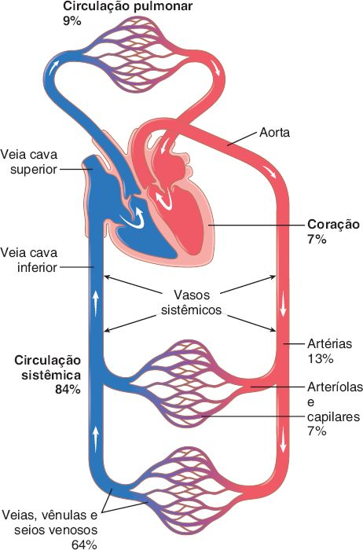 Distribuição do volume sanguíneo nas partes da circulação. <i>(Guyton & Hall, Fig. 14.1)</i>

| Segmento | Função | Detalhe que cai |
|---|---|---|
| <b>Artérias</b> | Levar sangue sob alta pressão | Paredes fortes, fluxo rápido |
| <b>Arteríolas</b> | <b>Válvulas de controle</b> do fluxo | Parede muscular forte: fecham ou dilatam várias vezes |
| <b>Capilares</b> | <b>Trocas</b> com o interstício | Paredes finas com poros |
| <b>Veias</b> | Retorno e <b>reservatório</b> controlável | Pressão baixa, parede fina mas com músculo |

- Volume: <b>84% na circulação sistêmica</b> (veias <b>64%</b>, artérias 13%, arteríolas + capilares 7%), coração 7%, pulmões 9%.
- <b>v = F / A</b>: a velocidade é inversa à área de secção. Aorta 2,5 cm² e ≈ 33 cm/s; capilares ≈ 2.500 cm² e ≈ 0,3 mm/s. O sangue fica só <b>1 a 3 s</b> no capilar.
- Área das veias ≈ 4× a das artérias: explica a grande capacidade de armazenamento venoso.

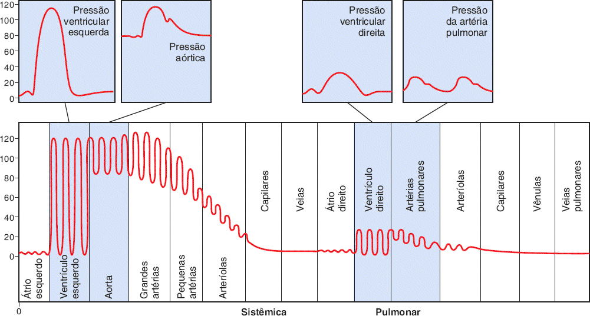 Pressões ao longo das circulações sistêmica e pulmonar (decúbito). <i>(Guyton & Hall, Fig. 14.2)</i>

| Local | Pressão (mmHg) |
|---|---|
| Aorta | 120/80, média <b>100</b> |
| Capilar sistêmico | 35 → 10, média funcional <b>≈ 17</b> (glomérulo ≈ 60) |
| Átrio direito (fim das cavas) | <b>≈ 0</b> |
| Artéria pulmonar | <b>25/8</b>, média <b>16</b> |
| Capilar pulmonar | <b>≈ 7</b> |

> 📌 **Os 3 princípios da circulação**
>
> - O fluxo de cada tecido é controlado pela <b>necessidade do tecido</b> (arteríolas). O tecido ativo pode pedir 20 a 30× o fluxo; o coração só sobe o DC 4 a 7×.
> - O <b>débito cardíaco é a soma dos fluxos locais</b>: o que volta, o coração bombeia.
> - A <b>PA é regulada de forma independente</b> do fluxo local e do DC: reflexos nervosos em segundos; rins em horas e dias.

## 2. Pressão, fluxo e resistência

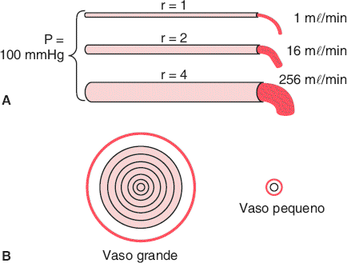 Efeito do raio sobre o fluxo (lei da quarta potência). <i>(Guyton & Hall, Fig. 14.8)</i>

- <b>Lei de Ohm: F = ΔP / R</b>. O que move o sangue é a <b>diferença</b> de pressão, não a pressão absoluta.
- DC de repouso ≈ <b>5.000 mℓ/min</b> (≈ 100 mℓ/s). Resistência periférica total ≈ 100 mmHg / 100 mℓ/s = <b>1 URP</b> (vai de 0,2 a 4 URP). Resistência pulmonar ≈ <b>0,14 URP</b> (≈ 1/7 da sistêmica).
- <b>Condutância = 1 / R</b>, e é proporcional a <b>r⁴</b>.
- <b>Poiseuille: F = π·ΔP·r⁴ / (8·η·ℓ)</b>. O <b>raio</b> é o fator mais importante: raio 2× → fluxo 16×; raio 4× → 256×.
- As <b>arteríolas</b> (4 a 25 µm) fazem ≈ <b>2/3 da resistência sistêmica</b> e mudam o diâmetro até 4×: por isso controlam o fluxo local.
- <b>Série</b>: R total = R1 + R2 + ... (mesmo fluxo em cada um). <b>Paralelo</b>: 1/R total = 1/R1 + 1/R2 + ...; C total = C1 + C2 + ... A resistência total em paralelo é <b>menor que a de qualquer ramo</b>. Tirar um rim ou amputar um membro <b>aumenta a RPT</b>.

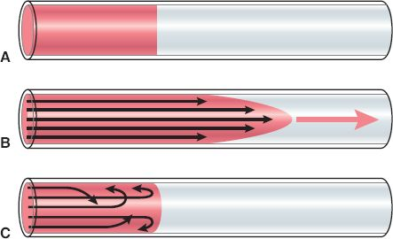 A: dois líquidos lado a lado. B: fluxo laminar (parabólico). C: fluxo turbulento. <i>(Guyton & Hall, Fig. 14.6)</i>

| Conceito | O que saber |
|---|---|
| <b>Fluxo laminar</b> | Camadas concêntricas; perfil <b>parabólico</b>: centro rápido, junto à parede quase parado |
| <b>Fluxo turbulento</b> | Redemoinhos, <b>resistência muito maior</b>; gera sopros e sons de Korotkoff |
| <b>Reynolds: Re = v·d·ρ / η</b> | ↑ com velocidade, diâmetro e densidade; ↓ com viscosidade. <b>200 a 400</b>: turbulência nos ramos; <b>&gt; 2.000</b>: turbulência até em vaso reto |
| Onde há turbulência normal | Aorta proximal e artéria pulmonar na ejeção rápida (Re de milhares) |

#### Viscosidade e hematócrito

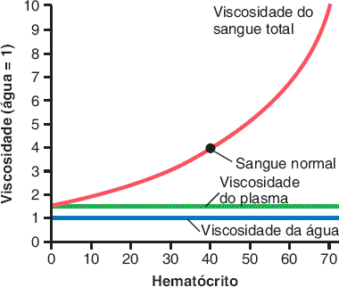 Efeito do hematócrito sobre a viscosidade do sangue (água = 1). <i>(Guyton & Hall, Fig. 14.11)</i>

- Hematócrito médio: homens <b>42</b>, mulheres <b>38</b>. Os <b>eritrócitos</b> são o principal determinante da viscosidade.
- Sangue normal: viscosidade <b>3 a 4×</b> a da água; plasma ≈ 1,5×. <b>Policitemia</b> (Ht 60 a 70): até <b>10×</b>, fluxo muito reduzido.

#### Autorregulação, fechamento crítico, Laplace e cisalhamento

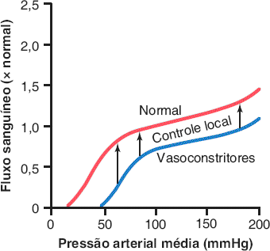 Autorregulação: fluxo quase constante entre 70 e 175 mmHg. <i>(Guyton & Hall, Fig. 14.12)</i>

- <b>Autorregulação</b>: entre ≈ <b>70 e 175 mmHg</b>, o tecido ajusta a resistência e mantém o fluxo (cap. 17).
- Num vaso passivo, ↑ pressão distende o vaso e ↓ R (fluxo sobe mais que o previsto). Abaixo da <b>pressão crítica de fechamento</b>, o vaso colapsa e o fluxo para.
- <b>Lei de Laplace: T = ΔP · r / h</b>. Vasos grandes sob alta pressão (aorta) precisam de parede forte; capilares, de raio mínimo, aguentam pouca tensão.
- <b>Tensão de cisalhamento</b>: atrito do fluxo no endotélio; ∝ velocidade × viscosidade, ∝ 1/r³. Sinaliza remodelamento vascular.
- Unidades: 1 mmHg = <b>1,36 cmH₂O</b>.

## 3. Distensibilidade e complacência

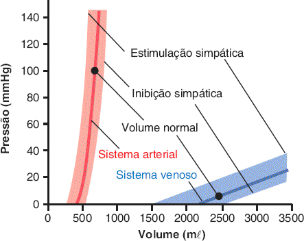 Curvas volume-pressão dos sistemas arterial e venoso. <i>(Guyton & Hall, Fig. 15.1)</i>

|  | Fórmula | Artéria × veia |
|---|---|---|
| <b>Distensibilidade</b> | ΔV / (ΔP × V inicial) | Veias ≈ <b>8×</b> mais distensíveis |
| <b>Complacência (capacitância)</b> | ΔV / ΔP = distensibilidade × volume | Veias ≈ <b>24×</b> (8× × 3× o volume) |

- Sistema arterial: <b>700 mℓ → PAM 100 mmHg</b>; com 400 mℓ a pressão cai a zero. Sistema venoso: 2.000 a 3.500 mℓ, e centenas de mℓ mudam a pressão só 3 a 5 mmHg.
- Por isso dá para transfundir <b>meio litro</b> em minutos sem grande efeito. As artérias pulmonares são ≈ 6× mais distensíveis que as sistêmicas.
- <b>Simpático</b> ↑ a pressão para cada volume: contrai sobretudo as veias e <b>desloca sangue para o coração</b>. Permite circular quase normal com até <b>25%</b> de perda.
- <b>Complacência tardia (estresse-relaxamento)</b>: após ↑ súbito de volume, a pressão sobe e depois volta em minutos a horas, porque o músculo liso se alonga. Acomoda transfusão; no sentido inverso, ajusta após hemorragia.

## 4. Pulso arterial e medida da PA

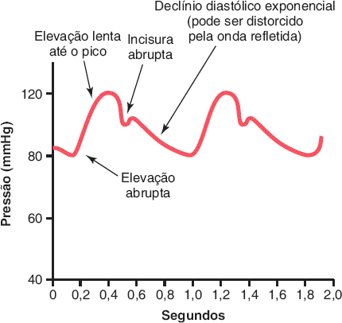 Pulso de pressão na aorta ascendente. <i>(Guyton & Hall, Fig. 15.3)</i>

> 📌 **Pressão de pulso (PP = PAS − PAD ≈ 40 mmHg)**
>
> - <b>PP ≈ volume sistólico / complacência arterial</b>. ↑ VS ou ↓ complacência (artéria rígida) → ↑ PP.
> - Idoso com <b>arteriosclerose</b>: PP pode <b>dobrar</b> (sistólica alta).

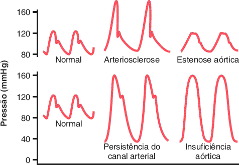 Pulsos aórticos anormais. <i>(Guyton & Hall, Fig. 15.4)</i>

| Condição | Pulso aórtico | Por quê |
|---|---|---|
| <b>Arteriosclerose</b> | PP ↑↑ | Complacência ↓ |
| <b>Estenose aórtica</b> | PP <b>↓</b>, pulso pequeno | Pouco fluxo pela valva estreita |
| <b>Persistência do canal arterial</b> | PAD ↓, PP ↑ | ≥ 50% do sangue volta pela artéria pulmonar |
| <b>Insuficiência aórtica</b> | PAD pode ir a ≈ 0, PP ↑↑, <b>sem incisura</b> | Refluxo para o VE; valva não fecha |

- <b>Transmissão do pulso</b>: 3 a 5 m/s na aorta, 7 a 10 m/s nos grandes ramos, 15 a 35 m/s nas pequenas artérias. Quanto <b>mais complacente, mais lenta</b>. É ≈ 15× a velocidade do sangue.
- <b>Amortecimento</b> do pulso (quase some nos capilares) ∝ <b>resistência × complacência</b>.

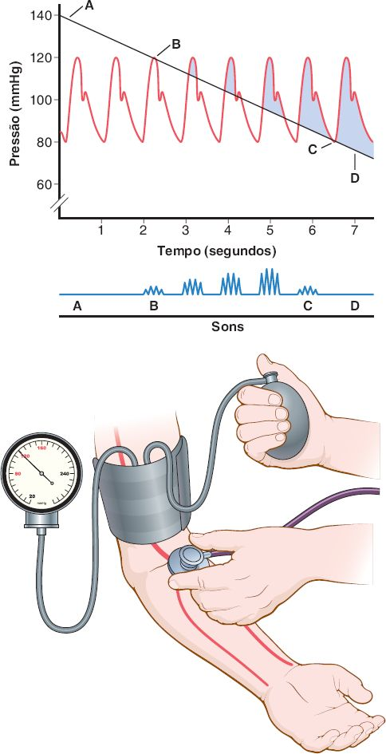 Método auscultatório: sons de Korotkoff. <i>(Guyton & Hall, Fig. 15.7)</i>

- <b>Korotkoff</b>: jato turbulento pela artéria parcialmente ocluída + vibração da parede. <b>1º som = sistólica</b>; som <b>abafado</b> (ou desaparecimento, preferido por muitos) = <b>diastólica</b>. Erro ≈ 10% vs cateter.
- Sons que não somem com manguito vazio: <b>fístula AV</b> de hemodiálise e <b>insuficiência aórtica</b>.
- <b>Oscilométrico</b>: a oscilação <b>máxima</b> corresponde à <b>PAM</b>; evita o efeito do jaleco, mas erra com manguito inadequado ou artérias rígidas.
- <b>PAM ≈ 60% diastólica + 40% sistólica</b> (fica mais perto da diastólica porque a diástole é mais longa). Em FC muito alta, aproxima-se da média simples. Na clínica: <b>PAM ≈ PAD + PP/3</b>.
- A PA sobe com a idade (rins, após os 50); após os 60, a sistólica e a PP sobem mais (artérias rígidas).

## 5. Veias: pressão venosa, gravidade e reservatório

- <b>Pressão venosa central (átrio direito) ≈ 0 mmHg</b>; de −3 a −5 (coração vigoroso, hemorragia) até 20 a 30 (IC grave, transfusão maciça).
- PVC é o equilíbrio entre <b>bombeamento do coração direito</b> (bomba forte ↓ PVC) e <b>retorno venoso</b> (↑ volume, ↑ tônus venoso, dilatação arteriolar ↑ PVC).
- Veias periféricas em decúbito: <b>+4 a +6 mmHg</b> acima do AD, por pontos de compressão (1ª costela, pescoço colapsado, abdome).
- Pressão intra-abdominal (normal ≈ +6; gravidez, obesidade, ascite +15 a +30) eleva a pressão das veias das pernas ao mesmo nível.
- <b>Jugulares</b>: sentado normal, nunca distendidas; começam a distender com PAD ≈ <b>+10</b> e ficam todas cheias com <b>+15 mmHg</b>.

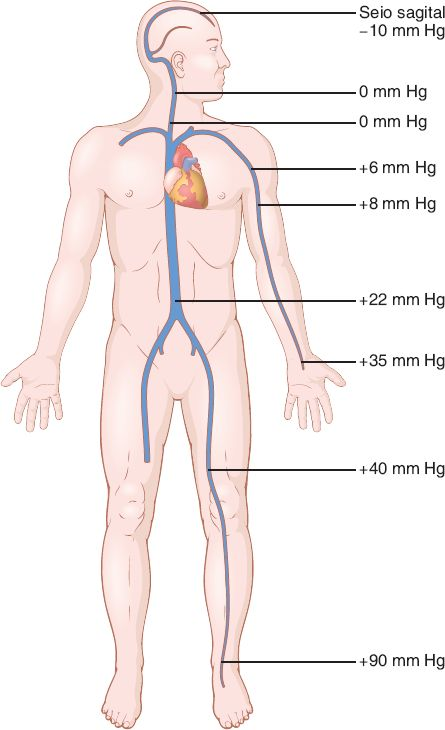 Efeito da gravidade sobre as pressões venosas (em pé, imóvel). <i>(Guyton & Hall, Fig. 15.10)</i>

- Pressão hidrostática: <b>+1 mmHg a cada 13,6 mm</b> abaixo do coração. Em pé e imóvel: pés <b>+90</b>; mão +35; pescoço 0 (colapsa); seio sagital <b>−10</b> (risco de <b>embolia gasosa</b> se aberto). Artérias: PAM 100 no coração → ≈ 190 nos pés.
- <b>Bomba venosa (muscular)</b> + <b>válvulas</b>: caminhando, pressão nos pés <b>&lt; +20 mmHg</b>. Imóvel, chega a 90 em ≈ 30 s; perde-se <b>10 a 20% do volume</b> em 15 a 30 min (desmaio do soldado em posição de sentido).
- <b>Varizes</b>: distensão crônica → válvulas incompetentes → falha da bomba → edema, úlcera. Tratamento: elevar as pernas, meia de compressão.
- <b>Nível de referência</b> das pressões: <b>valva tricúspide</b> (efeito gravitacional ≤ 1 a 2 mmHg); deitado, ≈ 60% da espessura do tórax a partir do dorso.
- <b>Reservatórios</b>: veias (&gt; 60% do sangue; circulação quase normal com até 20% de perda), baço (até 100 mℓ; até 50 mℓ de hemácias, Ht +1 a 2%), fígado (centenas de mℓ), veias abdominais (≈ 300 mℓ), plexo subcutâneo, coração (50 a 100 mℓ) e pulmões (100 a 200 mℓ).

## Valores para decorar

| Item | Valor |
|---|---|
| Distribuição do volume: veias · artérias · coração · pulmão | 64% · 13% · 7% · 9% |
| Pressão aórtica · média | 120/80 · ≈ 100 mmHg |
| Pressão capilar sistêmica | 35 → 10 mmHg (funcional ≈ 17) |
| Pressão na artéria pulmonar · capilar pulmonar | 25/8 (média 16) · ≈ 7 mmHg |
| Pressão no átrio direito (PVC) | ≈ 0 mmHg |
| Velocidade na aorta · capilares | ≈ 33 cm/s · ≈ 0,3 mm/s |
| Resistência periférica total · pulmonar | ≈ 1 URP · ≈ 0,14 URP |
| Viscosidade do sangue (água = 1) | 3 a 4 (hematócrito ≈ 40) |
| Pressão de pulso | ≈ 40 mmHg |
| PAM (estimativa clínica) | PAD + PP/3 |
| Pressão hidrostática | 1 mmHg a cada 13,6 mm de sangue |
| Pressão nas veias do pé em pé, imóvel | +90 mmHg |
| Número de Reynolds para turbulência | > 200 a 400 nos ramos; > 2.000 em vaso reto |

## Glossário

- **Condutância**: Inverso da resistência; proporcional à 4ª potência do raio.
- **Complacência (capacitância)**: Volume acumulado por mmHg de aumento de pressão (ΔV/ΔP).
- **Distensibilidade**: Aumento fracional do volume por mmHg (ΔV / ΔP × V inicial).
- **Complacência tardia**: Estresse-relaxamento: depois de um aumento de volume, a pressão cai lentamente em minutos a horas.
- **Pressão crítica de fechamento**: Pressão abaixo da qual um vaso colapsa e o fluxo para (≈ 20 mmHg).
- **Fluxo laminar**: Camadas concêntricas com perfil parabólico; silencioso.
- **Sons de Korotkoff**: Sons do fluxo turbulento sob o manguito; 1º som = sistólica, desaparecimento = diastólica.
- **Lei de Laplace**: T = P × r; vasos maiores suportam mais tensão na parede.

## Correlações clínicas

- **Arteriosclerose**: Artérias rígidas: pressão de pulso alta e sistólica alta no idoso.
- **Estenose aórtica**: Pressão de pulso pequena e pulso fraco, porque pouco sangue passa pela valva estreitada.
- **Insuficiência aórtica e persistência do canal arterial**: Diastólica cai muito e a pressão de pulso aumenta.
- **Varizes**: Válvulas venosas incompetentes anulam a bomba muscular: edema e úlcera nas pernas.
- **Policitemia e anemia**: Hematócrito 60 a 70 aumenta a viscosidade até 10×; na anemia, viscosidade baixa ajuda a aumentar o débito.

## Onde ler na fonte

| Fonte | O que ler |
|---|---|
| Guyton cap. 14 | Volumes (Fig. 14.1), pressões (Fig. 14.2), Poiseuille (Fig. 14.8), fluxo laminar (Fig. 14.6), viscosidade (Fig. 14.11). |
| Guyton cap. 15 | Complacência (Fig. 15.1), pulso arterial (Figs. 15.3 e 15.4), Korotkoff (Fig. 15.7), gravidade e veias (Fig. 15.10). |

---
Figuras reproduzidas das fontes indicadas, para estudo pessoal. Repositório privado.
