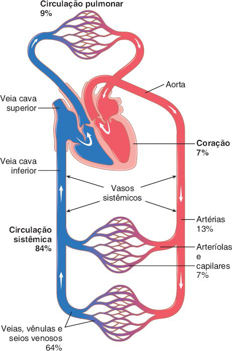
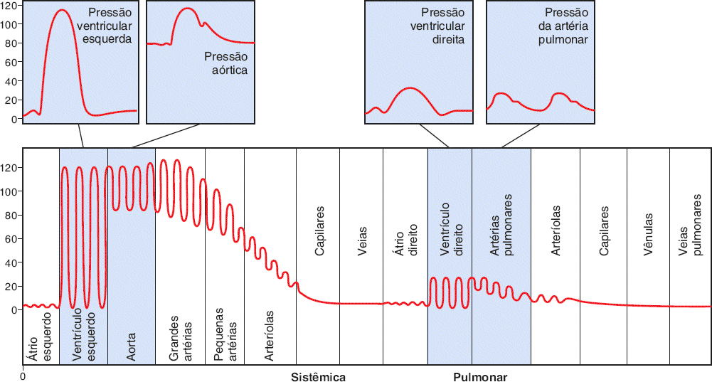
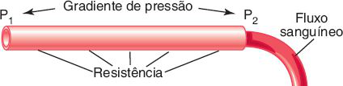
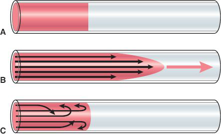
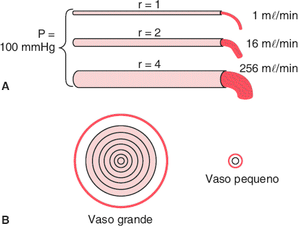
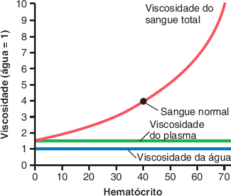
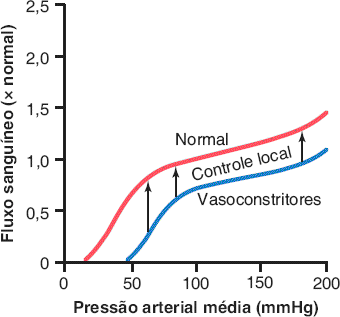
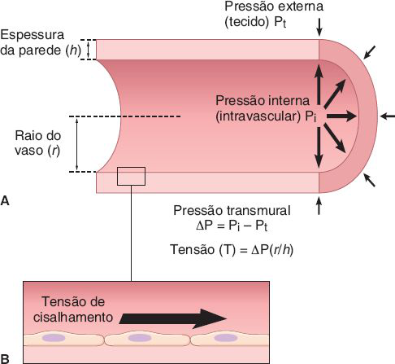

# Tema D · Biofísica da circulação

**Área:** Fisiologia · **Resumão:** [resumao.pdf](resumao.pdf) (9 páginas) · **Anki:** [flashcards.apkg](flashcards.apkg) (46 cartões)

**Fontes:** Guyton & Hall, 14ª ed., cap. 14 (PDF p. 535–568)

[← voltar ao índice](../../README.md)

## O essencial

- **Lei de Ohm da circulação:** fluxo = **ΔP / R**. Quem move o sangue é a **diferença** de pressão entre as pontas do vaso, não a pressão absoluta.
- **Poiseuille:** o fluxo é proporcional à **4ª potência do raio**. Dobrar o raio multiplica o fluxo por 16. Por isso as **arteríolas** (≈ 2/3 da resistência sistêmica) controlam o fluxo.
- **Velocidade = fluxo / área.** A área total dos capilares é a maior (≈ 2.500 cm²), então o sangue é **mais lento nos capilares** (≈ 0,3 mm/s) e mais rápido na aorta (≈ 33 cm/s).
- **Volume:** ≈ **64% do sangue está nas veias** (reservatório). Só ≈ 7% está em arteríolas e capilares.
- **Resistências:** em **série** somam; em **paralelo** a total é **menor** que a de qualquer ramo. RPT ≈ **1 URP**; pulmonar ≈ **0,14 URP**.
- **Viscosidade** depende do **hematócrito**: sangue normal ≈ 3–4 vezes a água; policitemia até 10 vezes.
- **Autorregulação:** entre ≈ **70 e 175 mmHg** de pressão média, o fluxo do tecido fica quase constante.

## Valores para decorar

| Parâmetro | Valor | Observação |
|---|---|---|
| Débito cardíaco (repouso) | ≈ 5.000 mL/min | ≈ 100 mL/s |
| Sangue nas veias sistêmicas | ≈ 64% | Artérias 13% · arteríolas+capilares 7% |
| Sangue no coração / pulmões | 7% / 9% | Sistêmica 84% |
| Área total dos capilares | ≈ 2.500 cm² | Aorta 2,5 cm² |
| Velocidade na aorta | ≈ 33 cm/s |  |
| Velocidade nos capilares | ≈ 0,3 mm/s | Trânsito de 1–3 s |
| Pressão média na aorta | ≈ 100 mmHg | 120/80 |
| Pressão capilar sistêmica | 35 → 10 mmHg | Funcional média ≈ 17 |
| Pressão capilar glomerular | ≈ 60 mmHg |  |
| Artéria pulmonar | 25/8 mmHg | Média ≈ 16 |
| Capilar pulmonar | ≈ 7 mmHg |  |
| Resistência periférica total | ≈ 1 URP | 0,2 a 4 URP |
| Resistência pulmonar total | ≈ 0,14 URP | ≈ 1/7 da sistêmica |
| Resistência das arteríolas | ≈ 2/3 da sistêmica | Diâmetro 4–25 µm |
| Reynolds com turbulência | 200–400 em ramos | > 2.000 em vaso reto |
| 1 mmHg | 1,36 cmH₂O |  |
| Hematócrito | ♂ ≈ 42 · ♀ ≈ 38 |  |
| Viscosidade do sangue | 3–4 × a água | Policitemia até 10 ×; plasma 1,5 × |
| Faixa de autorregulação | ≈ 70–175 mmHg | Pressão arterial média |

## Figuras-chave

**Guyton & Hall, Fig. 14.1** — Distribuição do sangue (em porcentagem do sangue total) nas diferentes partes do sistema circulatório.

**Guyton & Hall, Fig. 14.2** — Pressão arterial normal (em mmHg) nas diferentes partes do sistema circulatório quando a pessoa está na posição horizontal (posição supina).

**Guyton & Hall, Fig. 14.3** — Inter-relações de pressão, resistência e fluxo sanguíneo. P1: pressão na origem do vaso; P2: pressão na outra extremidade do vaso.

**Guyton & Hall, Fig. 14.6** — A. Dois líquidos (um tingido de vermelho e outro transparente) antes do início do fluxo. B. Os mesmos líquidos 1 segundo após o início do fluxo. C. Fluxo turbulento, com elementos do líquido movendo-se em um padrão desordenado.

**Guyton & Hall, Fig. 14.8** — A. Demonstração do efeito do diâmetro do vaso sobre o fluxo sanguíneo. B. Anéis concêntricos de sangue fluindo em velocidades diferentes; quanto mais longe da parede do vaso, mais rápido o fluxo. r: raio; P: diferença de pressão entre as duas extremidades dos vasos.

**Guyton & Hall, Fig. 14.11** — Efeito do hematócrito sobre a viscosidade do sangue (viscosidade da água = 1).

**Guyton & Hall, Fig. 14.12** — Efeito de alterações da pressão arterial durante um período de vários minutos no fluxo sanguíneo de um tecido, como o músculo esquelético. Observe que, entre os valores de pressão de 70 e 175 mmHg, o fluxo sanguíneo é autorregulado. A linha azul mostra o efeito da estimulação do nervo simpático ou da vasoconstrição por hormônios como noradrenalina, angiotensina II, vasopressina ou endotelina nessa relação. A redução do fluxo sanguíneo tecidual raramente é mantida por mais do que algumas horas em virtude da ativação de mecanismos autorregulatórios locais que eventualmente fazem o fluxo sanguíneo voltar ao normal.

**Guyton & Hall, Fig. 14.14** — Ilustração dos efeitos da tensão na parede do vaso e da tensão de cisalhamento sobre os vasos sanguíneos. A tensão na parede desenvolve-se em resposta a gradientes de pressão transmural e provoca o estiramento das células endoteliais e das células da musculatura lisa vascular em todas as direções. Tensão de cisalhamento é a força de atrito ou resistência nas células endoteliais causada pelo fluxo sanguíneo. A tensão de cisalhamento resulta na deformação unidirecional das células endoteliais.

## Glossário

| Termo | Significado |
|---|---|
| **Fluxo sanguíneo** | Volume que passa por um ponto em um tempo (mL/min). |
| **Resistência vascular** | Dificuldade ao fluxo, calculada por ΔP / F. |
| **URP** | Unidade de resistência periférica: 1 mmHg para 1 mL/s. |
| **Condutância** | Inverso da resistência: fluxo por unidade de ΔP. |
| **Fluxo laminar** | Fluxo em camadas concêntricas, com perfil parabólico de velocidade. |
| **Fluxo turbulento** | Fluxo desordenado, com redemoinhos e resistência maior. |
| **Número de Reynolds** | Índice da tendência à turbulência (v · d · ρ / η). |
| **Hematócrito** | Porcentagem do sangue ocupada por hemácias. |
| **Viscosidade** | Atrito interno do líquido; no sangue, depende sobretudo das hemácias. |
| **Autorregulação** | Manutenção do fluxo de um tecido apesar de mudanças da pressão (≈ 70–175 mmHg). |
| **Pressão crítica de fechamento** | Pressão abaixo da qual um vaso colapsa e o fluxo para. |
| **Pressão transmural** | Pressão de dentro menos a de fora do vaso. |
| **Tensão de cisalhamento** | Atrito do sangue sobre o endotélio. |

## Correlações clínicas

- **Sopros.** **Estenose** (vaso ou valva estreitada) aumenta a velocidade e cria **fluxo turbulento**, que vibra e é ouvido como **sopro**. A aorta proximal já tem certa turbulência na ejeção rápida.
- **Policitemia e anemia.** Na **policitemia** (hematócrito 60–70) a viscosidade chega a 10 vezes a da água e o fluxo cai muito. Na **anemia** a viscosidade cai e a resistência periférica diminui.
- **Vasodilatadores e arteríolas.** Como o fluxo depende de **r⁴**, pequenas dilatações das arteríolas aumentam muito o fluxo e baixam a resistência periférica total: é o alvo dos anti-hipertensivos vasodilatadores.
- **Aneurisma.** Pela **lei de Laplace**, quanto maior o raio, maior a tensão na parede: o aneurisma tende a crescer cada vez mais e a romper.

## Pegadinhas de prova

- O fluxo depende da **diferença** de pressão (ΔP), não da pressão absoluta. Pressão igual nas duas pontas = fluxo zero.
- A **maior** área de seção transversal é a dos **capilares**, por isso eles têm a **menor** velocidade, não a maior.
- A maior parte do sangue está nas **veias** (≈ 64%), não nas artérias.
- A **maior resistência** está nas **arteríolas**, não nos capilares: cada capilar é estreito, mas eles estão em paralelo e são muitos.
- Em **paralelo**, somar ramos **diminui** a resistência total. Retirar um rim ou amputar um membro **aumenta** a resistência periférica total.
- Fluxo ∝ **r⁴**: dobrar o raio aumenta o fluxo **16 vezes**, não 2 nem 4.
- **Turbulência** aumenta com velocidade, diâmetro e densidade e **diminui** com a viscosidade.

## Onde ler nas fontes

| Livro | Onde | O que ler |
|---|---|---|
| Guyton & Hall | Cap. 14 · PDF p. 535–543 | Partes da circulação, volumes, áreas, velocidade e pressões (Fig. 14.1 e 14.2) |
| Guyton & Hall | Cap. 14 · PDF p. 543–550 | Lei de Ohm, fluxo, laminar e turbulento (Fig. 14.3 a 14.6) |
| Guyton & Hall | Cap. 14 · PDF p. 550–559 | Unidades, resistência, Poiseuille, série e paralelo (Fig. 14.8 e 14.9) |
| Guyton & Hall | Cap. 14 · PDF p. 559–568 | Hematócrito, viscosidade, autorregulação, Laplace (Fig. 14.10 a 14.14) |

---

*Figuras reproduzidas dos livros-texto para uso pessoal de estudo; o número de cada figura no livro está indicado na legenda.*
