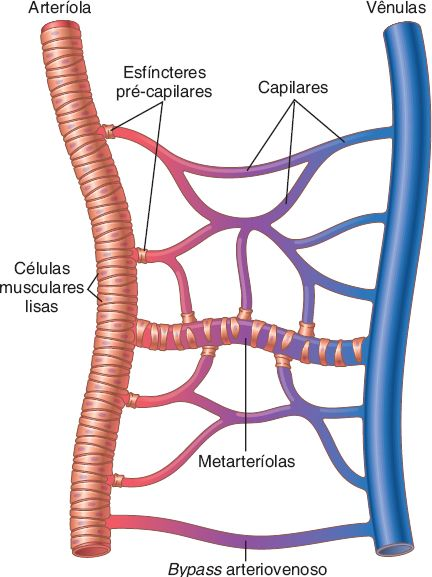
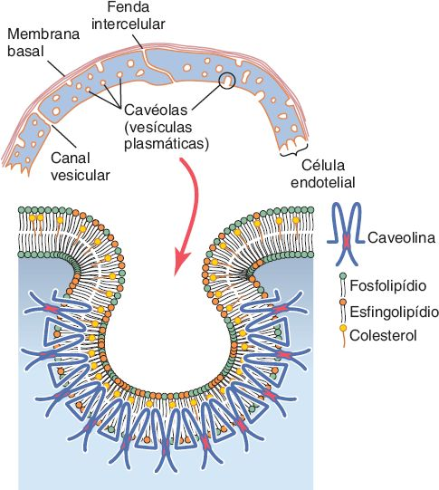
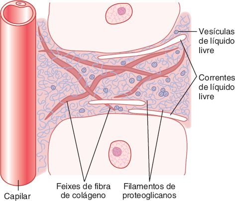
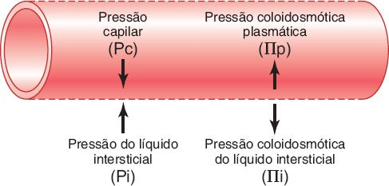
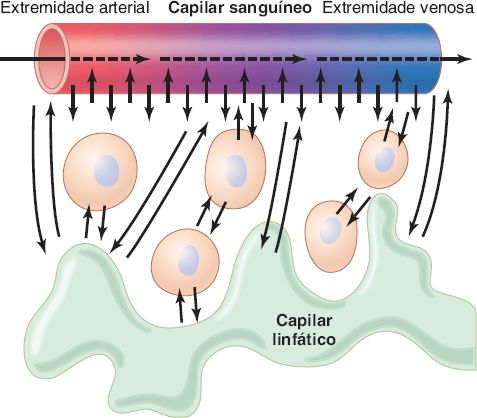
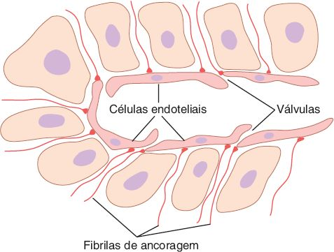
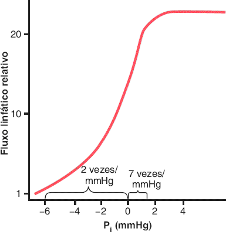
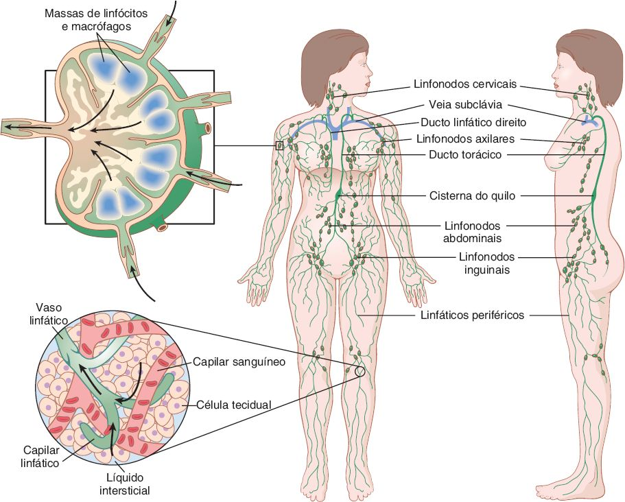

# E · Microcirculação e sistema linfático

Fonte: Guyton & Hall, Tratado de Fisiologia Médica, cap. 16.  
📄 [Resumão em PDF](resumao.pdf) · 🗂️ [Baralho do Anki](flashcards.apkg) (50 cartões, 10 de oclusão de imagem) · ⬅️ [Todos os temas](../../README.md)

## O essencial

1. A difusão é o principal meio de troca; lipossolúveis cruzam toda a membrana, hidrossolúveis passam pelas fendas intercelulares.
2. Forças de Starling: Pc e Πi empurram para fora; Πp puxa para dentro; Pi é negativa e também favorece a saída.
3. Quase todo o filtrado é reabsorvido; o pequeno excesso (≈ 2 mℓ/min) volta pela linfa.
4. Os linfáticos devolvem as proteínas ao sangue e mantêm a pressão intersticial negativa.

## Sumário

- [1. Estrutura da microcirculação](#1-estrutura-da-microcirculação)
- [2. Parede capilar e trocas por difusão](#2-parede-capilar-e-trocas-por-difusão)
- [3. Interstício](#3-interstício)
- [4. Forças de Starling e filtração](#4-forças-de-starling-e-filtração)
- [5. Sistema linfático](#5-sistema-linfático)
- [Valores para decorar](#valores-para-decorar)
- [Glossário](#glossário)
- [Correlações clínicas](#correlações-clínicas)
- [Onde ler na fonte](#onde-ler-na-fonte)

## 1. Estrutura da microcirculação

 Microcirculação: arteríola, metarteríolas, esfíncteres pré-capilares, capilares e vênulas. <i>(Guyton & Hall, Fig. 16.1)</i>

- Função: levar nutrientes e remover resíduos. ≈ <b>10 bilhões de capilares</b>, <b>500 a 700 m²</b> de superfície; quase nenhuma célula fica a mais de <b>20 a 30 µm</b> de um capilar.
- <b>Arteríolas</b> (10 a 15 µm): muito musculares, controlam o fluxo de cada tecido. <b>Metarteríolas</b>: músculo só em pontos intermitentes. <b>Esfíncter pré-capilar</b>: anel muscular na origem de cada capilar verdadeiro.
- <b>Vênulas</b>: maiores que as arteríolas e com músculo fraco, mas contraem bem porque a pressão nelas é baixa.
- Parede capilar: <b>1 camada de endotélio</b> + membrana basal, ≈ <b>0,5 µm</b>; luz de <b>4 a 9 µm</b> (a hemácia passa justa).

> 💡 **Vasomotricidade**
>
> O fluxo no capilar é <b>intermitente</b> (abre e fecha a cada segundos ou minutos) pela contração das metarteríolas e esfíncteres. O fator principal é o <b>O₂ tecidual</b>: com O₂ baixo, os períodos de fluxo ficam mais longos e mais frequentes. Como há bilhões de capilares, raciocinamos com os valores médios.

## 2. Parede capilar e trocas por difusão

 Parede capilar: fenda intercelular entre as células endoteliais e cavéolas (transcitose). <i>(Guyton & Hall, Fig. 16.2)</i>

- <b>Difusão</b> é o principal meio de troca entre plasma e interstício. Só as <b>proteínas</b> não passam com facilidade.
- <b>Lipossolúveis</b> (O₂, CO₂) atravessam a membrana do endotélio em toda a área: muito mais rápidos.
- <b>Hidrossolúveis</b> (água, Na⁺, Cl⁻, glicose) passam pelas <b>fendas intercelulares</b> de <b>6 a 7 nm</b> (≈ 1/1.000 da área). Mesmo assim, a água do plasma troca com o interstício <b>≈ 80×</b> enquanto o sangue percorre o capilar.
- <b>Cavéolas</b> (vesículas com caveolina): endocitose e <b>transcitose</b> de macromoléculas.
- A difusão efetiva é proporcional à <b>diferença de concentração</b>: O₂ sai para o tecido, CO₂ entra no sangue.

| Substância | Peso molecular | Permeabilidade relativa (músculo) |
|---|---|---|
| Água | 18 | <b>1,00</b> |
| NaCl · ureia | 58,5 · 60 | 0,96 · 0,8 |
| Glicose | 180 | 0,6 |
| Insulina | 5.000 | 0,2 |
| Hemoglobina | 68.000 | 0,01 |
| <b>Albumina</b> | 69.000 | <b>0,001</b> |

> 📌 **O que a prova cobra**
>
> - <b>Cérebro</b>: junções oclusivas (barreira hematoencefálica). <b>Fígado</b>: sinusoides, passam até proteínas. <b>Glomérulo</b>: fenestrações, permeabilidade à água ≈ 500× a do músculo, mas não às proteínas. <b>Intestino</b>: intermediário.
> - A albumina é um pouco maior que a fenda: por isso quase não sai e gera a pressão oncótica do plasma.

## 3. Interstício

 Interstício: feixes de colágeno e filamentos de proteoglicanos (gel); o líquido livre é raro. <i>(Guyton & Hall, Fig. 16.4)</i>

- ≈ <b>1/6</b> do volume corporal. Sólidos: <b>fibras de colágeno</b> (força) e <b>filamentos de proteoglicanos</b> (98% ácido hialurônico).
- O líquido fica preso entre os proteoglicanos como <b>gel tecidual</b>: move-se por <b>difusão</b> (95 a 99% da velocidade livre), não por fluxo.
- <b>Líquido livre</b>: normalmente <b>&lt; 1%</b>. No <b>edema</b>, a metade ou mais vira líquido livre.
- Composição igual à do plasma, mas com bem menos proteína (≈ 40% do plasma, ≈ 3 g/dℓ).

## 4. Forças de Starling e filtração

 As quatro forças de Starling que movem o líquido pela membrana capilar. <i>(Guyton & Hall, Fig. 16.5)</i>

> 📌 **Fórmulas**
>
> - <b>PEF = Pc − Pi − Πp + Πi</b> (Pi negativa soma para fora).
> - <b>Filtração = Kf × PEF</b>. Kf do corpo ≈ <b>6,67 mℓ/min por mmHg</b>; nos tecidos ≈ 0,01 mℓ/min/mmHg/100 g (pequeno no cérebro e músculo, enorme no fígado e glomérulo).

| Força | Valor | Detalhe |
|---|---|---|
| <b>Pc</b> (hidrostática capilar) | arterial <b>30</b> · venosa <b>10</b> · funcional <b>17</b> | Micropipeta: 30–40 → 10–15, meio ≈ 25. Glomérulo ≈ <b>60</b>; peritubular ≈ 13 |
| <b>Pi</b> (intersticial) | ≈ <b>−3</b> (subcutâneo) | Micropipeta −2; cápsula −6. Encapsulados positivos: cérebro +4 a +6, rim +6 |
| <b>Πp</b> (oncótica do plasma) | <b>28</b> | 19 da proteína + 9 do <b>efeito Donnan</b>; <b>albumina ≈ 80%</b> |
| <b>Πi</b> (oncótica intersticial) | <b>8</b> | Proteína intersticial ≈ 3 g/dℓ (40% da do plasma) |

| Balanço | Para fora | Para dentro | Resultado |
|---|---|---|---|
| Extremidade arterial | 30 + 3 + 8 = 41 | 28 | <b>13 para fora</b> (filtra ≈ 1/200 do plasma) |
| Extremidade venosa | 10 + 3 + 8 = 21 | 28 | <b>7 para dentro</b> (reabsorve 9/10) |
| Média (equilíbrio de Starling) | 17,3 + 3 + 8 = 28,3 | 28 | <b>0,3 para fora</b> → ≈ <b>2 mℓ/min</b> (vai para a linfa) |

- Por que 7 mmHg bastam para reabsorver? Os capilares venosos são <b>mais numerosos e mais permeáveis</b>.
- Se Pc sobe <b>20 mmHg</b>: PEF vai de 0,3 a 20,3 → filtração <b>68×</b> maior, 2 a 5× acima da capacidade dos linfáticos → <b>edema</b>. Se Pc cai muito: reabsorção efetiva, o volume sanguíneo sobe à custa do interstício.
- Cavidades com líquido livre também são negativas: <b>pleura −8</b>; sinovial e epidural −4 a −6 mmHg.

 O líquido filtrado no capilar volta quase todo ao sangue; o excesso vai para o linfático. <i>(Guyton & Hall, Fig. 16.3)</i>

## 5. Sistema linfático

 Capilar linfático: bordas das células endoteliais funcionam como válvulas; filamentos de ancoragem. <i>(Guyton & Hall, Fig. 16.7)</i>

- Via acessória do interstício para o sangue. Função vital: devolver as <b>proteínas</b> que escaparam (sem isso, morte em ≈ <b>24 h</b>). Também absorve as <b>gorduras</b> do intestino (linfa com 1 a 2% de gordura após refeição) e filtra bactérias nos linfonodos.
- Volume: ≈ <b>1/10 do filtrado</b>; ≈ <b>120 mℓ/h</b> (100 pelo ducto torácico), <b>2 a 3 ℓ/dia</b>.
- <b>Ducto torácico</b>: parte inferior do corpo + lado esquerdo da cabeça, braço E e tórax; desemboca na junção <b>jugular interna E + subclávia E</b>. <b>Ducto linfático direito</b>: lado direito da cabeça, pescoço, braço D e tórax D.
- Sem linfáticos: pele superficial, <b>SNC</b>, endomísio e ossos (têm <b>pré-linfáticos</b>; no cérebro drenam para o liquor).
- Proteína na linfa: tecidos ≈ 2 g/dℓ; <b>fígado 6</b>; intestino 3 a 4; ducto torácico 3 a 5 g/dℓ (2/3 da linfa vem do fígado e intestino).

 Fluxo linfático × pressão intersticial: sobe muito até Pi ≈ 0 e depois faz platô. <i>(Guyton & Hall, Fig. 16.8)</i>

- Aumentam o fluxo linfático: <b>↑ Pc</b>, <b>↓ Πp</b>, <b>↑ Πi</b>, <b>↑ permeabilidade</b> capilar (todos ↑ Pi).
- <b>Bomba linfática</b>: cada segmento entre válvulas se contrai quando é estirado; ducto torácico gera 50 a 100 mmHg. Bomba externa, em ordem: <b>contração muscular</b>, movimento, pulso arterial, compressão externa. Exercício: <b>10 a 30×</b>.
- O bombeamento linfático é a causa da <b>Pi negativa</b>, que mantém os tecidos unidos (vácuo parcial). Perdeu a Pi negativa → edema.

> 💡 **Ciclo proteína → linfa**
>
> Proteína escapa para o interstício → ↑ Πi → mais filtração → ↑ volume e Pi → ↑ fluxo linfático, que remove o excesso de líquido e proteína até um novo estado estacionário. O linfático controla a proteína, o volume e a pressão do interstício.

 Sistema linfático: ducto torácico, ducto linfático direito e linfonodos. <i>(Guyton & Hall, Fig. 16.6)</i>

## Valores para decorar

| Item | Valor |
|---|---|
| Número de capilares · área total | ≈ 10 bilhões · 500 a 700 m² |
| Fenda intercelular | 6 a 7 nm |
| Pressão capilar arterial · venosa · funcional | 30 · 10 · ≈ 17 mmHg |
| Pressão intersticial (subcutâneo) | ≈ −3 mmHg |
| Pressão oncótica do plasma | 28 mmHg (19 proteína + 9 efeito Donnan) |
| Pressão oncótica intersticial | 8 mmHg |
| Pressão efetiva média de filtração | ≈ 0,3 mmHg → ≈ 2 mℓ/min |
| Coeficiente de filtração do corpo | ≈ 6,67 mℓ/min/mmHg |
| Fluxo de linfa | ≈ 120 mℓ/h · 2 a 3 ℓ/dia |
| Proteína na linfa do fígado | ≈ 6 g/dℓ |

## Glossário

- **Metarteríola**: Ramo terminal da arteríola com músculo liso intermitente.
- **Esfíncter pré-capilar**: Anel de músculo liso na origem do capilar; abre e fecha o fluxo.
- **Vasomotricidade**: Abertura e fechamento intermitente dos capilares, regulada sobretudo pelo O₂.
- **Cavéolas**: Vesículas da membrana endotelial que fazem a transcitose de macromoléculas.
- **Gel tecidual**: Líquido intersticial preso entre os proteoglicanos.
- **Efeito Donnan**: Cátions retidos pelas proteínas negativas do plasma que somam pressão oncótica.
- **Filamentos de ancoragem**: Prendem o capilar linfático ao tecido e o abrem quando o interstício incha.
- **Bomba linfática**: Contração dos segmentos linfáticos entre válvulas, somada à compressão externa.

## Correlações clínicas

- **Insuficiência cardíaca**: ↑ Pressão venosa → ↑ Pc → filtração maior que a capacidade linfática → edema.
- **Cirrose e síndrome nefrótica**: ↓ Albumina → ↓ Πp → edema e ascite.
- **Queimadura e inflamação**: ↑ Permeabilidade capilar: proteína sai, ↑ Πi e edema.
- **Linfedema**: Obstrução linfática (filariose, câncer, retirada de linfonodos): proteína acumula no interstício.

## Onde ler na fonte

| Fonte | O que ler |
|---|---|
| Guyton cap. 16 | Microcirculação (Fig. 16.1), parede capilar (Fig. 16.2), interstício (Fig. 16.4), forças de Starling (Fig. 16.5), linfáticos (Figs. 16.6 a 16.8). |

---
Figuras reproduzidas das fontes indicadas, para estudo pessoal. Repositório privado.
