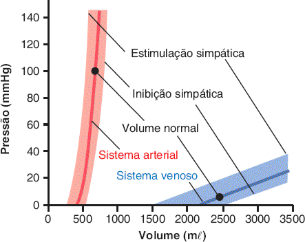
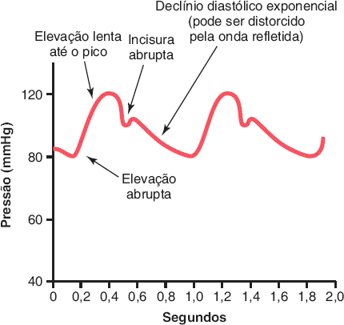
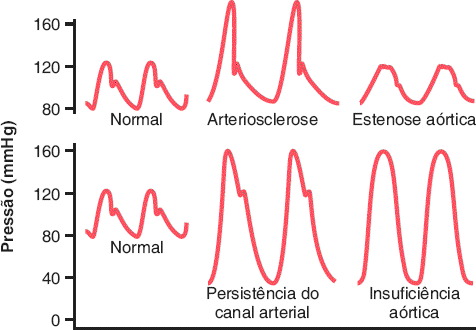
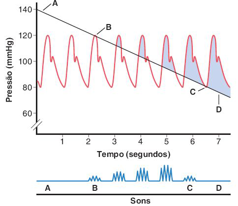
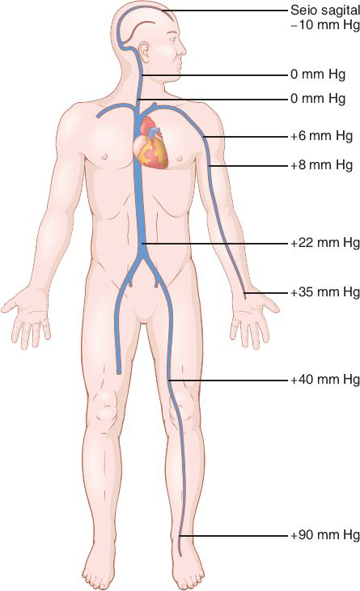
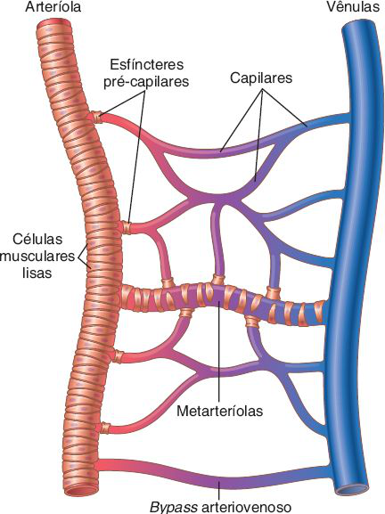
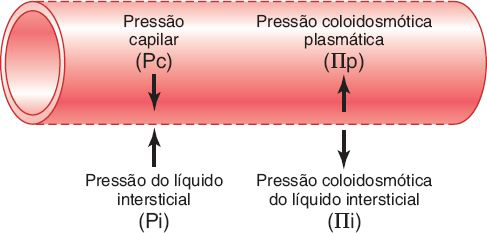
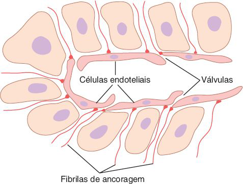

# Tema E · Vasos, pulso e microcirculação

**Área:** Fisiologia · **Resumão:** [resumao.pdf](resumao.pdf) (10 páginas) · **Anki:** [flashcards.apkg](flashcards.apkg) (62 cartões)

**Fontes:** Guyton & Hall, 14ª ed., cap. 15 (PDF p. 569–602) · Guyton & Hall, 14ª ed., cap. 16 (PDF p. 603–641)

[← voltar ao índice](../../README.md)

## O essencial

- **Veias:** ≈ **8 vezes mais distensíveis** e ≈ **24 vezes mais complacentes** que as artérias (8 × volume 3 vezes maior). Por isso são o **reservatório** de sangue.
- **Pressão de pulso** = sistólica − diastólica (≈ 40 mmHg) ≈ **volume sistólico ÷ complacência arterial**. Artéria rígida (idoso) aumenta a pressão de pulso.
- **PA média** ≈ **60% diastólica + 40% sistólica**: fica mais perto da diastólica.
- **Korotkoff:** o primeiro som marca a **sistólica**; o abafamento ou o desaparecimento, a **diastólica**.
- **Pressão venosa central** (átrio direito) ≈ **0 mmHg**. De pé e parado, a veia do pé chega a **+90 mmHg**; andando, a **bomba muscular** a mantém **< 20 mmHg**.
- **Starling:** filtração = Kf × (**Pc − Pi − πp + πi**). Na ponta arterial sai líquido (**+13**), na venosa volta (**−7**); no balanço sobram **0,3 mmHg** de filtração, que a **linfa** devolve.
- **Pressão oncótica do plasma ≈ 28 mmHg**, ≈ 80% dela pela **albumina**. Linfa ≈ **2–3 L/dia**.

## Valores para decorar

| Parâmetro | Valor | Observação |
|---|---|---|
| Distensibilidade: veia vs. artéria | ≈ 8 × |  |
| Complacência: veia vs. artéria | ≈ 24 × | 8 × 3 (volume) |
| Volume no sistema arterial | ≈ 700 mL | Venoso 2.000–3.500 mL |
| Pressão de pulso | ≈ 40 mmHg | 120 − 80 |
| PA média | ≈ 60% PAD + 40% PAS |  |
| Velocidade do pulso | Aorta 3–5 m/s | Pequenas artérias 15–35 m/s |
| Pressão venosa central | ≈ 0 mmHg | IC grave: 20–30 |
| Veias periféricas (deitado) | PVC + 4 a 6 mmHg |  |
| Veia do pé de pé e parado | ≈ +90 mmHg | Andando < 20 mmHg |
| Seio sagital (de pé) | ≈ −10 mmHg | Risco de embolia gasosa |
| Pressão abdominal | ≈ +6 mmHg | 15–30 na gestação, ascite |
| Jugulares distendidas | PAD ≥ +10 mmHg | Todas com +15 mmHg |
| Capilares | ≈ 10 bilhões | 500–700 m² |
| Fenda intercelular | 6–7 nm | Pouco menor que a albumina |
| Pc ponta arterial / venosa | 30 / 10 mmHg | Média funcional ≈ 17 |
| Pi (subcutâneo) | ≈ −3 mmHg | Pleura ≈ −8 |
| πp (oncótica do plasma) | ≈ 28 mmHg | 80% albumina |
| πi | ≈ 8 mmHg | Proteína ≈ 3 g/dL |
| PEF ponta arterial / venosa | +13 / −7 mmHg | Média +0,3 |
| Filtração efetiva (corpo) | ≈ 2 mL/min | Kf ≈ 6,67 mL/min/mmHg |
| Fluxo de linfa | ≈ 120 mL/h | 2–3 L/dia |

## Figuras-chave

**Guyton & Hall, Fig. 15.1** — Curvas de volume-pressão dos sistemas arterial e venoso sistêmico, mostrando os efeitos da estimulação ou inibição dos nervos simpáticos no sistema circulatório.

**Guyton & Hall, Fig. 15.3** — Curva do pulso de pressão na aorta ascendente.

**Guyton & Hall, Fig. 15.4** — Curvas de pressão de pulso aórtica na arteriosclerose, na estenose aórtica, na persistência do canal arterial e na insuficiência aórtica.

**Guyton & Hall, Fig. 15.7** — 

**Guyton & Hall, Fig. 15.10** — Efeito da pressão gravitacional sobre as pressões venosas em todo o corpo na pessoa em pé.

**Guyton & Hall, Fig. 16.1** — Componentes da microcirculação.

**Guyton & Hall, Fig. 16.5** — A pressão do líquido e as forças de pressão coloidosmótica operam na membrana capilar e tendem a mover o líquido para fora ou para dentro através dos poros da membrana.

**Guyton & Hall, Fig. 16.7** — Estrutura especial dos capilares linfáticos, que permite a passagem de substâncias de alto peso molecular para a linfa.

## Glossário

| Termo | Significado |
|---|---|
| **Distensibilidade** | Aumento de volume por mmHg em relação ao volume original. |
| **Complacência** | Aumento de volume por mmHg (distensibilidade × volume). |
| **Complacência tardia** | Queda lenta da pressão após aumento de volume, pelo alongamento do músculo liso. |
| **Pressão de pulso** | Sistólica menos diastólica. |
| **Incisura** | Entalhe no pulso aórtico pelo fechamento da valva aórtica. |
| **Sons de Korotkoff** | Sons do jato turbulento sob o manguito, entre a sistólica e a diastólica. |
| **Pressão venosa central** | Pressão no átrio direito. |
| **Bomba venosa** | Compressão das veias pelos músculos, com válvulas que só deixam o sangue subir. |
| **Metarteríola** | Arteríola terminal com músculo liso descontínuo. |
| **Esfíncter pré-capilar** | Anel muscular na entrada do capilar. |
| **Vasomotricidade** | Contração intermitente de metarteríolas e esfíncteres. |
| **Pressão coloidosmótica** | Pressão osmótica das proteínas (oncótica). |
| **Kf** | Coeficiente de filtração capilar. |
| **Efeito Donnan** | Cátions retidos pelas proteínas, que somam ≈ 9 mmHg à pressão oncótica. |

## Correlações clínicas

- **Pulso e valvopatias.** **Estenose aórtica:** pulso de amplitude pequena. **Insuficiência aórtica:** pressão de pulso enorme, diastólica muito baixa, sem incisura. **Canal arterial:** diastólica baixa.
- **Hipertensão sistólica do idoso.** A rigidez arterial reduz a complacência: a **sistólica e a pressão de pulso sobem**, mesmo com diastólica normal ou baixa.
- **Turgência jugular.** Veias do pescoço distendidas com o paciente sentado indicam **pressão venosa central elevada** (≥ 10 mmHg), como na insuficiência cardíaca direita.
- **Varizes e edema.** Válvulas incompetentes impedem a bomba muscular; a pressão venosa e capilar sobe e surge **edema** de membros inferiores. Tratar com elevação e meias de compressão.
- **Edema pelas forças de Starling.** Edema surge com **Pc alta** (insuficiência cardíaca), **πp baixa** (hipoalbuminemia: cirrose, síndrome nefrótica, desnutrição), **mais permeabilidade** (inflamação) ou **bloqueio linfático**.

## Pegadinhas de prova

- **Complacência ≠ distensibilidade:** complacência = distensibilidade × volume. A veia é 8 × mais distensível, mas 24 × mais complacente.
- A **PA média** fica mais perto da **diastólica**, não é (PAS + PAD) / 2.
- Quanto **mais complacente** o vaso, **mais lenta** a transmissão do pulso. O pulso viaja muito mais rápido que o sangue.
- No aparelho **oscilométrico**, a oscilação máxima é a **PA média**, não a sistólica.
- **Pi normal é negativa** (≈ −3 mmHg) no subcutâneo, por causa da bomba linfática.
- **πi** puxa líquido para **fora** do capilar; **πp** puxa para **dentro**.
- A pressão oncótica depende do **número** de moléculas: por isso a **albumina** (menor e mais abundante) gera ≈ 80% dela.
- Só **1/10** do filtrado vai para a linfa; 9/10 voltam na ponta venosa.

## Onde ler nas fontes

| Livro | Onde | O que ler |
|---|---|---|
| Guyton & Hall | Cap. 15 · PDF p. 569–580 | Distensibilidade, complacência, pulso e pulsos anormais (Fig. 15.1 a 15.6) |
| Guyton & Hall | Cap. 15 · PDF p. 580–587 | Medida da PA, PA média e idade (Fig. 15.7 e 15.8) |
| Guyton & Hall | Cap. 15 · PDF p. 587–601 | Veias, PVC, gravidade, bomba venosa, reservatórios (Fig. 15.9 a 15.13) |
| Guyton & Hall | Cap. 16 · PDF p. 603–616 | Microcirculação, parede capilar, difusão, interstício (Fig. 16.1 a 16.4) |
| Guyton & Hall | Cap. 16 · PDF p. 616–629 | Forças de Starling e seus valores (Fig. 16.5) |
| Guyton & Hall | Cap. 16 · PDF p. 629–639 | Sistema linfático (Fig. 16.6 a 16.9) |

---

*Figuras reproduzidas dos livros-texto para uso pessoal de estudo; o número de cada figura no livro está indicado na legenda.*
