# F · Controle local, humoral e nervoso da circulação

Fonte: Guyton & Hall, Tratado de Fisiologia Médica, caps. 17 e 18.  
📄 [Resumão em PDF](resumao.pdf) · 🗂️ [Baralho do Anki](flashcards.apkg) (70 cartões, 18 de oclusão de imagem) · ⬅️ [Todos os temas](../../README.md)

## O essencial

1. Cada tecido controla o próprio fluxo pelo metabolismo (adenosina, CO₂, K⁺, H⁺, falta de O₂).
2. Autorregulação: de 70 a 175 mmHg o fluxo muda pouco (mecanismos metabólico e miogênico).
3. NO: cisalhamento → eNOS → guanilato ciclase solúvel → GMPc → relaxamento.
4. Barorreflexo: controle rápido da PA (seio carotídeo → IX; arco aórtico → X; ambos ao NTS), mas se reajusta em 1 a 2 dias.
5. Resposta isquêmica do SNC (PA < 60) é o último recurso; a reação de Cushing é sua forma clínica.

## Sumário

- [1. Cada tecido controla o próprio fluxo](#1-cada-tecido-controla-o-próprio-fluxo)
- [2. Controle agudo: metabolismo e autorregulação](#2-controle-agudo-metabolismo-e-autorregulação)
- [3. Endotélio: óxido nítrico e endotelina](#3-endotélio-óxido-nítrico-e-endotelina)
- [4. Controle de longo prazo e remodelagem](#4-controle-de-longo-prazo-e-remodelagem)
- [5. Controle humoral](#5-controle-humoral)
- [6. Controle nervoso: o centro vasomotor](#6-controle-nervoso-o-centro-vasomotor)
- [7. Reflexos que mantêm a PA](#7-reflexos-que-mantêm-a-pa)
- [Valores para decorar](#valores-para-decorar)
- [Glossário](#glossário)
- [Correlações clínicas](#correlações-clínicas)
- [Onde ler na fonte](#onde-ler-na-fonte)

## 1. Cada tecido controla o próprio fluxo

| Órgão (repouso) | % do DC | mℓ/min | mℓ/min/100 g |
|---|---|---|---|
| <b>Fígado</b> (portal 21% + arterial 6%) | <b>27</b> | 1.350 | 95 |
| <b>Rins</b> | <b>22</b> | 1.100 | <b>360</b> |
| Músculo (inativo) | 15 | 750 | <b>4</b> |
| Cérebro | 14 | 700 | 50 |
| Coração | 4 | 200 | 70 |
| Pele (frio) · ossos | 6 · 5 | 300 · 250 | 3 · 3 |
| Tireoide · adrenais | 1 · 0,5 | 50 · 25 | 160 · 300 |

- O fluxo de cada tecido é mantido no <b>mínimo suficiente</b> para suas necessidades (O₂, nutrientes, remoção de CO₂ e H⁺). Fluxo alto para todos exigiria mais do que o coração bombeia.
- Músculo: 30 a 40% da massa corporal, mas só ≈ 4 mℓ/min/100 g em repouso; no exercício o metabolismo sobe <b>60×</b> e o fluxo <b>20×</b>.
- Dois tempos: <b>agudo</b> (segundos a minutos, diâmetro de arteríolas, metarteríolas e esfíncteres) e <b>longo prazo</b> (dias a meses, número e tamanho dos vasos).

## 2. Controle agudo: metabolismo e autorregulação

- Metabolismo 8× → fluxo agudo ≈ 4×. <b>Falta de O₂</b> (altitude, pneumonia, CO, cianeto) aumenta muito o fluxo: saturação a 25% → fluxo 3×; cianeto → até 7×.
- <b>Teoria vasodilatadora</b>: tecido ativo ou com pouco O₂ libera <b>adenosina</b> (a principal no coração), CO₂, compostos de fosfato, histamina, <b>K⁺</b>, <b>H⁺</b> e lactato, que dilatam arteríolas, metarteríolas e esfíncteres.
- <b>Teoria da demanda de O₂</b>: o músculo liso precisa de O₂ para contrair; com pouco O₂ relaxa. Explica a <b>vasomoção</b> (esfíncteres totalmente abertos ou fechados). Provavelmente as duas atuam juntas.
- Deficiência de <b>tiamina (beribéri)</b>, riboflavina ou niacina: vasodilatação e fluxo periférico 2 a 3×.

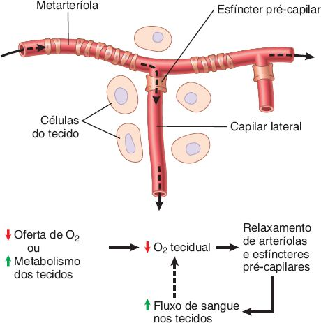 Teoria da demanda de O₂: pouco O₂ relaxa metarteríolas e esfíncteres pré-capilares. <i>(Guyton & Hall, Fig. 17.3)</i>

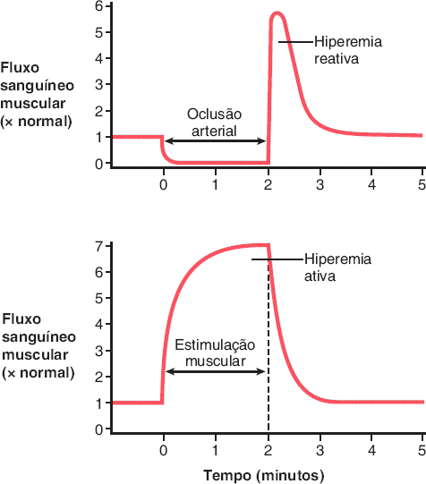 Hiperemia reativa (após oclusão) e hiperemia ativa (após exercício). <i>(Guyton & Hall, Fig. 17.4)</i>

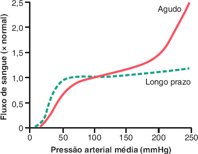 Autorregulação: aguda (vermelho) e de longo prazo (tracejado verde). <i>(Guyton & Hall, Fig. 17.5)</i>

- <b>Autorregulação</b>: a pressão sobe, o fluxo sobe e em &lt; 1 minuto volta quase ao normal. Entre <b>70 e 175 mmHg</b> o fluxo muda só <b>20 a 30%</b> (cérebro e coração, ainda menos).
- <b>Metabólica</b>: excesso de fluxo traz O₂ e lava os vasodilatadores → constrição. <b>Miogênica</b>: estiramento despolariza o músculo liso → entra Ca²⁺ → contração (sem nervo nem hormônio; mais forte nas arteríolas). No exercício, o metabólico prevalece.

| Órgão | Mecanismo especial |
|---|---|
| <b>Rim</b> | <b>Feedback tubuloglomerular</b>: a <b>mácula densa</b> sente o líquido do túbulo distal e contrai a arteríola aferente |
| <b>Cérebro</b> | <b>CO₂ e H⁺</b> ↑ dilatam fortemente (excitabilidade depende deles), além do O₂ |
| <b>Pele</b> | Temperatura, via <b>simpático</b>: 3 mℓ/min/100 g no frio até <b>7 a 8 ℓ/min</b> no corpo todo no calor |

## 3. Endotélio: óxido nítrico e endotelina

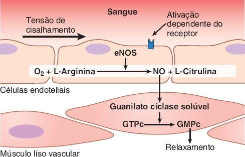 Cisalhamento → eNOS → NO → guanilato ciclase solúvel → GMPc → relaxamento. <i>(Guyton & Hall, Fig. 17.6)</i>

- <b>NO</b>: eNOS (arginina + O₂) → NO (gás, meia-vida ≈ 6 s) → <b>guanilato ciclase solúvel</b> → <b>GMPc</b> → PKG → relaxamento.
- Estímulo principal: <b>tensão de cisalhamento</b> do fluxo. Quando a microcirculação dilata, o fluxo maior libera NO nas artérias proximais, que também dilatam. Angiotensina II também libera NO (freio contra constrição excessiva).
- Endotélio lesado (hipertensão, aterosclerose) produz menos NO → mais constrição e mais lesão.
- <b>Nitratos</b> liberam NO (angina). <b>Sildenafila</b> inibe a <b>PDE-5</b>, que degrada o GMPc (disfunção erétil).
- <b>Endotelina</b>: peptídeo de 27 aminoácidos, constrição potente em nanogramas; liberada pelo <b>endotélio lesado</b> (evita sangramento em artérias até 5 mm). Bloqueadores: hipertensão pulmonar.

## 4. Controle de longo prazo e remodelagem

- O controle agudo corrige só <b>≈ 3/4</b>: PA 100 → 150 faz o fluxo subir 100% e voltar a <b>10 a 15% acima</b> em 30 s a 2 min. Em semanas, volta ao normal (plano de 50 a 200 mmHg).
- <b>Angiogênese</b>: hipóxia → <b>HIF</b> → <b>VEGF</b>, FGF, PDGF, angiogenina. Brotamento: dissolve a membrana basal, células endoteliais crescem em cordão, formam tubo e alça. Rápida no jovem e no tumor, lenta no idoso.
- Antiangiogênicos naturais: <b>angiostatina</b> (do plasminogênio) e <b>endostatina</b>. Esteroides podem sumir com vasos.
- A vascularização segue a necessidade <b>máxima</b>, não a média. <b>Retinopatia da prematuridade</b>: O₂ alto para o crescimento de vasos; ao retirar, crescimento explosivo para o vítreo.
- <b>Colaterais</b>: dilatação metabólica em 1 a 2 min (&lt; 1/4 da necessidade), metade em 1 dia, suficiente em poucos dias; crescem por meses (muitos canais pequenos). Explicam coronárias ocluídas sem infarto.

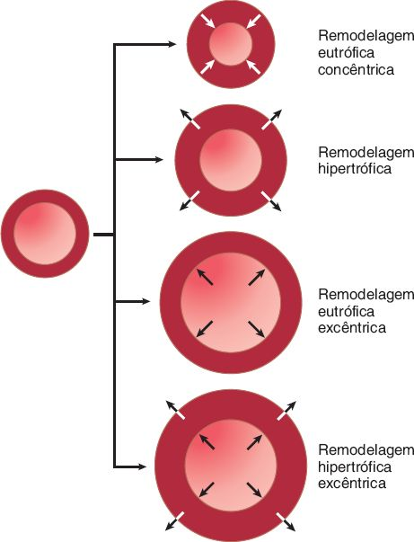 Tipos de remodelagem vascular. <i>(Guyton & Hall, Fig. 17.8)</i>

## 5. Controle humoral

| Substância | Efeito | Detalhe que cai |
|---|---|---|
| <b>Noradrenalina</b> | Constritor potente | Terminais simpáticos e adrenal (receptores α) |
| <b>Adrenalina</b> | Constritor menor; dilata em alguns leitos | Dilata coronárias e músculo (β) |
| <b>Angiotensina II</b> | Constrição forte das pequenas arteríolas | 1 µg pode ↑ PA ≥ 50 mmHg; ↑ RPT e ↓ excreção de Na⁺ e água |
| <b>Vasopressina (ADH)</b> | Constritor <b>mais potente que a Ang II</b> | Hipotálamo → neuro-hipófise; importante na hemorragia grave; função principal: reabsorver água |
| <b>Bradicinina</b> | Dilatação arteriolar + ↑ permeabilidade | Calicreína → calidina → bradicinina; inativada pela ECA; 1 µg ↑ fluxo do braço 6× |
| <b>Histamina</b> | Dilatação + ↑ permeabilidade (edema) | Mastócitos e basófilos; alergia e inflamação |

- Íons: <b>↑ Ca²⁺</b> intracelular contrai; <b>↑ K⁺</b>, <b>↑ Mg²⁺</b>, <b>↑ H⁺</b> (↓ pH), acetato e citrato dilatam. <b>CO₂</b> dilata pouco nos tecidos e muito no cérebro, mas no centro vasomotor causa <b>constrição generalizada</b>.
- Vasoativos crônicos mudam pouco o fluxo a longo prazo se não mudarem o metabolismo: a autorregulação vence.

## 6. Controle nervoso: o centro vasomotor

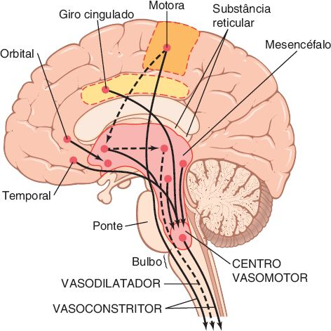 Áreas do encéfalo que controlam a circulação; o centro vasomotor fica no bulbo e na ponte. <i>(Guyton & Hall, Fig. 18.3)</i>

- Simpático: fibras de T1 a L1-L2 → cadeia simpática → nervos viscerais e nervos espinhais. Inerva <b>todos os vasos exceto capilares</b>. Arteríolas: ↑ resistência. Veias: ↓ volume, empurram sangue ao coração. Coração: ↑ FC e força.
- Constrição simpática forte em <b>rins, intestino, baço e pele</b>; fraca em músculo, coração e cérebro.
- Parassimpático (vago): papel vascular pequeno; efeito principal é <b>↓ FC</b> (e leve ↓ contratilidade).
- <b>Tônus vasoconstritor</b>: disparo contínuo de <b>0,5 a 2 impulsos/s</b>. Raquianestesia total: PA cai de <b>100 para 50 mmHg</b>.
- Noradrenalina age em <b>receptores α</b>. Medula adrenal libera adrenalina e noradrenalina ao mesmo tempo (sistema duplo).
- <b>Síncope vasovagal</b>: emoção → hipotálamo anterior → vasodilatação muscular + vago forte (FC ↓) → PA ↓ → desmaio.

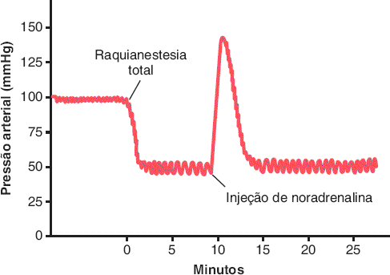 Raquianestesia total: perda do tônus simpático, PA 100 → 50 mmHg; noradrenalina a restaura. <i>(Guyton & Hall, Fig. 18.4)</i>

> 📌 **O controle nervoso é o mais rápido**
>
> - Três ações simultâneas: <b>arteríolas contraem</b> (↑ RPT), <b>veias contraem</b> (↑ retorno), <b>coração estimulado</b> (FC até 3×, DC até 2×).
> - Dobra a PA em <b>5 a 10 s</b>; a inibição súbita a reduz à metade em 10 a 40 s.
> - Exercício: PA ↑ 30 a 40% (ativação reticular junto do córtex motor). <b>Reação de alarme</b>: PA ↑ 75 a 100 mmHg em segundos.

## 7. Reflexos que mantêm a PA

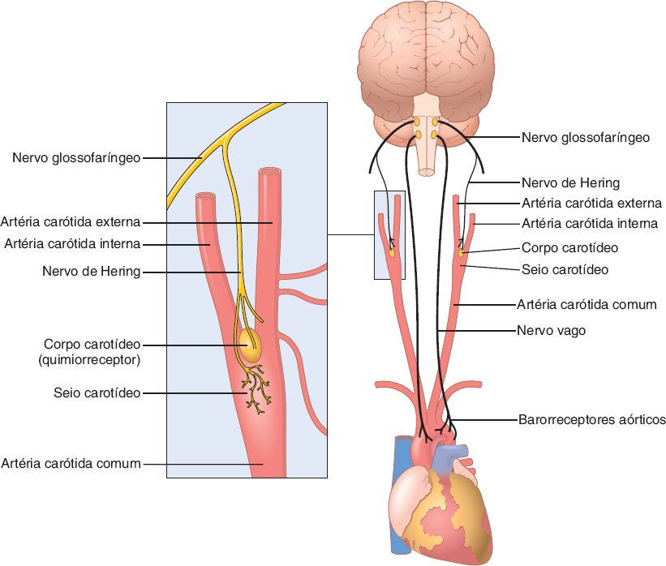 Sistema barorreceptor: seio carotídeo (nervo de Hering → glossofaríngeo) e arco aórtico (vago). <i>(Guyton & Hall, Fig. 18.6)</i>

- <b>Barorreceptores</b>: terminações livres de estiramento no <b>seio carotídeo</b> (carótida interna, acima da bifurcação) e no <b>arco aórtico</b>. Carotídeo: nervo de <b>Hering → IX</b>; aórtico: <b>X</b>; ambos → <b>núcleo do trato solitário</b>.
- Carotídeos: silenciosos de 0 a 50–60 mmHg, máximo ≈ 180; os aórticos operam ≈ 30 mmHg acima. Respondem mais a pressão que <b>varia</b> (até 2× mais do que a estável).
- Ocluir as carótidas comuns → ↓ disparo → PA sobe. Ao levantar-se, evitam a queda da PA na cabeça.
- <b>Tampão</b>: sem eles a faixa de PA do dia aumenta 2,5× (50 a &gt; 160 mmHg); com eles, variação ≈ <b>1/3</b>. Reajustam em <b>1 a 2 dias</b>, mas não totalmente (ajudam via simpático renal). Estimulação crônica do seio carotídeo ↓ PA 15 a 20 mmHg.

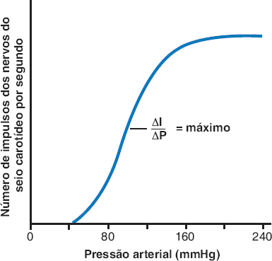 Resposta do seio carotídeo: sem disparo abaixo de 50–60 mmHg, ganho máximo (ΔI/ΔP) perto de 100 mmHg. <i>(Guyton & Hall, Fig. 18.5)</i>

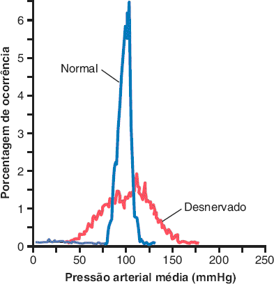 PA ao longo do dia: com barorreceptores (normal) e sem eles (desnervado). <i>(Guyton & Hall, Fig. 18.9)</i>

- <b>Quimiorreceptores</b> (corpos carotídeos e aórticos, ≈ 2 mm, fluxo abundante): sentem ↓ O₂, ↑ CO₂ e ↑ H⁺; excitam o centro vasomotor quando a PA cai <b>abaixo de 80</b>. Contribuem para HAS na obesidade e na <b>apneia do sono</b>.
- <b>Resposta isquêmica do SNC</b>: isquemia do centro vasomotor (acúmulo de CO₂) → PA até <b>250 mmHg</b> por até 10 min; rim pode parar de urinar. Só abaixo de <b>60</b> (máxima em 15 a 20): último recurso.
- <b>Reação de Cushing</b>: ↑ pressão do liquor comprime as artérias cerebrais → resposta isquêmica → PA sobe até ficar pouco acima da pressão do liquor (clínica: hipertensão com bradicardia na hipertensão intracraniana).

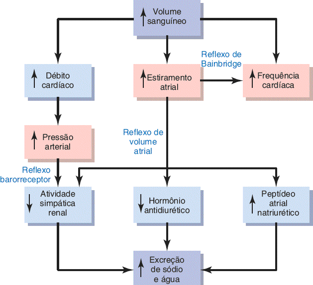 Reflexos atriais e da artéria pulmonar (baixa pressão): Bainbridge e reflexo de volume. <i>(Guyton & Hall, Fig. 18.10)</i>

- <b>Compressão abdominal</b>: reflexos também contraem músculos abdominais, espremendo os reservatórios venosos → ↑ DC e PA. Paralisados têm mais hipotensão.
- Exercício: a contração muscular comprime vasos e ajuda o DC a subir <b>5 a 7×</b>; PA média 100 → <b>130 a 160</b>.
- <b>Ondas respiratórias</b>: 4 a 6 mmHg (até 20 na respiração profunda); a PA sobe no início da expiração. <b>Ondas de Mayer (vasomotoras)</b>: 10 a 40 mmHg, ciclos de 7 a 10 s no humano, por oscilação do barorreflexo (ou quimiorreflexo a 40–80 mmHg).

## Valores para decorar

| Item | Valor |
|---|---|
| Fração do DC: fígado · rins · músculo · cérebro · coração | 27 · 22 · 15 · 14 · 4% |
| Fluxo renal por 100 g | ≈ 360 mℓ/min |
| Hiperemia reativa | fluxo 4 a 7× |
| Faixa de autorregulação aguda | 70 a 175 mmHg |
| Tônus vasoconstritor simpático | 0,5 a 2 impulsos/s |
| Raquianestesia total | PA 100 → 50 mmHg |
| Barorreceptor carotídeo: limiar · máximo · maior ganho | 50 a 60 · ≈ 180 · ≈ 100 mmHg |
| Reajuste dos barorreceptores | 1 a 2 dias |
| Quimiorreceptores atuam abaixo de | 80 mmHg |
| Resposta isquêmica do SNC | PA < 60 mmHg; PA pode ir a 250 |
| Reflexo de Bainbridge | FC ↑ 40 a 60% |
| Ondas de Mayer | 10 a 40 mmHg, a cada 7 a 10 s |

## Glossário

- **Hiperemia ativa**: Aumento do fluxo quando o metabolismo do tecido sobe.
- **Hiperemia reativa**: Aumento do fluxo após um período de oclusão.
- **Autorregulação miogênica**: Estiramento do vaso → entrada de Ca²⁺ → contração.
- **Feedback tubuloglomerular**: A mácula densa ajusta a arteríola aferente conforme o líquido tubular.
- **Angiogênese**: Crescimento de novos vasos, estimulado por VEGF (via HIF) quando falta O₂.
- **Remodelagem eutrófica**: Muda a luz do vaso sem mudar a área da parede.
- **Centro vasomotor**: Áreas do bulbo e da ponte que controlam o simpático e o vago.
- **Núcleo do trato solitário**: Área sensorial do bulbo que recebe barorreceptores e quimiorreceptores.

## Correlações clínicas

- **Síncope vasovagal**: Emoção → vasodilatação muscular + bradicardia vagal → PA cai → desmaio.
- **Reação de Cushing**: Hipertensão intracraniana → isquemia do centro vasomotor → PA alta com bradicardia.
- **Apneia do sono e obesidade**: Hipóxia repetida ativa quimiorreceptores e o simpático: contribui para hipertensão.
- **Nitratos e sildenafila**: Nitratos doam NO (angina); sildenafila inibe a PDE-5 (disfunção erétil). Juntos causam hipotensão grave.
- **Hipertensão pulmonar**: Tratada com bloqueadores dos receptores de endotelina.

## Onde ler na fonte

| Fonte | O que ler |
|---|---|
| Guyton cap. 17 | Controle metabólico (Figs. 17.1 a 17.3), hiperemia (Fig. 17.4), autorregulação (Fig. 17.5), NO (Fig. 17.6), remodelagem (Fig. 17.8). |
| Guyton cap. 18 | Centro vasomotor (Fig. 18.3), raquianestesia (Fig. 18.4), barorreceptores (Figs. 18.5 a 18.9), reflexos atriais (Fig. 18.10). |

---
Figuras reproduzidas das fontes indicadas, para estudo pessoal. Repositório privado.
