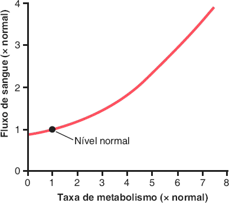
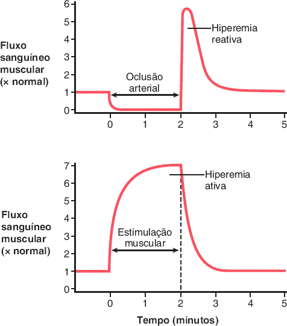
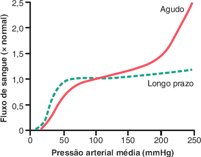
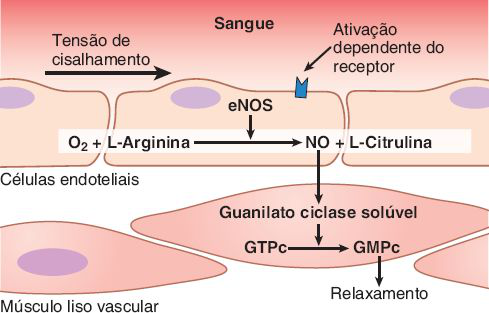
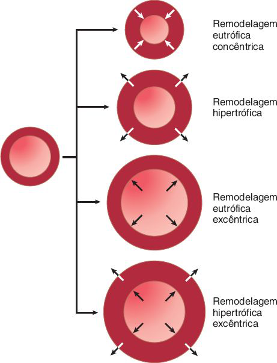
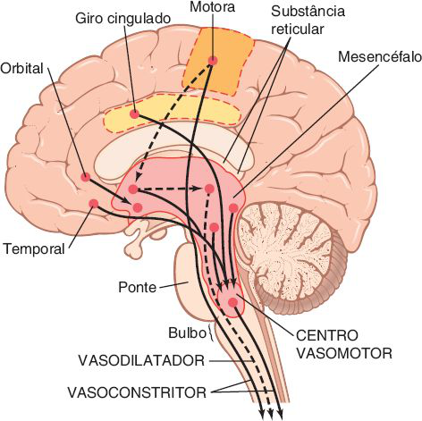
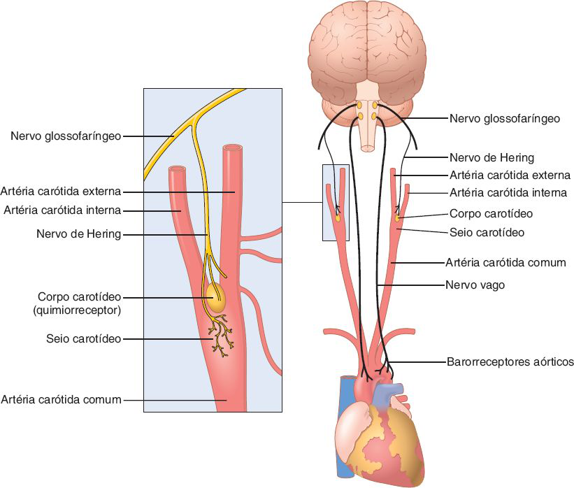
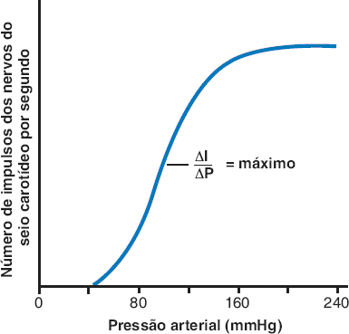
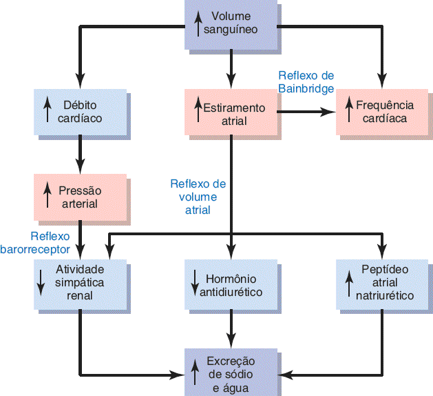

# Tema F · Controle local, humoral e nervoso da circulação

**Área:** Fisiologia · **Resumão:** [resumao.pdf](resumao.pdf) (10 páginas) · **Anki:** [flashcards.apkg](flashcards.apkg) (65 cartões)

**Fontes:** Guyton & Hall, 14ª ed., cap. 17 (PDF p. 642–680) · Guyton & Hall, 14ª ed., cap. 18 (PDF p. 681–715)

[← voltar ao índice](../../README.md)

## O essencial

- **Controle local:** cada tecido ajusta o próprio fluxo à sua **necessidade metabólica** (sobretudo de **O₂**). Metabolismo 8 × maior faz o fluxo subir ≈ 4 ×.
- **Autorregulação:** entre ≈ **70 e 175 mmHg** o fluxo quase não muda. Duas teorias: **metabólica** (lava os vasodilatadores) e **miogênica** (estiramento abre canais de Ca²⁺ e contrai).
- **Óxido nítrico:** o endotélio o libera sob **tensão de cisalhamento**; ativa **guanilato ciclase → GMPc** e relaxa o músculo liso. **Endotelina** é o vasoconstritor do endotélio lesado.
- **Longo prazo:** muda a **vascularização** (angiogênese por **VEGF**, estimulada pela falta de O₂) e remodela a parede dos vasos.
- **Humoral:** constritores = **noradrenalina/adrenalina, angiotensina II, vasopressina, endotelina**. Dilatadores = **bradicinina, histamina** (e NO).
- **Nervoso:** quase todo pelo **simpático** (noradrenalina em receptores **α**). O **centro vasomotor** (bulbo e ponte) mantém o **tônus vasomotor**; o **vago** reduz a FC.
- **Barorreflexo:** seio carotídeo (n. de Hering → IX) e arco aórtico (X) → **núcleo do trato solitário**. PA alta → inibe o simpático e excita o vago. Faixa de 60 a 180 mmHg, mais sensível perto de **100 mmHg**; reajusta em 1–2 dias.
- **Quimiorreceptores** só pesam abaixo de **80 mmHg**; a **resposta isquêmica do SNC** abaixo de **60 mmHg** (máxima em 15–20). **Reação de Cushing:** hipertensão intracraniana → PA sobe.

## Valores para decorar

| Parâmetro | Valor | Observação |
|---|---|---|
| Débito cardíaco em repouso | 5.000 mL/min |  |
| Fluxo renal | 1.100 mL/min (22%) | 360 mL/min/100 g, o maior por peso |
| Fluxo hepático | 1.350 mL/min (27%) | Maior fluxo absoluto |
| Fluxo cerebral | 700 mL/min (14%) | 50 mL/min/100 g |
| Fluxo coronariano | 200 mL/min (4%) | 70 mL/min/100 g |
| Metabolismo 8 × | Fluxo ≈ 4 × |  |
| Hiperemia reativa | 4–7 × o fluxo |  |
| Hiperemia ativa (músculo) | Até 20 × |  |
| Faixa de autorregulação | ≈ 70–175 mmHg | +150% de PA → +20–30% de fluxo |
| Controle agudo corrige | ≈ 3/4 do excesso | Longo prazo corrige o resto |
| Meia-vida do NO | ≈ 6 s |  |
| Endotelina | 27 aminoácidos | Hemostasia em artérias até 5 mm |
| Angiotensina II | 1 µg → PA + 50 mmHg |  |
| Tônus simpático | 0,5–2 impulsos/s | Raquianestesia total: PA 100 → 50 |
| Simpático máximo | FC até 3 × | Bombeamento até 2 × |
| Velocidade do controle nervoso | PA × 2 em 5–10 s | PA ÷ 2 em 10–40 s |
| Seio carotídeo | Silencioso < 50–60 mmHg | Máximo ≈ 180 mmHg |
| Maior sensibilidade barorreceptora | ≈ 100 mmHg |  |
| Reajuste dos barorreceptores | 1–2 dias |  |
| Quimiorreceptores | PA < 80 mmHg | Corpos de ≈ 2 mm |
| Resposta isquêmica do SNC | PA < 60 mmHg | Máxima em 15–20; PA até 250 |
| Reflexo de Bainbridge | FC até + 75% |  |

## Figuras-chave

**Guyton & Hall, Fig. 17.1** — Efeito do aumento da taxa de metabolismo no fluxo sanguíneo dos tecidos.

**Guyton & Hall, Fig. 17.4** — Hiperemia reativa em um tecido após a oclusão temporária da artéria que fornece o fluxo sanguíneo e hiperemia ativa após aumento da atividade

**Guyton & Hall, Fig. 17.5** — Efeito de diferentes níveis de pressão arterial sobre o fluxo sanguíneo de um músculo. A curva vermelha sólida mostra o efeito quando a pressão arterial aumenta por um período de minutos. A curva verde tracejada mostra o efeito quando a pressão arterial aumenta lentamente ao longo de várias semanas.

**Guyton & Hall, Fig. 17.6** — A enzima óxido nítrico sintase endotelial (eNOS), presente nas células endoteliais, sintetiza o óxido nítrico (NO) a partir da arginina e do oxigênio. O NO ativa as guanilato ciclases solúveis nas células da musculatura lisa vascular, resultando na conversão do trifosfato de guanosina cíclico (GTPc) em monofosfato de guanosina cíclico (GMPc), que, por fim, provoca o relaxamento dos vasos sanguíneos.

**Guyton & Hall, Fig. 17.8** — Remodelagem vascular em resposta a um aumento crônico da pressão sanguínea ou do fluxo sanguíneo. Em pequenas artérias e arteríolas que se contraem em resposta ao aumento da pressão arterial, a remodelagem eutrófica concêntrica normalmente ocorre porque o diâmetro do lúmen é menor e

**Guyton & Hall, Fig. 18.3** — Áreas do cérebro que desempenham papéis importantes na regulação nervosa da circulação. As linhas tracejadas representam as vias inibitórias.

**Guyton & Hall, Fig. 18.5** — Sistema barorreceptor de controle da pressão arterial.

**Guyton & Hall, Fig. 18.6** — Ativação dos barorreceptores em diferentes níveis de pressão arterial. ΔI, variação dos impulsos nervosos do seio carotídeo por segundo; ΔP, variação da pressão arterial (mmHg).

**Guyton & Hall, Fig. 18.10** — Respostas reflexas ao aumento do volume sanguíneo, que elevam a pressão arterial e o estiramento atrial.

## Glossário

| Termo | Significado |
|---|---|
| **Hiperemia reativa** | Aumento do fluxo após o fim de uma oclusão arterial. |
| **Hiperemia ativa** | Aumento do fluxo quando o tecido aumenta a atividade. |
| **Autorregulação** | Fluxo quase constante apesar de mudanças da pressão arterial. |
| **Teoria miogênica** | Contração do músculo liso em resposta ao estiramento. |
| **Feedback tubuloglomerular** | Ajuste das arteríolas renais pela mácula densa. |
| **Tensão de cisalhamento** | Força de arrasto do sangue sobre o endotélio. |
| **eNOS** | Óxido nítrico sintase endotelial. |
| **Endotelina** | Peptídeo vasoconstritor do endotélio lesado. |
| **VEGF** | Fator de crescimento do endotélio vascular (angiogênese). |
| **Remodelagem eutrófica** | Mudança do lúmen sem mudar a área da parede. |
| **Centro vasomotor** | Área do bulbo e da ponte que comanda simpático e vago. |
| **Tônus vasomotor** | Constrição parcial contínua dos vasos pelo simpático. |
| **Núcleo do trato solitário** | Área sensorial do bulbo que recebe IX e X. |
| **Barorreceptor** | Terminação nervosa sensível ao estiramento arterial. |
| **Quimiorreceptor** | Célula sensível a O₂ baixo, CO₂ e H⁺ altos. |
| **Reflexo de Bainbridge** | Aumento da FC pelo estiramento atrial. |
| **Reação de Cushing** | Aumento da PA pela isquemia cerebral na hipertensão intracraniana. |

## Correlações clínicas

- **Nitratos e sildenafila.** A **nitroglicerina** libera NO e dilata (angina). A **sildenafila** inibe a PDE-5 e mantém o GMPc. Juntos podem causar **hipotensão grave**.
- **Circulação colateral.** Oclusão coronariana **lenta** dá tempo para colaterais (dias) e é mais bem tolerada que a oclusão **súbita**, que causa infarto.
- **Hipotensão ortostática.** Ao levantar, o **barorreflexo** evita a queda da PA na cabeça. Se falha (disautonomia, idosos, desidratação), surgem tontura e síncope.
- **Síncope vasovagal.** Emoção forte: vasodilatação muscular + **bradicardia vagal** → PA e fluxo cerebral caem → desmaio.
- **Massagem do seio carotídeo.** Estimula os barorreceptores → **aumenta o tônus vagal** e reduz a FC (usada para reverter taquicardias supraventriculares).
- **Tríade de Cushing.** Hipertensão intracraniana: **PA alta**, **bradicardia** (barorreflexo) e respiração irregular. Sinal de herniação iminente.
- **Inibidores da ECA.** Bloqueiam a formação de angiotensina II **e** a degradação da bradicinina; a bradicinina acumulada explica a **tosse** e o **angioedema**.
- **Retinopatia da prematuridade.** Excesso de O₂ suprime e depois desencadeia crescimento vascular explosivo na retina, com risco de cegueira.

## Pegadinhas de prova

- Maior fluxo **por grama** é o do **rim** (360 mL/min/100 g); maior fluxo **absoluto** é o do **fígado** (1.350 mL/min).
- Autorregulação **não** mantém o fluxo totalmente constante: +150% de pressão ainda dá +20–30% de fluxo.
- Na teoria **miogênica**, quem dispara a contração é o **estiramento** (entrada de Ca²⁺), não um metabólito.
- O simpático inerva **todos os vasos exceto os capilares**.
- O **parassimpático** quase não age nos vasos: o efeito circulatório principal é **reduzir a FC**.
- Barorreceptores do **seio carotídeo** → nervo de Hering → **glossofaríngeo (IX)**; do **arco aórtico** → **vago (X)**.
- Barorreceptores **não** controlam bem a PA a longo prazo: **reajustam em 1–2 dias**.
- Quimiorreceptores e resposta isquêmica do SNC **não** regulam a PA normal: só abaixo de 80 e de 60 mmHg.
- **Corpo** carotídeo (quimiorreceptor, na bifurcação) ≠ **seio** carotídeo (barorreceptor, na carótida interna).
- A **adrenalina** dilata as coronárias e os vasos musculares (β); a noradrenalina contrai (α).

## Onde ler nas fontes

| Livro | Onde | O que ler |
|---|---|---|
| Guyton & Hall | Cap. 17 · PDF p. 642–654 | Fluxo dos órgãos, controle metabólico, hiperemias (Tabela 17.1, Fig. 17.1 a 17.4) |
| Guyton & Hall | Cap. 17 · PDF p. 654–661 | Autorregulação, rim, cérebro, pele, NO e endotelina (Fig. 17.5 e 17.6) |
| Guyton & Hall | Cap. 17 · PDF p. 662–673 | Longo prazo, angiogênese, colaterais, remodelagem (Fig. 17.7 e 17.8) |
| Guyton & Hall | Cap. 17 · PDF p. 673–680 | Controle humoral e íons |
| Guyton & Hall | Cap. 18 · PDF p. 681–693 | Simpático, centro vasomotor, tônus, controle rápido (Fig. 18.1 a 18.4) |
| Guyton & Hall | Cap. 18 · PDF p. 694–709 | Barorreceptores, quimiorreceptores, reflexos atriais, isquemia do SNC (Fig. 18.5 a 18.10) |
| Guyton & Hall | Cap. 18 · PDF p. 710–713 | Compressão abdominal, ondas respiratórias e de Mayer (Fig. 18.11), leitura opcional |

---

*Figuras reproduzidas dos livros-texto para uso pessoal de estudo; o número de cada figura no livro está indicado na legenda.*
