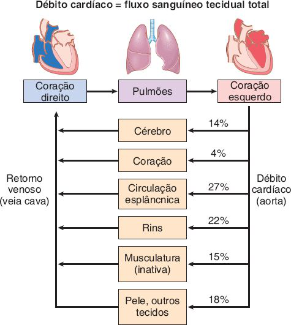
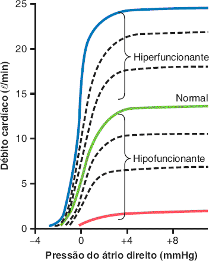
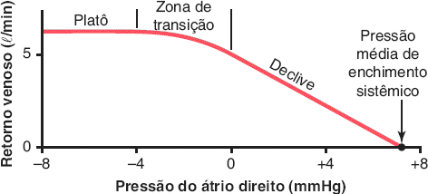
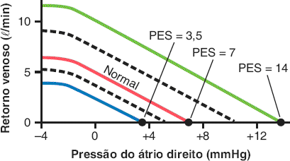
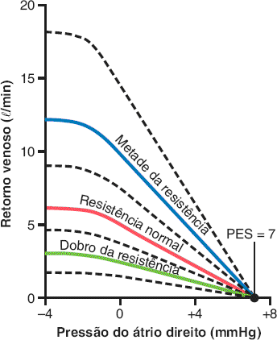
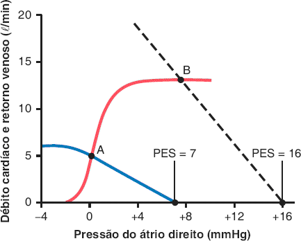
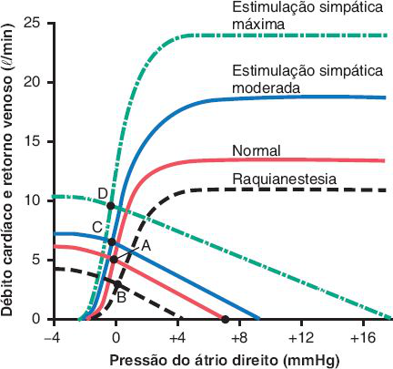
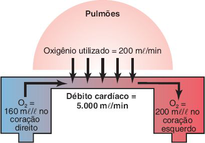

# Tema G · Débito cardíaco e retorno venoso

**Área:** Fisiologia · **Resumão:** [resumao.pdf](resumao.pdf) (8 páginas) · **Anki:** [flashcards.apkg](flashcards.apkg) (54 cartões)

**Fontes:** Guyton & Hall, 14ª ed., cap. 20 (PDF p. 770–813)

[← Tema F](../f-controle-da-circulacao/README.md) · [Índice](../../README.md) · [Tema H →](../h-regulacao-renal-da-pa/README.md)

## O essencial

- **Débito cardíaco (DC)** em repouso ≈ **5 L/min** (homem jovem 5,6; mulher 4,9). **Índice cardíaco** ≈ **3 L/min/m²** (superfície ≈ 1,7 m²).
- Normalmente quem controla o DC é o **retorno venoso**, ou seja, a **soma dos fluxos locais** dos tecidos. O coração bombeia o que chega pelo **Frank-Starling**.
- Com PA constante, o DC varia **inversamente** à **resistência periférica total** (DC = PA ÷ RPT).
- O coração normal bombeia até ≈ **13 L/min** (platô, 2,5 × o normal); com simpático máximo ≈ **25 L/min**; atleta treinado **30–40 L/min**.
- **Retorno venoso = (PES − PAD) ÷ RRV.** Normal: 5 = (7 − 0) ÷ 1,4. **PES ≈ 7 mmHg**; o RV cai a zero quando a PAD sobe até a PES.
- **Ponto de equilíbrio:** onde a curva de DC cruza a de RV (normal: DC 5 L/min, PAD 0 mmHg).
- **DC alto** = queda crônica da RPT (beribéri, fístula AV, hipertireoidismo, anemia). **DC baixo** = coração fraco ou **retorno venoso baixo** (hemorragia, dilatação venosa).
- **Fick:** DC = consumo de O₂ ÷ (O₂ arterial − O₂ venoso) = 200 ÷ (200 − 160) × 1 L = **5 L/min**.

## Valores para decorar

| Parâmetro | Valor | Observação |
|---|---|---|
| DC em repouso | ≈ 5 L/min | Homem 5,6; mulher 4,9 |
| Índice cardíaco | ≈ 3 L/min/m² | >4 aos 10 anos; 2,4 aos 80 |
| Superfície corporal (70 kg) | ≈ 1,7 m² |  |
| Platô da curva de DC normal | ≈ 13 L/min | 2,5 × o normal |
| Platô com simpático máximo | ≈ 25 L/min | FC até 180–200 bpm |
| Atleta treinado | 30–40 L/min | Coração 50–75% maior |
| Exercício (PA mantida) | DC + 30–100% | Pelo simpático |
| Pressão intrapleural | ≈ −4 mmHg | Tórax aberto: 0 |
| PES / pressão de enchimento circulatório | ≈ 7 mmHg | Simpático máx. 14; inibição 4 |
| Volume com enchimento zero | ≈ 4.000 mL | 5.000 mL → 7 mmHg |
| RV zero quando PAD = | PES (≈ +7 mmHg) |  |
| Platô do retorno venoso | PAD ≈ −2 mmHg | Colapso das veias |
| Resistência ao RV (RRV) | ≈ 1,4 mmHg/(L/min) | 2/3 nas veias |
| Capacitância arterial | 1/30 da venosa |  |
| Ponto de equilíbrio normal | DC 5 L/min, PAD 0 |  |
| Transfusão de 20% | DC 2,5–3 × | Normaliza em 10–40 min |
| Simpático máximo | DC ≈ 2 × | PES 17 mmHg |
| Raquianestesia total | DC ≈ 60% do normal | PES ≈ 4 mmHg |
| Fístula AV grande | 5 → 13 → 16 → 20 L/min | Imediato, 1 min, semanas |
| Hipertireoidismo | DC + 40–80% |  |
| Fick (exemplo) | 200 ÷ (200 − 160) = 5 L/min | mL O₂/min ÷ mL O₂/L |

## Figuras-chave

**Guyton & Hall, Fig. 20.2** — O débito cardíaco é igual ao retorno venoso e representa a soma dos fluxos sanguíneos dos tecidos e órgãos. Exceto quando o coração está gravemente enfraquecido e incapaz de bombear o retorno venoso de forma adequada, o débito cardíaco (fluxo sanguíneo total dos tecidos) é determinado, principalmente, pelas necessidades metabólicas dos tecidos e órgãos do corpo.

**Guyton & Hall, Fig. 20.5** — Curvas de débito cardíaco para o coração normal e para corações hipofuncionantes e hiperfuncionantes. (Modificada de Guyton AC, Jones CE, Coleman TG: Circulatory Physiology: Cardiac Output and Its Regulation, 2nd ed. Philadelphia: WB Saunders, 1973.)

**Guyton & Hall, Fig. 20.10** — Curva normal de retorno venoso. O platô é causado pelo colapso das grandes veias que entram no tórax quando a pressão do átrio direito fica abaixo da pressão atmosférica. Observe também que o retorno venoso é zero quando a pressão do átrio direito aumenta para se igualar à pressão média de enchimento sistêmico.

**Guyton & Hall, Fig. 20.12** — Curvas de retorno venoso mostrando a curva normal quando a pressão média de enchimento sistêmico (PES) é de 7 mmHg e o efeito da alteração nos valores de PES para 3,5, 7 ou 14 mmHg. (Modificada de Guyton AC, Jones CE, Coleman TG: Circulatory Physiology: Cardiac Output and Its Regulation, 2nd ed. Philadelphia: WB Saunders, 1973.)

**Guyton & Hall, Fig. 20.13** — Curvas de retorno venoso que mostram o efeito de alterações na resistência ao retorno venoso. PES: pressão média de enchimento sistêmico. (Modificada de Guyton AC, Jones CE, Coleman TG: Circulatory Physiology: Cardiac Output and Its Regulation, 2nd ed. Philadelphia: WB Saunders, 1973.)

**Guyton & Hall, Fig. 20.15** — As duas curvas sólidas demonstram uma análise do débito cardíaco e da pressão atrial direita quando as curvas de débito cardíaco (linha vermelha) e de retorno venoso (linha azul) estão normais. A transfusão de sangue equivalente a 20% do volume sanguíneo faz com que a curva de retorno venoso se desloque para a linha tracejada. Como resultado, o débito cardíaco e a pressão do átrio direito se deslocam do ponto A para o ponto B. PES: pressão média de enchimento sistêmico.

**Guyton & Hall, Fig. 20.16** — Análise do efeito sobre o débito cardíaco de (1) estimulação simpática moderada (do ponto A ao ponto C); (2) estimulação simpática máxima (ponto D) e (3) inibição simpática provocada por raquianestesia total (ponto B). (Modificada de Guyton AC, Jones CE, Coleman TG: Circulatory Physiology: Cardiac Output and Its Regulation, 2nd ed. Philadelphia: WB Saunders, 1973.)

**Guyton & Hall, Fig. 20.19** — Princípio de Fick para determinação do débito cardíaco.

## Glossário

| Termo | Significado |
|---|---|
| **Débito cardíaco** | Volume bombeado pelo coração por minuto. |
| **Retorno venoso** | Volume que chega ao átrio direito por minuto. |
| **Índice cardíaco** | DC por m² de superfície corporal. |
| **Curva de débito cardíaco** | DC em função da pressão do átrio direito. |
| **Curva de retorno venoso** | RV em função da pressão do átrio direito. |
| **PES** | Pressão média de enchimento sistêmico (≈ 7 mmHg). |
| **Gradiente para o retorno venoso** | PES menos pressão do átrio direito. |
| **RRV** | Resistência ao retorno venoso. |
| **Ponto de equilíbrio** | Cruzamento das curvas de DC e de RV. |
| **Tamponamento** | Líquido no pericárdio que comprime o coração. |
| **Princípio de Fick** | DC = consumo de O₂ ÷ diferença arteriovenosa de O₂. |
| **Termodiluição** | Diluição do indicador usando soro frio. |

## Correlações clínicas

- **Choque hipovolêmico.** A hemorragia reduz o enchimento (PES) e o **retorno venoso**; o DC cai mesmo com coração normal. Repor volume restaura a PES.
- **Síncope.** A perda súbita do simpático dilata as veias, a PES cai e o **retorno venoso** desaba: o DC e a PA caem.
- **Tamponamento cardíaco.** Líquido no pericárdio aumenta a pressão externa e desloca a curva de DC para a direita: **PVC alta com DC baixo**.
- **Ventilação com pressão positiva.** Aumenta a pressão intrapleural, desloca a curva de DC para a direita e pode **reduzir o DC** em pacientes com pouco volume.
- **Estados de alto débito.** **Beribéri, fístula AV, hipertireoidismo, anemia**: a RPT baixa aumenta o retorno venoso e o DC; podem levar à insuficiência cardíaca de alto débito.
- **Medida na UTI.** O cateter de artéria pulmonar mede o DC por **termodiluição**; a gasometria venosa mista permite o cálculo por **Fick**.

## Pegadinhas de prova

- Na maioria das situações, quem determina o DC é a **periferia** (retorno venoso), não o coração.
- **DC alto** crônico vem sempre de **RPT baixa**, nunca de um coração "excitado demais".
- A **PAD nunca passa da PES**: com PAD = PES, o retorno venoso é zero.
- Pressão atrial direita muito negativa **não** aumenta o retorno venoso: as veias do tórax **colapsam** (platô).
- A resistência ao retorno venoso está **2/3 nas veias**, não nas arteríolas.
- Aumento da pressão intrapleural desloca a curva de DC para a **direita**, sem mudar o platô.
- Simpático **dobra** o DC quase sem mudar a PAD, porque desloca as duas curvas ao mesmo tempo.
- No Fick, o sangue venoso misto vem da **artéria pulmonar** (ou VD), não de uma veia periférica.

## Onde ler nas fontes

| Livro | Onde | O que ler |
|---|---|---|
| Guyton & Hall | Cap. 20 · PDF p. 770–777 | Valores normais, índice cardíaco, Frank-Starling, DC e RPT (Fig. 20.1 a 20.4) |
| Guyton & Hall | Cap. 20 · PDF p. 777–787 | Limites do coração, controle nervoso, DC alto e baixo (Fig. 20.5 a 20.7) |
| Guyton & Hall | Cap. 20 · PDF p. 787–791 | Curvas de DC e pressão externa (Fig. 20.8 e 20.9) |
| Guyton & Hall | Cap. 20 · PDF p. 791–800 | Retorno venoso, PES e resistência (Fig. 20.10 a 20.14) |
| Guyton & Hall | Cap. 20 · PDF p. 800–808 | Ponto de equilíbrio, volume, simpático e fístula AV (Fig. 20.15 a 20.17) |
| Guyton & Hall | Cap. 20 · PDF p. 808–814 | Fick, diluição, eco e bioimpedância (Fig. 20.18 a 20.20) |

---

[← Tema F](../f-controle-da-circulacao/README.md) · [Índice](../../README.md) · [Tema H →](../h-regulacao-renal-da-pa/README.md)

*Figuras reproduzidas dos livros-texto para uso pessoal de estudo; o número de cada figura no livro está indicado na legenda.*
