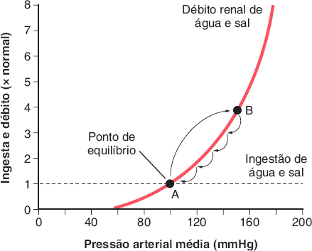
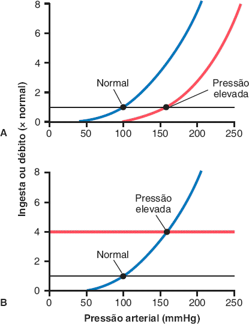
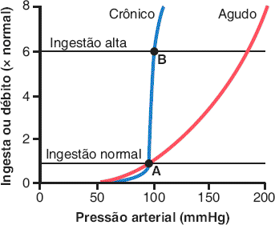
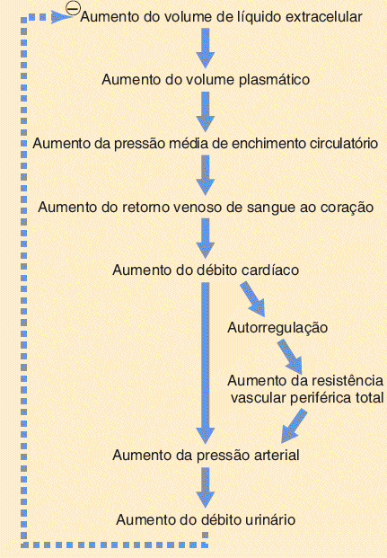
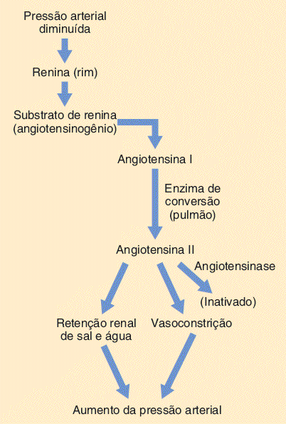
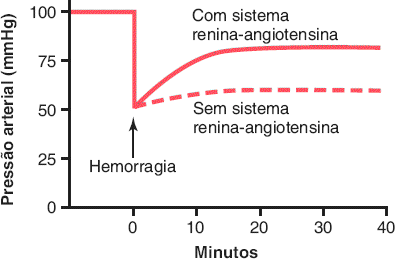
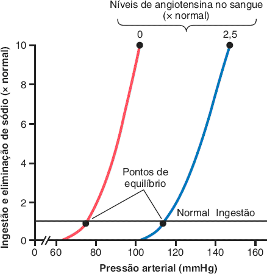
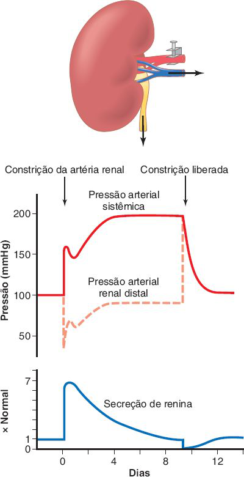
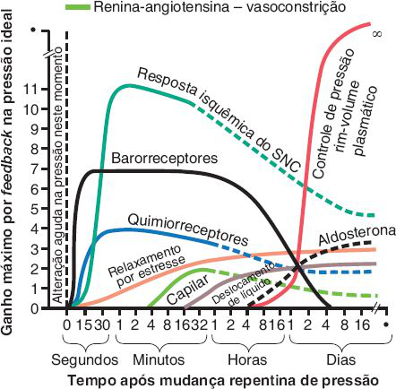

# Tema H · Regulação renal da pressão arterial

**Área:** Fisiologia · **Resumão:** [resumao.pdf](resumao.pdf) (9 páginas) · **Anki:** [flashcards.apkg](flashcards.apkg) (58 cartões)

**Fontes:** Guyton & Hall, 14ª ed., cap. 19 (PDF p. 716–769)

[← Tema G](../g-debito-cardiaco-e-retorno-venoso/README.md) · [Índice](../../README.md) · [Tema S →](../s-semiologia-anamnese-sintomas-arritmias/README.md)

## O essencial

- **Longo prazo = rim-volume.** PA alta → **diurese e natriurese por pressão** → volume cai → PA volta. Ganho por feedback **quase infinito**: a PA volta exatamente ao ponto de equilíbrio.
- **Ponto de equilíbrio:** cruzamento da **curva de débito renal** com a linha de **ingestão de sal e água**. Só dois determinantes mudam a PA de longo prazo: **deslocar a curva renal** ou **mudar a ingestão**.
- A curva **crônica** é muito mais **íngreme** que a aguda (simpático, angiotensina II e aldosterona caem quando a PA sobe). Por isso a maioria das pessoas é **insensível ao sal**.
- Aumentar a **resistência periférica total fora do rim** não sustenta hipertensão: em 1–2 dias o rim normaliza a PA. O que importa é a **resistência renal**.
- **Hipertensão por volume:** primeiro sobe o **DC**; depois a **autorregulação** normaliza o DC e eleva a **RPT**. A RPT alta é **efeito**, não causa.
- **Renina** (células **justaglomerulares**) ← PA baixa, pouco NaCl na **mácula densa**, simpático (**β1**). Angiotensinogênio → **Ang I** (10 aa) → **ECA (pulmão)** → **Ang II** (8 aa).
- **Ang II:** vasoconstrição (rápida, ≈ 20 min para efeito pleno) e **retenção renal de sal e água** (direta + **aldosterona**), o efeito mais potente a longo prazo.
- **Goldblatt:** estenose da artéria renal → renina → hipertensão. **Hipertensão essencial** (90–95%): obesidade, simpático renal, Ang II/aldosterona e natriurese por pressão prejudicada.

## Valores para decorar

| Parâmetro | Valor | Observação |
|---|---|---|
| Débito urinário com PA de 50 mmHg | ≈ 0 |  |
| Débito urinário com PA de 200 mmHg | 4–6 × o normal |  |
| Infusão de 400 mL (cão sem reflexos) | PA 205 mmHg; urina × 12 | Normal em ≈ 1 h |
| Eliminação com PA de 150 mmHg | ≈ 3 × a ingestão | Ponto B |
| Sal × 6 com curva crônica normal | PA quase igual | Insensível ao sal |
| Hipertensão | PA média > 110 mmHg | PAD > 90, PAS > 135 |
| PA média normal (Guyton) | ≈ 90 mmHg |  |
| Hipertensão grave | PA média 150–170 | PAD até 130, PAS até 250 |
| Cão com 30% de rim + salina | PA + 40 mmHg | Só com água: + 6 |
| Hipertensão por volume, 1ª fase | DC e volume + 20–40% |  |
| Hipertensão por volume, semanas | RPT + 33%; PA + 40% | DC quase normal |
| Ang I / Ang II | 10 / 8 aminoácidos |  |
| Meia-vida: renina / Ang II | 30–60 min / 1–2 min |  |
| Renina-angiotensina pleno | ≈ 20 min |  |
| Hemorragia (PA 50) | Volta a 83 com o sistema | 60 sem o sistema |
| Equilíbrio com Ang II zero / 2,5 × | 75 / 115 mmHg |  |
| Sal × 100 com sistema normal | PA + 4–6 mmHg | Com Ang II fixa: + 40 |
| Goldblatt: pico de renina | 1–2 h | Normaliza em 5–7 dias |
| Coarctação da aorta | MMSS 40–50% > MMII |  |
| Pré-eclâmpsia | 5–10% das gestantes |  |
| Hipertensão essencial | 90–95% dos casos | Peso: 65–75% do risco |
| Hipertensão monogênica | < 1% |  |
| Secção dos barorreceptores | PA 100 → 160 | Normal em ≈ 2 dias |

## Figuras-chave

**Guyton & Hall, Fig. 19.1** — Curva típica de pressão arterial-débito urinário renal medida em um rim isolado perfundido, mostrando diurese por pressão quando a pressão arterial se eleva acima do normal (ponto A) para aproximadamente 150 mmHg (ponto B). O ponto de equilíbrio A descreve o nível em que a pressão arterial será regulada se a ingestão não for alterada. (Observe que a pequena porção da ingestão total de sal e água que é perdida por vias não renais é ignorada nesta e em outras figuras semelhantes neste capítulo.)

**Guyton & Hall, Fig. 19.3** — Duas maneiras pelas quais a pressão arterial pode ser elevada. A. Deslocando a curva de débito renal para a direita, em direção a um nível de pressão mais alto. B. Aumentando o nível de ingestão de sal e água.

**Guyton & Hall, Fig. 19.4** — Curvas de débito renal agudas e crônicas. Em condições estáveis, o débito renal de sal e água é igual à ingestão. A e B representam os pontos de equilíbrio para a regulação a longo prazo da pressão arterial, quando a ingestão de sal é normal ou seis vezes o normal, respectivamente. Por causa da inclinação da curva de débito renal crônico, o aumento da ingestão de sal normalmente causa apenas pequenas alterações na pressão arterial. Em pessoas com insuficiência renal, a inclinação da curva de débito renal pode diminuir, semelhante à curva aguda, resultando em aumento da sensibilidade da pressão arterial às alterações na ingestão de sal.

**Guyton & Hall, Fig. 19.6** — Etapas sequenciais pelas quais o aumento do volume de líquido extracelular aumenta a pressão arterial. Observe especialmente que o aumento do débito cardíaco tem um efeito direto para aumentar a pressão arterial e um efeito indireto, aumentando primeiro a resistência vascular periférica total.

**Guyton & Hall, Fig. 19.9** — Mecanismo vasoconstritor renina-angiotensina para controle da pressão arterial.

**Guyton & Hall, Fig. 19.10** — Efeito compensador de pressão do sistema vasoconstritor renina-angiotensina após hemorragia grave. (Extraída de experimentos do Dr. Royce Brough.)

**Guyton & Hall, Fig. 19.11** — Efeito de dois níveis de angiotensina II no sangue sobre a curva de débito renal, mostrando a regulação da pressão arterial em um ponto de equilíbrio de 75 mmHg, quando o nível de angiotensina II está baixo, e em 115 mmHg, quando o nível de angiotensina II é alto.

**Guyton & Hall, Fig. 19.14** — Efeito da colocação de um grampo de constrição na artéria renal de um rim após a remoção do outro. Observe as alterações na pressão arterial sistêmica, pressão arterial renal distal ao grampo e taxa de secreção de renina. A hipertensão resultante é chamada de hipertensão de rim único de Goldblatt.

**Guyton & Hall, Fig. 19.16** — Potência aproximada de vários mecanismos de controle da pressão arterial em diferentes intervalos de tempo, após o início de um distúrbio na pressão arterial. Observe especialmente o ganho quase infinito (∞) do mecanismo de controle de pressão rim-volume que ocorre após algumas semanas. SNC, sistema nervoso central. (Modificada de Guyton AC: Arterial Pressure and Hypertension. Philadelphia: WB Saunders, 1980.)

## Glossário

| Termo | Significado |
|---|---|
| **Diurese por pressão** | Aumento do débito urinário com a PA. |
| **Natriurese por pressão** | Aumento da excreção de sódio com a PA. |
| **Curva de débito renal** | Eliminação de sal e água em função da PA. |
| **Ponto de equilíbrio** | PA em que a eliminação renal iguala a ingestão. |
| **Ganho infinito** | Correção completa do erro pelo sistema rim-volume. |
| **Sensibilidade ao sal** | Elevação da PA com o aumento da ingestão de sal. |
| **Células justaglomerulares** | Células da arteríola aferente que secretam renina. |
| **Mácula densa** | Células do túbulo distal que sentem o NaCl. |
| **Angiotensinogênio** | Substrato da renina, produzido no fígado. |
| **ECA** | Enzima conversora de angiotensina I em II. |
| **Angiotensinases** | Enzimas que inativam a angiotensina II. |
| **Goldblatt** | Hipertensão por constrição da artéria renal. |
| **Hipertensão renovascular** | Hipertensão por estenose de artéria renal. |
| **Hipertensão essencial** | Hipertensão de causa desconhecida (primária). |
| **Relaxamento por estresse** | Distensão lenta dos vasos que tampona a pressão. |

## Correlações clínicas

- **Inibidores da ECA e BRA.** Bloqueiam a angiotensina II: **deslocam a curva renal para a esquerda** e baixam a PA. Com dieta pobre em sal, a PA cai ainda mais.
- **Estenose de artéria renal.** Hipertensão **renovascular**: renina alta. Inibidor da ECA pode piorar a filtração do rim estenosado, que depende da Ang II na arteríola eferente.
- **Hiperaldosteronismo primário.** Tumor adrenal: aldosterona alta, **renina suprimida**, retenção de sódio e hipertensão (com hipocalemia).
- **Coarctação da aorta.** PA alta nos **braços** e baixa nas **pernas**, pulsos femorais fracos; mecanismo semelhante ao Goldblatt.
- **Obesidade e hipertensão.** Simpático renal, Ang II e aldosterona elevados prejudicam a natriurese. **Perda de peso** é o primeiro tratamento.
- **Doença renal crônica.** A perda de néfrons achata a curva renal: a PA fica **sensível ao sal**; restringir sal ajuda.
- **Diálise.** Se o volume não é retirado na diálise, surge hipertensão por **sobrecarga de volume**.

## Pegadinhas de prova

- Quem define a PA a **longo prazo** é o **rim** (ganho infinito), não os barorreceptores.
- Aumentar a **RPT fora do rim** não causa hipertensão crônica: o rim normaliza a PA em 1–2 dias.
- Na hipertensão por volume a **RPT alta é consequência** (autorregulação), não causa.
- A **renina é uma enzima**, não um vasoconstritor. Quem contrai é a **angiotensina II**.
- A ECA está sobretudo no **pulmão** e também **degrada a bradicinina**.
- O efeito mais potente da Ang II a longo prazo é a **retenção de sal e água**, não a vasoconstrição.
- A Ang II contrai mais a arteríola **eferente**.
- No Goldblatt, a renina **volta ao normal** em 5–7 dias, mas a hipertensão **persiste** (volume).
- Com rins e renina-angiotensina normais, a maioria é **insensível ao sal**.
- **Sal** eleva mais a PA que **água** pura.

## Onde ler nas fontes

| Livro | Onde | O que ler |
|---|---|---|
| Guyton & Hall | Cap. 19 · PDF p. 716–731 | Rim-volume, diurese por pressão, equilíbrio, curva crônica, RPT, volume e sal (Fig. 19.1 a 19.6) |
| Guyton & Hall | Cap. 19 · PDF p. 732–739 | Hipertensão por sobrecarga de volume e aldosterona (Fig. 19.7 e 19.8) |
| Guyton & Hall | Cap. 19 · PDF p. 739–749 | Sistema renina-angiotensina (Fig. 19.9 a 19.13) |
| Guyton & Hall | Cap. 19 · PDF p. 750–759 | Goldblatt, coarctação, pré-eclâmpsia, neurogênica, genética (Fig. 19.14) |
| Guyton & Hall | Cap. 19 · PDF p. 759–764 | Hipertensão essencial e tratamento (Fig. 19.15) |
| Guyton & Hall | Cap. 19 · PDF p. 764–768 | Integração dos sistemas de controle (Fig. 19.16) |

---

[← Tema G](../g-debito-cardiaco-e-retorno-venoso/README.md) · [Índice](../../README.md) · [Tema S →](../s-semiologia-anamnese-sintomas-arritmias/README.md)

*Figuras reproduzidas dos livros-texto para uso pessoal de estudo; o número de cada figura no livro está indicado na legenda.*
