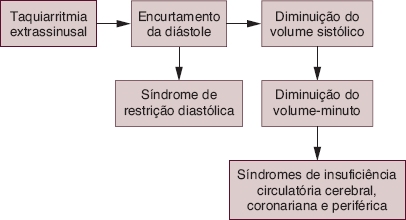
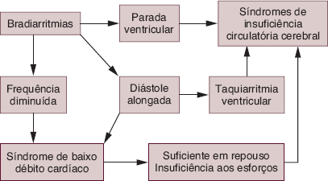
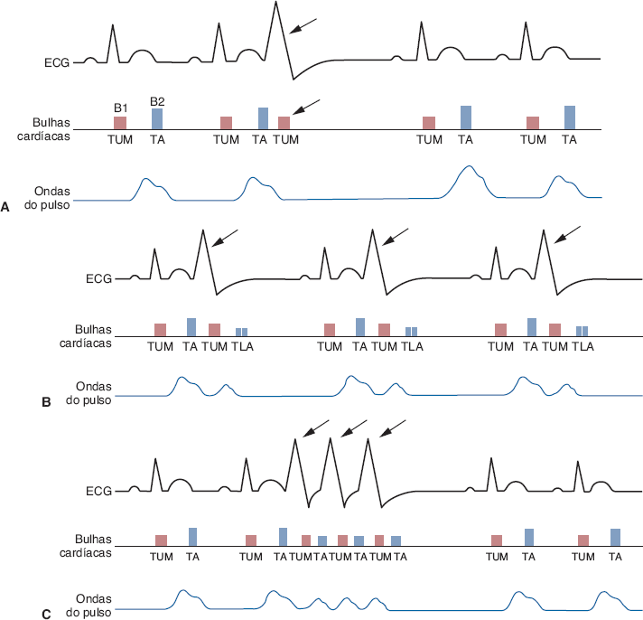
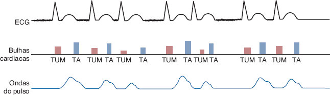
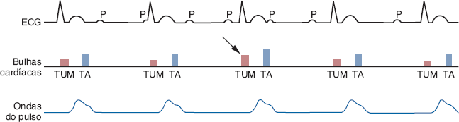

# Tema S · Semiologia: anamnese, sintomas e arritmias

**Área:** Semiologia · **Resumão:** [resumao.pdf](resumao.pdf) (8 páginas) · **Anki:** [flashcards.apkg](flashcards.apkg) (56 cartões) · **Vídeos:** [por subtema](#vídeos-recomendados)

**Fontes:** Porto, Semiologia Médica, 8ª ed., cap. 47 (PDF p. 537–550 e 556–560)

[← Tema H](../h-regulacao-renal-da-pa/README.md) · [Índice](../../README.md) · [Tema T →](../t-semiologia-precordio-bulhas-sopros/README.md)

## O essencial

- **Dor anginosa:** retroesternal, **constritiva** (mão fechada no peito), irradia para mandíbula, MMSS, epigástrio e dorso; vem com **esforço**, emoção, frio ou refeição; alivia com **repouso** e **nitrato em 3–4 min**.
- **Duração da dor:** angina **2–3 min** (raro > 10); angina instável até **20 min**; infarto **> 20 min**, começa em repouso, com sudorese, náuseas e vômitos.
- **Pericardite:** dor contínua por horas, piora com **respiração e decúbito dorsal**, melhora ao **inclinar o tórax para frente**. **Dissecção aórtica:** súbita, **lancinante**, irradia para o **dorso (interescapular)**.
- **Dispneia da IVE:** de esforço (grandes → médios → pequenos, **progressão rápida**), **ortopneia**, **dispneia paroxística noturna** (asma cardíaca) e **edema agudo de pulmão** (expectoração **rósea e espumosa**). Causa básica: **congestão pulmonar**.
- **Palpitações:** “falhas” e “arrancos” = **extrassístoles**; início e fim **súbitos** = **taquicardia paroxística** (FC > 150); irregular e rápida = **fibrilação atrial**.
- **Síncope cardíaca:** bradicardia **< 30–40** ou taquicardia **> 150 bpm**. **Stokes-Adams** = síncope com convulsão por arritmia (Chagas com BAV). A **vasovagal** é a mais comum e melhora ao **deitar**.
- **Cianose:** Hb reduzida **≥ 5 g/dL** (anêmico grave não fica cianótico). **Central** (melhora com O₂) × **periférica** (pele fria, melhora ao aquecer ou elevar o membro).
- **Edema cardíaco (IVD):** começa nos **maléolos**, bilateral, **vespertino**, com **jugulares túrgidas** e **hepatomegalia**; generalizado = **anasarca**.
- **FA:** ritmo **completamente irregular**, B1 de intensidade variável (**delirium cordis**) e **déficit de pulso**. **BAVT:** FC **30–40**, regular, B1 variável com **bulha em canhão**.

## Valores para decorar

| Parâmetro | Valor | Observação |
|---|---|---|
| Angina estável | 2–3 min | Raro > 10 min |
| Angina instável | Até 20 min |  |
| Infarto agudo | > 20 min | Começa em repouso |
| Alívio da angina com nitrato | 3–4 min | 5–10 min: instável |
| Palpitação: taquicardia sinusal | FC 100–150 |  |
| Palpitação: taquicardia paroxística | FC > 150 | Foco a 150–250/min |
| Apneia do Cheyne-Stokes | 15–30 s | Até 60 s |
| Hemoptise | > 2 mL de sangue |  |
| Síncope por arritmia | FC < 30–40 ou > 150 |  |
| Stokes-Adams: perda da consciência | 10–15 s após a arritmia | Convulsão em 20–40 s |
| Hb reduzida para cianose | ≥ 5 g/dL | Normal ≈ 2,6 |
| Meta-hemoglobina com cianose | > 20% da Hb |  |
| Peso retido antes da fóvea | Até 10% |  |
| DC compensado | FC entre 40 e 160 |  |
| Fibrilação atrial (átrios) | 400–600/min |  |
| BAV total | FC 30–40 |  |
| Bulha em canhão | Sístole atrial 0,10–0,12 s antes |  |

## Figuras-chave

**Porto, Fig. 47.6** — Repercussões hemodinâmicas das taquiarritmias extrassinusais.

**Porto, Fig. 47.7** — Repercussões hemodinâmicas das bradiarritmias.

**Porto, Fig. 47.8** — A. Extrassístole ventricular isolada (setas). Observa-se que a contração extrassistólica é prematura, somente se ausculta a 1ª bulha (TUM) e não se percebe onda de pulso correspondente a ela. Após a extrassístole, ocorre uma pausa compensadora e a onda de pulso que vem a seguir é mais ampla. B. Extrassístoles bigeminadas ou bigeminismo extrassistólico. Após cada batimento normal, ocorre uma sístole prematura (setas), seguida de pausa compensadora. A 2ª bulha da contração extrassistólica costuma ser desdobrada e a onda de pulso correspondente tem menor amplitude. C. Extrassístoles em salva. No momento da salva de extrassístoles (setas), ausculta-se uma rápida sucessão de bulhas cardíacas, sendo difícil diferenciar B1 e B2. Após as contrações extrassistólicas, observa-se uma pausa compensadora. No pulso radial, percebem-se ondas de pequena amplitude que se sucedem rapidamente.

**Porto, Fig. 47.9** — Fibrilação atrial (observe a ausência da onda P no ECG). As bulhas cardíacas variam de intensidade de um batimento para outro e os intervalos entre elas também apresentam duração variável. A amplitude e a sequência (ritmo) do pulso são completamente irregulares.

**Porto, Fig. 47.10** — Bloqueio atrioventricular total. A frequência cardíaca é lenta, as bulhas cardíacas se sucedem regularmente, com variação da intensidade de B1, ocorrendo de vez em quando uma 1ª bulha de maior intensidade (seta), denominada bulha em canhão. O pulso é lento e regular.

## Glossário

| Termo | Significado |
|---|---|
| **Angina de peito** | Dor por isquemia miocárdica transitória. |
| **Síndrome de Tietze** | Osteocondrite condroesternal dolorosa. |
| **Palpitação** | Percepção incômoda dos batimentos cardíacos. |
| **Ortopneia** | Dispneia ao deitar, aliviada sentado. |
| **Dispneia paroxística noturna** | Crise de dispneia que acorda o paciente. |
| **Asma cardíaca** | DPN com broncospasmo e sibilos. |
| **Cheyne-Stokes** | Respiração periódica com apneias. |
| **Hemoptise** | Eliminação de sangue das vias aéreas pela tosse. |
| **Síncope** | Perda súbita e transitória da consciência. |
| **Lipotimia** | Pré-síncope: perda parcial da consciência. |
| **Stokes-Adams** | Síncope com convulsão por arritmia grave. |
| **Cianose** | Cor azulada por Hb reduzida ≥ 5 g/dL. |
| **Baqueteamento digital** | Dedos em baqueta e unhas em vidro de relógio. |
| **Anasarca** | Edema generalizado com derrames cavitários. |
| **Pausa compensadora** | Pausa longa após a extrassístole. |
| **Déficit de pulso** | Menos pulsos radiais que batimentos cardíacos. |
| **Delirium cordis** | Irregularidade total da fibrilação atrial. |
| **Bulha em canhão** | B1 muito intensa no BAV total. |

## Correlações clínicas

- **Síndrome coronariana aguda.** Dor constritiva **> 20 min**, em repouso, com sudorese e náuseas: pensar em **infarto** e fazer ECG imediato.
- **Pericardite aguda.** Dor que **melhora inclinando para frente** e piora deitado; ao exame, **atrito pericárdico**.
- **Dissecção de aorta.** Dor **lancinante** irradiada para o dorso, em hipertenso; pulsos e PA assimétricos.
- **Insuficiência cardíaca esquerda.** Dispneia progressiva, **ortopneia**, **DPN**, tosse noturna, **estertores** nas bases e **B3**.
- **Insuficiência cardíaca direita.** **Edema vespertino** de membros inferiores, **jugulares túrgidas**, **hepatomegalia** e ascite.
- **Doença de Chagas.** Natural de zona endêmica com **BAV**, extrassístoles, **Stokes-Adams** e IC.
- **Estenose mitral.** Mulher jovem com dispneia, **hemoptise**, **FA** e edema agudo de pulmão.
- **Tetralogia de Fallot.** Criança com **cianose central**, **baqueteamento** e **posição de cócoras**.

## Pegadinhas de prova

- Dor precordial **não** é sinônimo de dor cardíaca.
- Dor **perimamilar** ou na **ponta** quase nunca é cardíaca (psicogênica).
- Angina que dura **mais de 20 min** já não é angina estável.
- **Ortopneia** surge **logo ao deitar**; a **paroxística noturna** acorda o paciente depois de horas.
- **Anemia grave** impede a cianose (falta Hb reduzida).
- Cianose **periférica** tem pele **fria**; a **central** melhora com **O₂**.
- Na extrassístole o paciente sente o batimento **após** a pausa, não o prematuro.
- Síncope **ao esforço** sugere **estenose aórtica**.
- **Bradicardia sinusal** acelera com exercício; o **BAVT** não.
- **Inibidores da ECA** causam tosse seca.

## Onde ler nas fontes

| Livro | Onde | O que ler |
|---|---|---|
| Porto | Cap. 47 · PDF p. 537–540 | Anamnese e dor torácica (Quadro 47.1) |
| Porto | Cap. 47 · PDF p. 540–545 | Palpitações, dispneia, tosse, chiado e hemoptise (Quadros 47.2 a 47.5) |
| Porto | Cap. 47 · PDF p. 545–548 | Síncope e lipotimia (Quadro 47.6) |
| Porto | Cap. 47 · PDF p. 548–550 | Cianose, edema, astenia e posição de cócoras |
| Porto | Cap. 47 · PDF p. 556–560 | Ritmo, frequência e arritmias (Quadro 47.7, Fig. 47.6 a 47.10) |

## Vídeos recomendados

Vídeos gratuitos do YouTube em português (**PT**) e em inglês (**EN**), separados por subtema e do mais curto ao mais longo. Todos foram abertos e conferidos em 03/10/2026. Dica: assista ao vídeo do subtema **antes** de ler a parte correspondente do resumão.

### Dor torácica

- **PT · 18 min** · [Cardiologia: abordagem à dor torácica](https://www.youtube.com/watch?v=sn6cDa4v0lw) · *Jaleko Acadêmicos*  
  Diferencia a dor da síndrome coronariana aguda, da dissecção de aorta, do TEP, da pericardite, do espasmo esofágico e da costocondrite.
- **PT · 40 min** · [Dor torácica: diagnósticos diferenciais](https://www.youtube.com/watch?v=Oi5qW38b2j8) · *Medicina Resumida*  
  As causas graves de dor no peito, uma por uma, e a abordagem inicial.
- **EN · 9 min** · [Chest Pain History Taking - OSCE Guide](https://www.youtube.com/watch?v=eiRIm6BOzP4) · *Geeky Medics*  
  A anamnese da dor torácica feita do início ao fim com o roteiro SOCRATES (local, início, caráter, irradiação, sintomas associados, tempo, fatores de piora e melhora, intensidade).

### Dispneia, ortopneia e dispneia paroxística noturna

- **PT · 2 min** · [Dispneia: ortopneia, platipneia, trepopneia?](https://www.youtube.com/watch?v=PCKXLBxmAJg) · *Gabriel Pereira*  
  Conceito rápido dos tipos de dispneia ligados à posição do corpo.
- **EN · 10 min** · [Understanding Heart Failure: Visual Explanation for Students](https://www.youtube.com/watch?v=q2t9sFITAIY) · *Zero To Finals*  
  Insuficiência cardíaca ilustrada, com atenção especial à dispneia paroxística noturna.
- **EN · 32 min** · [Dyspnea, PND & Orthopnea](https://www.youtube.com/watch?v=9Oubwtvu_TI) · *AETCM Emergency Medicine*  
  Mecanismo da ortopneia e da DPN e como separar a dispneia cardíaca da respiratória.

### Síncope

- **PT · 9 min** · [Síncope cardíaca e suas características e procedimentos](https://www.youtube.com/watch?v=2uuSn6wYggU) · *Medcel*  
  Resumo das causas cardíacas de síncope (estruturais e arrítmicas) e dos achados de alto risco.
- **PT · 48 min** · [Síncope de etiologia cardíaca](https://www.youtube.com/watch?v=dv0jFSToKf8) · *Medicina Interna*  
  Aula completa: classificação, avaliação inicial, critérios de alto risco e papel do ECG.
- **EN · 16 min** · [An Approach to Syncope](https://www.youtube.com/watch?v=iJ6g5rsQKaM) · *Strong Medicine*  
  Compara síncope reflexa (vasovagal), cardiogênica e ortostática, e síncope × crise convulsiva.
- **EN · 32 min** · [Syncope | Clinical Medicine](https://www.youtube.com/watch?v=nTcI1cITnI0) · *Ninja Nerd*  
  A fisiopatologia de cada tipo de síncope, passo a passo, e a diferença com crise convulsiva.

### Cianose

- **PT · 29 min** · [Inspeção geral: cianose](https://www.youtube.com/watch?v=o8IDbxnQklY) · *RABISCANDO*  
  Definição clínica e fisiopatologia da cianose (aula do exame respiratório que vale também para o cardíaco).
- **EN · 17 min** · [Cyanosis](https://www.youtube.com/watch?v=s5UQ_JpvFqc) · *Dr Matt & Dr Mike*  
  Mecanismo da cianose central e da periférica, com a curva de dissociação da hemoglobina.

### Arritmias no exame clínico

- **PT · 2 min** · [O que esperar no exame físico do paciente com FA?](https://www.youtube.com/watch?v=CAXJmVU20-I) · *Plantão Médico Curso*  
  Os achados de exame físico que sugerem fibrilação atrial.
- **PT · 6 min** · [Pausa compensatória](https://www.youtube.com/watch?v=9ABVkqpdwQ8) · *Arritmia Na Prática*  
  Como reconhecer a pausa compensatória da extrassístole (a “falha” que o paciente sente) e diferenciá-la de bloqueio AV.
- **EN · 2 min** · [What is pulse deficit?](https://www.youtube.com/watch?v=EYZJXh9cups) · *Johnson's Cardiology*  
  O que é déficit de pulso e por que ele aparece na fibrilação atrial.

### Visão geral e aulas completas

- **PT · 8 min** · [Semiologia cardiovascular](https://www.youtube.com/watch?v=2utpvJ6FCAM) · *Prática Enfermagem*  
  Panorama curto da semiologia cardiovascular.
- **PT · 34 min** · [Semiologia cardiovascular](https://www.youtube.com/watch?v=gJ_ugrpJGZU) · *MEDsimple*  
  Aula de semiologia cardiovascular para a graduação.
- **PT · 1 h 6 min** · [Aula 02: semiologia cardiovascular](https://www.youtube.com/watch?v=BdFdGr77Es0) · *Liga Acadêmica de Cardiologia de Paulo Afonso*  
  Aula de semiologia dada por uma liga acadêmica de cardiologia.
- **PT · 1 h 45 min** · [Semiologia cardiovascular](https://www.youtube.com/watch?v=5NTRLH2Rrvc) · *Fabricio Fortuna*  
  Aula teórica completa de semiologia cardiocirculatória do curso de Medicina da Universidade de Caxias do Sul.
- **PT · 1 h 49 min** · [Semiologia cardiovascular: aula teórica, parte 1](https://www.youtube.com/watch?v=zW24HGh4yWU) · *Semiologia Descomplicada*  
  Aula teórica longa (parte 1) de semiologia cardiovascular.
- **EN · 8 min** · [Cardiovascular Examination - OSCE Guide](https://www.youtube.com/watch?v=XU_xeUMJ3Zc) · *Geeky Medics*  
  O exame cardiovascular inteiro em 8 minutos: mãos, pulsos, jugular, ictus, frêmitos, ausculta e manobras.
- **EN · 49 min** · [The Cardiovascular Exam / Heart Sounds (Strong Exam)](https://www.youtube.com/watch?v=r9uo6Ljza6U) · *Strong Medicine*  
  O exame cardiovascular essencial em profundidade: pulsos, edema, jugular, sopro carotídeo e ausculta.

Para ouvir as arritmias (fibrilação atrial, taquicardias, bradicardia do atleta), use o [baralho de sons](../../anki/LIMAC-Sons-cardiacos.apkg).

---

[← Tema H](../h-regulacao-renal-da-pa/README.md) · [Índice](../../README.md) · [Tema T →](../t-semiologia-precordio-bulhas-sopros/README.md)

*Figuras reproduzidas dos livros-texto para uso pessoal de estudo; o número de cada figura no livro está indicado na legenda.*
