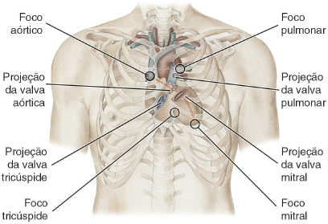
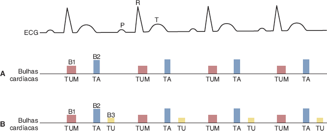
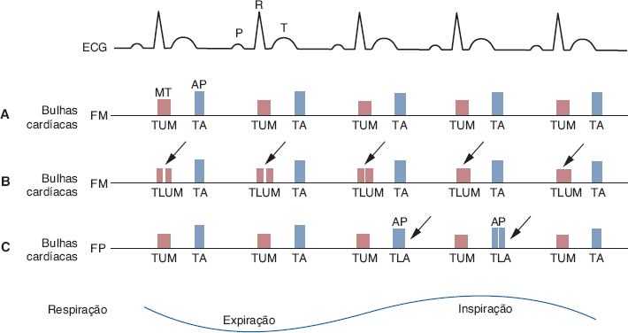
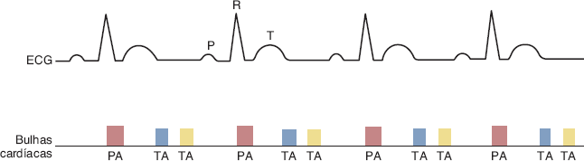
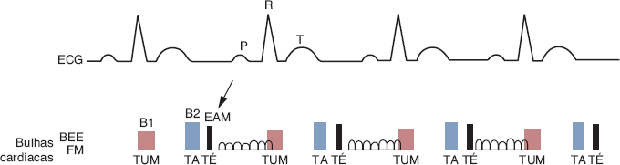
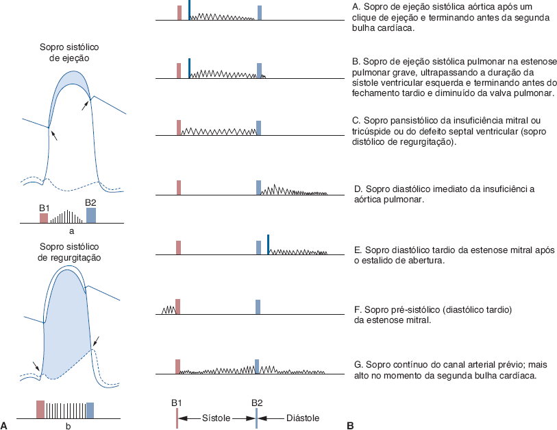
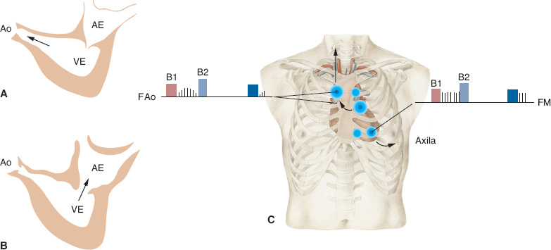
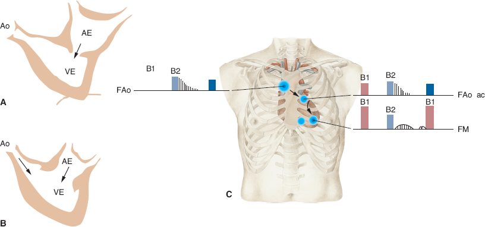
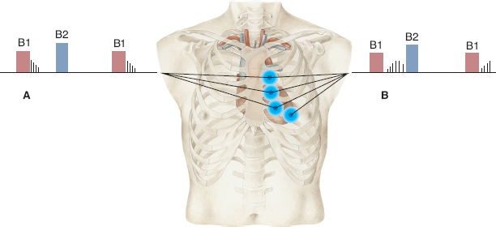
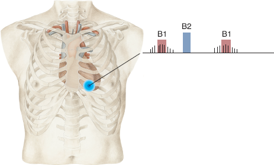

# Tema T · Semiologia: precórdio, bulhas e sopros

**Área:** Semiologia · **Resumão:** [resumao.pdf](resumao.pdf) (10 páginas) · **Anki:** [flashcards.apkg](flashcards.apkg) (62 cartões) · **Vídeos:** [por subtema](#vídeos-recomendados)

**Fontes:** Porto, Semiologia Médica, 8ª ed., cap. 47 (PDF p. 550–556 e 560–569)

[← Tema S](../s-semiologia-anamnese-sintomas-arritmias/README.md) · [Índice](../../README.md) · [Tema U →](../u-semiologia-pulsos-pulso-venoso-pa/README.md)

## O essencial

- **Ictus cordis:** 5º EIC na linha hemiclavicular esquerda (mediolíneo), **1–2 polpas digitais**, desloca **1–2 cm** com o decúbito. **Difuso** (≥ 3 polpas) = **dilatação**; **propulsivo** = **hipertrofia**. Deslocado para baixo e para fora = **VE**.
- **Hipertrofia do VD** não desloca o ictus: dá **levantamento em massa** paraesternal, **retração sistólica apical** e **pulsação epigástrica**.
- **Focos:** mitral = 5º EIC LHCE (ictus); tricúspide = base do apêndice xifoide; pulmonar = 2º EIC esquerdo; aórtico = 2º EIC direito; **aórtico acessório = 3º–4º EIC esquerdo**. Não coincidem com a projeção das valvas.
- **B1** = fechamento **mitral e tricúspide**, coincide com o **ictus e o pulso carotídeo** (TUM). **B2** = fechamento **aórtico e pulmonar** (TA); **desdobra na inspiração** (fisiológico).
- **B3:** protodiastólica, **enchimento rápido**, baixa frequência (campânula, DLE); normal em crianças e jovens. **B4:** pré-sistólica, **contração atrial** contra ventrículo **pouco complacente**.
- **Galope ventricular** (B3 patológica) = **sofrimento miocárdico / IC**, o “grito de socorro do miocárdio”. **Galope atrial** (B4): HAS grave, coronariopatia (disfunção diastólica).
- **Desdobramentos de B2:** **constante e variável** = **BRD**; **fixo** = **CIA**; **paradoxal** (na expiração) = **BRE** ou estenose aórtica grave.
- **Sopro sistólico de ejeção** (estenose aórtica/pulmonar): começa **após B1**, **crescendo-decrescendo**, termina antes de B2. **De regurgitação** (IM, IT, CIV): **holossistólico**, **mascara B1**.
- **Estenose mitral:** B1 hiperfonética, **estalido de abertura** e **ruflar diastólico** com reforço pré-sistólico, melhor em **DLE com campânula**. **Insuficiência aórtica:** sopro **protodiastólico aspirativo**, melhor **sentado e inclinado para frente**.
- **Irradiação:** estenose aórtica → **pescoço**; insuficiência mitral → **axila**. **Rivero-Carvallo:** sopro que **aumenta na inspiração** é **tricúspide**.

## Valores para decorar

| Parâmetro | Valor | Observação |
|---|---|---|
| Ictus no mediolíneo | 5º EIC, LHCE |  |
| Ictus no brevilíneo | 4º EIC | ≈ 2 cm para fora |
| Ictus no longilíneo | 6º EIC | 1–2 cm para dentro |
| Extensão normal do ictus | 1–2 polpas | ≥ 3: difuso |
| Mobilidade normal do ictus | 1–2 cm | Fixo na sínfise pericárdica |
| Ictus na insuficiência aórtica | 6º–8º EIC | Até a linha axilar anterior |
| Foco mitral | 5º EIC esquerdo, LHC | Ictus |
| Foco pulmonar | 2º EIC esquerdo | Paraesternal |
| Foco aórtico | 2º EIC direito | Paraesternal |
| Foco aórtico acessório | 3º–4º EIC esquerdo | Paraesternal |
| Foco tricúspide | Base do apêndice xifoide | Levemente à esquerda |
| FC normal no adulto | 60–100 bpm |  |
| Galope com FC baixa | Exercício até ≈ 100 bpm | Para evidenciar |
| Intensidade dos sopros | + a ++++ | ++++: estetoscópio afastado |
| Sopro inocente | + a ++ | Sistólico, sem frêmito |
| Campânula | ≈ 2,5 cm | Baixa frequência |
| Diafragma | 3–3,5 cm | Alta frequência |

## Figuras-chave

**Porto, Fig. 47.1** — Localização dos focos de referência para a ausculta cardíaca, notando-se que não coincidem com a projeção superficial das valvas do coração. (Adaptada de Wolf-Heidegger – Atlas de Anatomia Humana, 6ª ed., 2006.)

**Porto, Fig. 47.3** — Esquema de bulhas cardíacas normais tendo como referência a atividade elétrica do coração (ECG). A. Ritmo de dois tempos ou ritmo binário, no qual se ouvem apenas duas bulhas (B1 e B2). B. Ritmo de três tempos ou ritmo tríplice, pela presença de uma 3ª bulha (B3) na protodiástole.

**Porto, Fig. 47.4** — Desdobramento fisiológico das bulhas cardíacas. A. Bulhas cardíacas representadas sem desdobramento: os componentes mitral (M) e tricúspide (T) de B1 e os componentes aórtico (A) e pulmonar (P) de B2 estão unidos, ouvindo-se dois ruídos (TUM-TA). B. Os componentes mitral e tricúspide da 1ª bulha (setas) ficam separados, passando-se a ouvir um ruído desdobrado (TLUM). Isso ocorre com frequência em pessoas normais, e não tem relação com a respiração. C. Desdobramento fisiológico (setas) da 2ª bulha (TLA), que aparece na inspiração.

**Porto, Fig. 47.11** — Ritmo de galope ventricular. Em vez do TUM-TA, ouve-se uma sequência de três ruídos (PA-TA-TA), que lembram o galope de cavalo.

**Porto, Fig. 47.13** — O estalido de abertura mitral (EAM) é um ruído seco (TÉ), de curta duração, protodiastólico, precedendo o ruflar, mais audível no foco mitral (FM) e na borda esternal esquerda (BEE). Aparece na estenose mitral em decorrência das modificações anatômicas das cúspides e das alterações pressóricas intracavitárias.

**Porto, Fig. 47.15** — A. Características hemodinâmicas do sopro sistólico de ejeção (a) e do sopro sistólico de regurgitação (b). No sopro de ejeção, o gradiente de pressão inicia-se no fim da fase de contração ventricular isométrica e termina antes do fechamento das valvas aórtica e pulmonar (setas). Isso faz com que o sopro tenha início após a 1ª bulha (B1) e termine antes da 2ª bulha (B2). O sopro de regurgitação começa com a 1ª bulha, recobrindo-a, e termina no fim da 2ª bulha; isso porque há gradiente de pressão desde o início da contração ventricular até o fechamento das valvas aórtica e pulmonar. B. Representação esquemática da ausculta dos sopros sistólicos, diastólicos e sistodiastólicos.

**Porto, Fig. 47.16** — Sopros sistólicos: estenose aórtica e insuficiência mitral. Na estenose aórtica (A), durante a sístole, há dificuldade de o sangue passar do ventrículo esquerdo (VE) para a aorta (Ao) devido ao estreitamento do orifício valvar. Na insuficiência mitral (B), durante a sístole, as cúspides valvares não ocluem completamente o orifício, possibilitando o refluxo de certa quantidade de sangue para o átrio esquerdo (AE). Em ambas as condições, aparece um sopro sistólico (C). Na estenose aórtica, o sopro é tipo ejeção, audível no foco aórtico (FAo) e foco aórtico acessório (FAo’) com irradiação para cima, na direção dos vasos do pescoço. Na insuficiência mitral, o sopro é de regurgitação, audível no foco mitral (FM) e com irradiação na direção da axila. (Adaptada de Wolf-Heidegger – Atlas de Anatomia Humana, 6ª ed., 2006.)

**Porto, Fig. 47.17** — Sopros diastólicos: estenose mitral e insuficiência aórtica. Na estenose mitral (A), as cúspides da valva mitral não se abrem completamente durante a diástole, dificultando a passagem de sangue do átrio esquerdo (AE) para o ventrículo esquerdo (VE). Na insuficiência aórtica (B), durante a diástole, as cúspides da valva aórtica não ocluem o orifício, possibilitando o refluxo de sangue da aorta (Ao) para o ventrículo esquerdo (VE). Em ambas as condições, surge um sopro diastólico (C). O sopro de estenose mitral é audível na área mitral, com pequena irradiação, tem característica de ruflar e apresenta um reforço pré-sistólico. O sopro de insuficiência aórtica é audível no foco aórtico (FAo) ou no foco aórtico acessório (FAO ac), irradiando-se para a ponta do coração, é proto e mesodiastólico e tem alta frequência, o que lhe dá um caráter aspirativo. (Adaptada de Wolf-Heidegger – Atlas de Anatomia Humana, 6ª ed., 2006.)

**Porto, Fig. 47.18** — Sopros inocentes. Os sopros inocentes são sistólicos – proto (A) ou mesossistólicos (B), nunca holossistólicos – suaves, sem irradiação e mais audíveis na borda esternal esquerda e região mesocardíaca. (Adaptada de Wolf-Heidegger – Atlas de Anatomia Humana, 6ª ed., 2006.)

**Porto, Fig. 47.19** — Atrito pericárdico. O atrito pericárdico não guarda relação fixa com as bulhas cardíacas, mas, quase sempre, recobre a 1ª bulha e parte do pequeno silêncio. Sua localização mais frequente é entre a borda esternal esquerda e a ponta do coração, com pequena ou nenhuma irradiação para as áreas vizinhas. (Adaptada de Wolf-Heidegger – Atlas de Anatomia Humana, 6ª ed., 2006.)

## Glossário

| Termo | Significado |
|---|---|
| **Ictus cordis** | Choque da ponta do coração na parede torácica. |
| **Ictus difuso** | Ictus que ocupa 3 ou mais polpas digitais. |
| **Ictus propulsivo** | Ictus que levanta a mão a cada sístole. |
| **Levantamento em massa** | Impulsão sistólica paraesternal (hipertrofia do VD). |
| **Frêmito catário** | Vibração palpável de um sopro. |
| **Sínfise pericárdica** | Aderência dos folhetos pericárdicos. |
| **Foco aórtico acessório** | 3º–4º EIC esquerdo junto ao esterno. |
| **Pequeno silêncio** | Intervalo entre B1 e B2 (sístole). |
| **Grande silêncio** | Intervalo entre B2 e B1 (diástole). |
| **Ritmo de galope** | Ritmo tríplice que lembra o galope (PA-TA-TA). |
| **Desdobramento paradoxal** | B2 desdobrada só na expiração. |
| **Estalido de abertura mitral** | Ruído seco protodiastólico da estenose mitral. |
| **Clique mesossistólico** | Ruído seco sistólico do prolapso valvar. |
| **Ruflar** | Sopro diastólico grave da estenose mitral. |
| **Sopro aspirativo** | Sopro diastólico agudo da insuficiência aórtica. |
| **Sopro em maquinaria** | Sopro contínuo do canal arterial. |
| **Rivero-Carvallo** | Aumento do sopro tricúspide na inspiração. |
| **Sopro inocente** | Sopro sem alteração estrutural do coração. |
| **Atrito pericárdico** | Ruído de couro do pericárdio inflamado. |
| **Rumor venoso** | Ruído contínuo venoso cervical, benigno. |

## Correlações clínicas

- **Estenose mitral.** B1 **hiperfonética**, **estalido de abertura** e **ruflar** com reforço pré-sistólico; FA frequente. Causa: **febre reumática**.
- **Insuficiência aórtica.** Ictus **difuso e propulsivo** deslocado, sopro **diastólico aspirativo**, pulso célere e PA divergente.
- **Estenose aórtica.** Sopro **sistólico de ejeção** rude irradiado para o **pescoço**, B2 hipofonética, pulso **parvus**, síncope e angina ao esforço.
- **Insuficiência mitral.** Sopro **holossistólico** no foco mitral irradiado para a **axila**, com B3.
- **Insuficiência cardíaca.** **Galope ventricular** (B3) com taquicardia: sinal de **sofrimento miocárdico**.
- **Comunicação interatrial.** **Desdobramento fixo de B2** e sopro sistólico pulmonar por hiperfluxo.
- **Persistência do canal arterial.** Sopro **contínuo em maquinaria** perto do foco pulmonar e na região interescapulovertebral esquerda.
- **Pericardite aguda.** **Atrito pericárdico** mutável, que não se irradia.
- **Prolapso da valva mitral.** **Clique mesossistólico**, com ou sem sopro telessistólico.

## Pegadinhas de prova

- Os focos de ausculta **não** correspondem à posição anatômica das valvas.
- Hipertrofia do **VD não desloca o ictus**.
- Ictus **difuso** = dilatação; **propulsivo** = hipertrofia.
- B1 coincide com o **ictus** e o **pulso carotídeo**.
- O desdobramento **fisiológico** de B2 é na **inspiração**; o **paradoxal**, na **expiração**.
- Desdobramento **fixo** = **CIA**; **constante e variável** = **BRD**.
- B3 normal e patológica **soam iguais**: o contexto decide.
- Ruflar da EM é de **baixa frequência**: use a **campânula** sem comprimir.
- Sopro **holossistólico nunca** é inocente.
- O sopro aumenta na **inspiração**? É do **lado direito** (Rivero-Carvallo).
- O **rumor venoso** some ao **deitar** ou comprimir a jugular.

## Onde ler nas fontes

| Livro | Onde | O que ler |
|---|---|---|
| Porto | Cap. 47 · PDF p. 550–551 | Inspeção e palpação: abaulamento, ictus, batimentos, frêmito, hipertrofias |
| Porto | Cap. 47 · PDF p. 551–553 | Focos de ausculta e semiotécnica (Fig. 47.1 e 47.2) |
| Porto | Cap. 47 · PDF p. 553–556 | Bulhas cardíacas (Fig. 47.3 a 47.5) |
| Porto | Cap. 47 · PDF p. 560–563 | Ritmos tríplices, galope e alterações das bulhas (Fig. 47.11 e 47.12) |
| Porto | Cap. 47 · PDF p. 563–564 | Estalidos e cliques (Fig. 47.13 e 47.14) |
| Porto | Cap. 47 · PDF p. 564–569 | Sopros, sopros inocentes, atrito pericárdico e rumor venoso (Fig. 47.15 a 47.19) |

## Vídeos recomendados

Vídeos gratuitos do YouTube em português (**PT**) e em inglês (**EN**), separados por subtema e do mais curto ao mais longo. Todos foram abertos e conferidos em 03/10/2026. Dica: assista ao vídeo do subtema **antes** de ler a parte correspondente do resumão.

Aulas longas que cobrem S, T e U estão no [tema S](../s-semiologia-anamnese-sintomas-arritmias/README.md#visão-geral-e-aulas-completas).

### Inspeção e palpação do precórdio

- **PT · 3 min** · [Palpação do ictus cordis e focos da ausculta cardíaca](https://www.youtube.com/watch?v=9d5xjYtgsu0) · *Semiotécnica UEA*  
  Como localizar o ictus e os focos de ausculta, com base no Porto.
- **PT · 7 min** · [Inspeção do precórdio | Exame físico do aparelho cardiovascular 1/4](https://www.youtube.com/watch?v=4jpgwsRvQvI) · *PED+*  
  Inspeção do precórdio e do ictus, sinal de Levine e posição de Blechmann.
- **PT · 15 min** · [Semiologia 16: exame do aparelho cardiovascular, parte 1/2](https://www.youtube.com/watch?v=qzVWmGd_WVY) · *Medicina Resumida*  
  Exame periférico (pulso, jugular, edema) e inspeção e palpação do precórdio.
- **PT · 15 min** · [Semiologia cardiovascular: inspeção e palpação](https://www.youtube.com/watch?v=2NtkWjUHR1E) · *PET Medicina UFC - Sobral*  
  Demonstração da primeira parte do exame físico cardiovascular.
- **EN · 2 min** · [Precordial Movements: The Double Impulse](https://www.youtube.com/watch?v=jhUgnuVe_jU) · *Stanford Medicine 25*  
  Paciente real: como palpar o ictus e reconhecer um impulso duplo.

### Bulhas: B1, B2, desdobramentos, B3 e B4

- **PT · 6 min** · [Ausculta cardíaca normal: aprenda em 5 minutos](https://www.youtube.com/watch?v=zQtwZ4iyfgM) · *MedTV - DrJulioMassao*  
  B1, B2 e desdobramento em 5 minutos.
- **PT · 7 min** · [Ausculta do coração: bulhas cardíacas B3 e B4](https://www.youtube.com/watch?v=e_PUxfy61qY) · *Semiologia Simples*  
  B3 e B4 com os sons, para treinar o ouvido.
- **PT · 7 min** · [Ausculta cardíaca anormal: B3, B4 e ritmos de galope](https://www.youtube.com/watch?v=R8URksXmmUw) · *MedTV - DrJulioMassao*  
  B3, B4 e ritmos de galope em aula curta.
- **PT · 12 min** · [Semiologia médica: ausculta cardíaca (com sons)](https://www.youtube.com/watch?v=hAGcp57aGr0) · *Enfermagem Total*  
  Revisão da ausculta cardíaca com os sons.
- **PT · 15 min** · [Ausculta do coração: bulhas cardíacas B1 e B2](https://www.youtube.com/watch?v=Rg4whidnau0) · *Semiologia Simples*  
  B1 e B2 a fundo, com os sons.
- **PT · 17 min** · [Semiologia 17: exame do aparelho cardiovascular, parte 2/2](https://www.youtube.com/watch?v=NWmnE41Od6E) · *Medicina Resumida*  
  A ausculta cardíaca, continuação da parte 1.
- **EN · 31 min** · [Heart Sounds](https://www.youtube.com/watch?v=cE8X1nwZWC4) · *Strong Medicine*  
  Bulhas normais e anormais com muitos exemplos de áudio: intensidade de B1, desdobramentos de B2, B3, B4 e cliques.

### Sopros

- **PT · 7 min** · [Ausculta cardíaca na estenose e insuficiência valvares](https://www.youtube.com/watch?v=KOm8e4rAaC4) · *MedTV - DrJulioMassao*  
  Ausculta das estenoses e das insuficiências valvares em aula curta.
- **PT · 14 min** · [Sopro cardíaco: conheça os seus diferentes tipos](https://www.youtube.com/watch?v=4e0TQJMO7EY) · *Afya Cardiopapers*  
  Sopro sistólico × diastólico e sopro inocente × patológico.
- **PT · 32 min** · [Ausculta cardíaca (parte 2): sopros cardíacos](https://www.youtube.com/watch?v=BIQ3wq6SI_I) · *Precisa Desenhar?*  
  Graus dos sopros e as quatro valvopatias clássicas: IM, EAo, IAo e EM.
- **PT · 42 min** · [Semiologia cardíaca | Super Revisão de Cardiologia](https://www.youtube.com/watch?v=3nvjiRkzK8M) · *Estratégia MED*  
  Revisão de focos, bulhas, desdobramentos, sopros e manobras (Valsalva) com foco em prova.
- **PT · 44 min** · [Sopros cardíacos na ausculta do coração](https://www.youtube.com/watch?v=cwJfvMEJjy0) · *Semiologia Simples*  
  Sopros sistólicos e diastólicos como porta de entrada para as valvopatias.
- **EN · 2 min** · [Heart murmur sounds (cardiac auscultation sounds)](https://www.youtube.com/watch?v=Q5-0mSydRR4) · *Geeky Medics*  
  O sopro típico de cada foco em 2 minutos, com as manobras que o acentuam.
- **EN · 4 min** · [Approach to the Exam of Diastolic Murmurs (Real Patient and Sounds!)](https://www.youtube.com/watch?v=9u0bhcYYd-8) · *Stanford Medicine 25*  
  Como procurar sopros diastólicos, com paciente e sons reais.
- **EN · 9 min** · [Approach to the Exam for Aortic Regurgitation (Real Patient and Sounds!)](https://www.youtube.com/watch?v=Cb-EXdLlGGs) · *Stanford Medicine 25*  
  Insuficiência aórtica em paciente real: sopro, sopro de Austin Flint e pulso em martelo d’água.
- **EN · 19 min** · [Heart Murmurs and Heart Sounds: Visual Explanation for Students](https://www.youtube.com/watch?v=wYZbMoWjLEg) · *Zero To Finals*  
  Bulhas e sopros com animações: EM, IM, EAo e IAo.
- **EN · 22 min** · [Heart Murmurs | Locations, Maneuvers, Buzzwords](https://www.youtube.com/watch?v=teJcTTVZnzs) · *Dirty Medicine*  
  Local, manobras e palavras-chave de prova de cada sopro, incluindo o prolapso mitral.
- **EN · 37 min** · [Heart Murmurs](https://www.youtube.com/watch?v=lFcf5a6BZGw) · *Strong Medicine*  
  Como caracterizar um sopro (tempo, forma, timbre, intensidade e manobras), com casos.
- **EN · 44 min** · [Heart Sounds & Murmurs | Clinical Medicine](https://www.youtube.com/watch?v=9DzhhagWeNc) · *Ninja Nerd*  
  Aula completa: B1 a B4, os quatro desdobramentos de B2, sopros sistólicos, diastólicos e contínuos, manobras.

### Estalidos e pericardite

- **PT · 3 min** · [O que procurar no exame físico da pericardite aguda?](https://www.youtube.com/watch?v=Rb6QzBpv3fU) · *Afya Cardiopapers*  
  Os achados de exame físico na pericardite aguda.
- **PT · 5 min** · [Estalido diastólico](https://www.youtube.com/watch?v=ZK05CU3Layo) · *videoaulasuff*  
  Aula curta sobre o estalido diastólico.

Para treinar o ouvido, veja a seção [Sons cardíacos](#sons-cardíacos) logo abaixo.

## Sons cardíacos

- **Baralho de sons do LIMAC** ([LIMAC-Sons-cardiacos.apkg](../../anki/LIMAC-Sons-cardiacos.apkg)): gravações reais de bulhas, B3, B4, clique, sopros e arritmias, com pergunta, resposta e a parte *Para associar*, que liga cada som a outro tema. Use fone de ouvido.
- **[Physical Diagnosis: heart sounds](https://depts.washington.edu/physdx/heart/demo.html)** (Universidade de Washington): bulhas normais, estenose aórtica (pico precoce e pico tardio), insuficiência mitral, estenose pulmonar, insuficiência aórtica, estenose mitral, sopro inocente, CIA, CIV, PCA, desdobramento de B2, B3, B4 e atrito pericárdico (de 2 e de 3 componentes), em 16 gravações curtas. Em inglês.
- **[Easy Auscultation](https://www.easyauscultation.com/heart-sounds)** (MedEdu): aulas curtas com sons reais e simulados de bulhas, desdobramentos de B2 (fisiológico, persistente e fixo), estalido de abertura, B3, B4 e galopes, sopros sistólicos e diastólicos, pericardite aguda e cardiopatias congênitas, mais testes e treino por repetição. Quase todo o conteúdo é gratuito. Em inglês.

---

[← Tema S](../s-semiologia-anamnese-sintomas-arritmias/README.md) · [Índice](../../README.md) · [Tema U →](../u-semiologia-pulsos-pulso-venoso-pa/README.md)

*Figuras reproduzidas dos livros-texto para uso pessoal de estudo; o número de cada figura no livro está indicado na legenda.*
