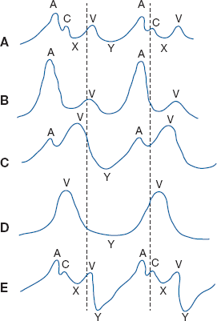
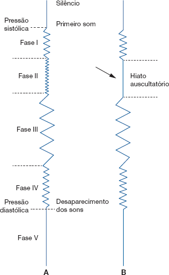
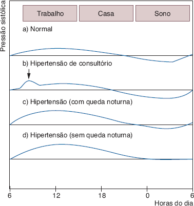

# Tema U · Semiologia: pulsos, pulso venoso e pressão arterial

**Área:** Semiologia · **Resumão:** [resumao.pdf](resumao.pdf) (8 páginas) · **Anki:** [flashcards.apkg](flashcards.apkg) (58 cartões) · **Vídeos:** [por subtema](#vídeos-recomendados)

**Fontes:** Porto, Semiologia Médica, 8ª ed., cap. 47 (PDF p. 569–584)

[← Tema T](../t-semiologia-precordio-bulhas-sopros/README.md) · [Índice](../../README.md)

## O essencial

- **Pulso radial:** analise parede, **frequência** (60–100), **ritmo**, **amplitude**, **tensão**, **tipo de onda** e **comparação com o outro lado**. Conte **1 minuto inteiro** e compare com a FC (**déficit de pulso**: FA e extrassístoles).
- **Amplitude:** **magnus** na insuficiência aórtica; **parvus** na estenose aórtica. **Pulso duro** depende da **pressão diastólica** e indica hipertensão.
- **Tipos de pulso:** **célere** (martelo d’água) = insuficiência aórtica, fístula AV, anemia, hipertireoidismo; **anacrótico** = estenose aórtica; **bisferiens** = EAo + IAo; **dicrótico** = febre; **alternante** = **IVE**; **filiforme** = choque; **paradoxal** = queda **> 10 mmHg** da sistólica na inspiração (tamponamento, pericardite constritiva).
- **Pulso venoso** (jugular) reflete o **coração direito**: ondas **A** (contração atrial), **C**, **V** (enchimento atrial) e descensos **X** (relaxamento atrial, o mais visível) e **Y** (abertura da tricúspide).
- **Turgência jugular a 45°** = hipertensão venosa (IVD, pericardite constritiva, compressão da cava superior). **Onda A gigante:** estenose tricúspide, BAVT, hipertensão pulmonar. **Sem X:** FA. **V gigante:** insuficiência tricúspide.
- **PA = DC × RP.** O DC (volume sistólico) pesa mais na **sistólica**; a **resistência periférica**, na **diastólica**; a **rigidez da aorta** do idoso eleva só a sistólica.
- **Técnica:** repouso **≥ 3 min**, braço na altura do coração, manguito **2 cm acima da fossa cubital**, **palpatório antes** (evita o **hiato auscultatório**), insuflar **30 mmHg acima** e desinsuflar **2–3 mmHg/s**.
- **Korotkoff:** **sistólica = fase I** (primeiro som); **diastólica = fase V** (desaparecimento). Se os sons vão até zero, usa-se a **fase IV** (abafamento). Manguito **estreito superestima** a PA.
- **Hipertensão** no consultório: **≥ 140 × 90**. MAPA: **24 h ≥ 130 × 80**, vigília > 135 × 85, sono > 120 × 70. MRPA e AMPA: > 135 × 85. Descenso noturno normal ≈ **10%**.

## Valores para decorar

| Parâmetro | Valor | Observação |
|---|---|---|
| Frequência do pulso no adulto | 60–100 bpm | Contar 1 min |
| Pulso paradoxal | Queda > 10 mmHg da PAS | Na inspiração profunda |
| DC em repouso | 5–6 L/min | Até 30 no exercício |
| Erro aceitável da medida | ± 8 mmHg |  |
| Repouso antes da medida | ≥ 3 min |  |
| Sem cigarro e café antes | 1 h |  |
| Bolsa do manguito | 80% do comprimento | 40% da circunferência |
| Manguito acima da fossa cubital | 2 cm |  |
| Insuflar acima da PAS palpatória | 30 mmHg |  |
| Velocidade de desinsuflação | 2–3 mmHg/s |  |
| Intervalo entre medidas | ≥ 1 min |  |
| Hiato auscultatório | 30–40 mmHg |  |
| Choro da criança | PA até + 50 mmHg |  |
| Pressão diferencial usual | 30–60 mmHg |  |
| Queda noturna normal | ≈ 10% |  |
| Hipertensão no consultório | ≥ 140 × 90 |  |
| MAPA 24 h normal | < 130 × 80 |  |
| MAPA vigília normal | < 135 × 85 |  |
| MAPA sono normal | < 120 × 70 |  |
| MRPA e AMPA anormais | > 135 × 85 |  |
| Calibração do aneroide | Pelo menos semestral |  |

## Figuras-chave

**Porto, Fig. 47.20** — Pulso venoso ou flebograma. A. Flebograma normal, vendo-se as ondas A, C e V e as deflexões X e Y. À inspeção do pescoço, é possível notar uma onda diastólica positiva e uma onda sistólica negativa. B. Onda A gigante, encontrada na estenose tricúspide, na atresia tricúspide, na estenose pulmonar e quando há hipertensão pulmonar grave. C. Onda V proeminente é sinal de insuficiência tricúspide com fibrilação atrial. D. Pulso venoso positivo, por ausência da deflexão X, aparece na fibrilação atrial. E. Depleção Y profunda, caracterizando-se, à inspeção do pescoço, pelo súbito colapso diastólico do pulso venoso que ocorre quando a pressão venosa é muito elevada, observada na pericardite constritiva e no derrame pericárdico.

**Porto, Fig. 47.27** — Esquema mostrando a escala de Korotkoff normal (A) e quando ocorre o hiato auscultatório (B), representado pela ausência da fase II, que é substituída por um intervalo silencioso.

**Porto, Fig. 47.24** — Perfil esquemático da pressão arterial de 24 horas em diferentes situações: a. Padrão normal de variação; b. Padrão de hipertensão somente durante a visita no consultório, “hipertensão de consultório”; c. Padrão observado na maioria dos hipertensos com queda noturna da pressão; d. Padrão observado na maioria dos hipertensos sem queda noturna da pressão.

## Glossário

| Termo | Significado |
|---|---|
| **Taquisfigmia** | Pulso acima de 100 por minuto. |
| **Bradisfigmia** | Pulso abaixo de 60 por minuto. |
| **Déficit de pulso** | Menos pulsos radiais que batimentos. |
| **Pulso magnus / parvus** | Pulso amplo / pequeno. |
| **Pulso célere** | Martelo d’água: sobe e cai rápido. |
| **Pulso anacrótico** | Entalhe no ramo ascendente (estenose aórtica). |
| **Pulso bisferiens** | Dupla onda no ápice (EAo + IAo). |
| **Pulso dicrótico** | Dupla onda, a segunda após o ápice (febre). |
| **Pulso alternante** | Ondas fortes e fracas alternadas (IVE). |
| **Pulso paradoxal** | Queda da amplitude na inspiração. |
| **Pulso capilar** | Rubor pulsátil no leito ungueal. |
| **Manobra de Osler** | Radial palpável com manguito acima da sistólica. |
| **Flebograma** | Registro das ondas do pulso venoso. |
| **Ingurgitamento jugular** | Jugulares túrgidas a 45° ou sentado. |
| **Sons de Korotkoff** | Ruídos arteriais na medida auscultatória da PA. |
| **Hiato auscultatório** | Silêncio entre as fases I e III. |
| **Pressão diferencial** | Sistólica menos diastólica. |
| **MAPA** | Monitorização ambulatorial da PA por 24 h. |
| **MRPA** | Monitorização residencial da PA com protocolo. |
| **Avental branco** | PA alta só no consultório. |

## Correlações clínicas

- **Insuficiência aórtica.** Pulso **célere** (martelo d’água) e **magnus**, **pulso capilar**, **dança arterial** e **pressão divergente**.
- **Estenose aórtica.** Pulso **parvus** e **anacrótico**, **pressão convergente**, frêmito e sopro nas carótidas.
- **Tamponamento e pericardite constritiva.** **Pulso paradoxal**, **turgência jugular** e **descenso Y profundo**.
- **Insuficiência ventricular esquerda.** **Pulso alternante** (sons alternados na fase I de Korotkoff).
- **Insuficiência ventricular direita.** **Ingurgitamento jugular a 45°**, refluxo hepatojugular, hepatomegalia e edema.
- **Fibrilação atrial.** Pulso irregular com **déficit de pulso** e pulso venoso **sem descenso X**.
- **BAV total.** Pulso lento e regular e **ondas A em canhão** na jugular.
- **Hipertensão do avental branco.** PA alta só no consultório; confirmar com **MAPA** ou **MRPA**.
- **Coarctação ou lesão da crossa.** **Assimetria** dos pulsos e da PA entre os membros.

## Pegadinhas de prova

- Pulso **duro** indica PA diastólica alta, não artéria endurecida.
- **Mediosclerose** da radial **não** indica aterosclerose coronária.
- Pulso **alternante** tem intervalos **iguais**; o **bigeminado**, não.
- O pulso venoso normal é **negativo**: o descenso **X** é o mais visível.
- O pulso venoso **colaba na inspiração** e some ao comprimir a base do pescoço.
- Manguito **estreito** = PA **falsamente alta**.
- Sem o método palpatório, o **hiato auscultatório** faz **subestimar** a sistólica.
- Diastólica = **fase V**; só usa a **fase IV** quando os sons vão até zero.
- Na classificação, se PAS e PAD divergem, vale a **categoria maior**.
- **Deitado** a PA é mais alta que em pé.

## Onde ler nas fontes

| Livro | Onde | O que ler |
|---|---|---|
| Porto | Cap. 47 · PDF p. 569–572 | Exame da aorta, pulso radial, tipos de pulso, pulso capilar e carótidas |
| Porto | Cap. 47 · PDF p. 572–573 | Ingurgitamento jugular e pulso venoso (Fig. 47.20) |
| Porto | Cap. 47 · PDF p. 573–575 | Determinantes e regulação da PA (Fig. 47.21) |
| Porto | Cap. 47 · PDF p. 575–579 | Esfigmomanômetros, MAPA, MRPA e AMPA (Quadros 47.8 e 47.9, Fig. 47.22 a 47.26) |
| Porto | Cap. 47 · PDF p. 579–582 | Técnica, Korotkoff, hiato auscultatório e populações especiais (Fig. 47.27) |
| Porto | Cap. 47 · PDF p. 582–584 | Fatores de variação, pressão diferencial e valores normais (Quadros 47.10 e 47.11) |

## Vídeos recomendados

Vídeos gratuitos do YouTube em português (**PT**) e em inglês (**EN**), separados por subtema e do mais curto ao mais longo. Todos foram abertos e conferidos em 03/10/2026. Dica: assista ao vídeo do subtema **antes** de ler a parte correspondente do resumão.

Aulas longas que cobrem S, T e U estão no [tema S](../s-semiologia-anamnese-sintomas-arritmias/README.md#visão-geral-e-aulas-completas).

### Pulso arterial

- **PT · 3 min** · [Análise de pulso arterial, parte 1 | Semiologia do Zero](https://www.youtube.com/watch?v=mf3M2ZVnCEI) · *Estratégia MED*  
  Início direto da análise do pulso arterial.
- **PT · 9 min** · [Exame das pulsações arteriais](https://www.youtube.com/watch?v=agIi_n5mxUM) · *Semiotécnica UEA*  
  Onde palpar cada pulso (radial, carotídeo, femoral, poplíteo, tibial posterior, pedioso) e a manobra de Allen.
- **PT · 12 min** · [Semiologia do pulso arterial](https://www.youtube.com/watch?v=_CXH5NXMIMU) · *Dr. Wagner Pádua*  
  Os principais tópicos da semiologia do pulso arterial para estudantes de Medicina.
- **EN · 3 min** · [Pulsus Paradoxus Video](https://www.youtube.com/watch?v=jTsjCZ9QxW8) · *Stanford Medicine 25*  
  Como medir o pulso paradoxal na suspeita de tamponamento cardíaco.
- **EN · 4 min** · [Alternans, Anacrotic, parvus, tardus, dicrotic & normal Pulse](https://www.youtube.com/watch?v=o8VdWslTWfk) · *USMLE exam gym*  
  Pulso alternante, anacrótico, parvus et tardus e dicrótico em 4 minutos.
- **EN · 7 min** · [Peripheral Vascular Examination - OSCE Guide](https://www.youtube.com/watch?v=1kfg1mYRJ-g) · *Geeky Medics*  
  Exame vascular periférico: pulsos dos membros, carotídeo e aórtico.
- **EN · 8 min** · [Clinical Skills: Pulses assessment](https://www.youtube.com/watch?v=nhAz84srBvg) · *Osmosis from Elsevier*  
  Como palpar os pulsos radial, apical e femoral.
- **EN · 9 min** · [Types of arterial pulses](https://www.youtube.com/watch?v=zDPw13FMEBs) · *Medic Notes*  
  Pulso anacrótico, bigeminado, dicrótico, alternante, bisferiens e parvus et tardus, com o mecanismo.

### Pulso venoso jugular

- **PT · 8 min** · [Exame cardiovascular (pulso venoso) | Semiologia do Zero](https://www.youtube.com/watch?v=O-KfgwnJqZo) · *Estratégia MED*  
  O pulso venoso no exame cardiovascular, do zero.
- **PT · 10 min** · [Ondas de pulso venoso anormais](https://www.youtube.com/watch?v=yVMjAe_7LRI) · *RABISCANDO*  
  Descensos X e Y alterados, onda A gigante e onda A em canhão.
- **PT · 11 min** · [Inspeção das veias do pescoço III: a onda do pulso venoso jugular](https://www.youtube.com/watch?v=bQ66G-1uOG0) · *RABISCANDO*  
  O que é a onda do pulso jugular e como diferenciá-la do pulso carotídeo.
- **EN · 3 min** · [Examination of the Jugular Venous Pressure (JVP)](https://www.youtube.com/watch?v=NU0-uD4REek) · *Dr James Gill*  
  Demonstração rápida do exame da pressão venosa jugular.
- **EN · 11 min** · [Understanding Jugular Venous Pressure (JVP)](https://www.youtube.com/watch?v=Z4yRBhlK0uY) · *Zero To Finals*  
  O que a jugular mostra do coração direito e o significado de cada onda.

### Pressão arterial e sons de Korotkoff

- **PT · 4 min** · [Pressão arterial e sons de Korotkoff](https://www.youtube.com/watch?v=DzlXZrXgeJA) · *MedTV - DrJulioMassao*  
  Os sons de Korotkoff para ouvir. Use fone de ouvido.
- **PT · 7 min** · [Fases de Korotkoff (hiato auscultatório)](https://www.youtube.com/watch?v=0KQw7IQoZjk) · *PRAXYS*  
  As fases de Korotkoff e o hiato auscultatório.
- **PT · 8 min** · [Como medir a pressão](https://www.youtube.com/watch?v=lP0_6xRYfuA) · *Professor Emerson Marques*  
  Medida da PA com esfigmomanômetro, passo a passo.
- **PT · 8 min** · [Como medir a pressão arterial? Aprenda a aferir da forma certa](https://www.youtube.com/watch?v=JYcU8Uz65T8) · *Descomplica Enfermagem*  
  A técnica correta de aferição na prática.
- **PT · 9 min** · [Método palpatório para verificar a pressão arterial](https://www.youtube.com/watch?v=yNyXdjNl0JY) · *Prática Enfermagem*  
  Método palpatório, sons de Korotkoff e o erro mais comum ao aferir a sistólica.
- **EN · 5 min** · [Blood Pressure Measurement: How to Check Blood Pressure Manually](https://www.youtube.com/watch?v=UGOoeqSo_ws) · *RegisteredNurseRN*  
  Medida manual da PA passo a passo, com a estimativa da sistólica antes de auscultar.

Os sons de Korotkoff estão no vídeo da MedTV acima. O sopro carotídeo está no [baralho de sons](../../anki/LIMAC-Sons-cardiacos.apkg).

---

[← Tema T](../t-semiologia-precordio-bulhas-sopros/README.md) · [Índice](../../README.md)

*Figuras reproduzidas dos livros-texto para uso pessoal de estudo; o número de cada figura no livro está indicado na legenda.*
